# PE Due Diligence Report

_Generated: Fri Jan  2 19:08:10 2026_

## Five-year overview and dividend

### Value Destruction: Targets, FCF, and QoE Alignment

**Q:** The market capitalization has plummeted by ﷼147,000 Mn, a devastating 42.2% decline, from ﷼348,000 Mn in 2021 to ﷼201,000 Mn in 2024, while the dividend per share concurrently dropped 20% from ﷼4.25 in 2022 to ﷼3.4 in 2024. How does this staggering value destruction and reduced dividend align with management's claimed ROIC targets or a sustainable Free Cash Flow conversion, which are paramount for LP capital preservation, suggesting inherent QoE issues?

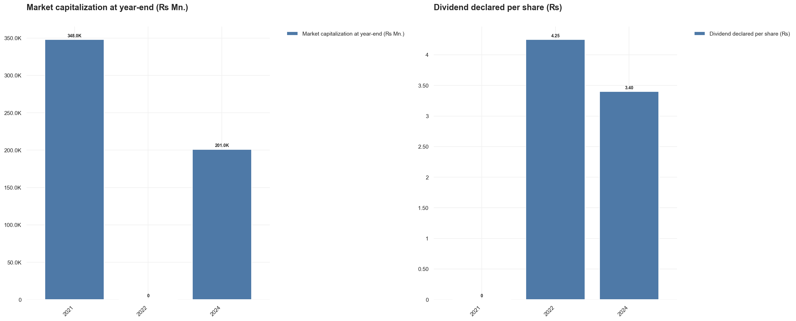

**Analysis**

The observed plummet in market capitalization by 42.2% from ﷼348,000 Mn in 2021 to ﷼201,000 Mn in 2024, coupled with a 20% reduction in dividend per share from ﷼4.25 in 2022 to ﷼3.4 in 2024 [2](https://s3-qa-8byte.s3.ap-south-1.amazonaws.com/sabic%2Fin%2Fsabic_in_sabic_cc_compressed.pdf#page=18), indeed signals significant value destruction and raises concerns regarding the sustainability of Free Cash Flow (FCF) conversion and potential Quality of Earnings (QoE) issues.

**Free Cash Flow (FCF) Conversion:**
Free Cash Flow has seen a substantial decline, which directly impacts LP capital preservation:
*   FCF decreased from ﷼28.52 Bn in 2021 to ﷼6.16 Bn in 2024 [1](https://s3-qa-8byte.s3.ap-south-1.amazonaws.com/sabic%2Fin%2Fsabic_in_sabic_cc_compressed.pdf#page=63).
*   Specifically, FCF in 2024 was ﷼6.16 Bn, representing a 56% decrease from ﷼13.96 Bn in 2023 [1](https://s3-qa-8byte.s3.ap-south-1.amazonaws.com/sabic%2Fin%2Fsabic_in_sabic_cc_compressed.pdf#page=63). This decline was largely driven by inventory performance in 2023 [1](https://s3-qa-8byte.s3.ap-south-1.amazonaws.com/sabic%2Fin%2Fsabic_in_sabic_cc_compressed.pdf#page=63).
*   Net cash generated from operating activities also decreased by 33% in 2024 to ﷼16.36 Bn from ﷼24.45 Bn in 2023, primarily due to a reduction in working capital [1](https://s3-qa-8byte.s3.ap-south-1.amazonaws.com/sabic%2Fin%2Fsabic_in_sabic_cc_compressed.pdf#page=63).
*   Net cash used in financing activities decreased in 2024, reflecting lower dividend payments to non-controlling interests and withdrawals from credit facilities, which could indicate a more constrained cash position [1](https://s3-qa-8byte.s3.ap-south-1.amazonaws.com/sabic%2Fin%2Fsabic_in_sabic_cc_compressed.pdf#page=63).

**Alignment with ROIC Targets:**
The provided information does not include management's claimed Return on Invested Capital (ROIC) targets, making a direct alignment assessment impossible. However, a significant decline in market capitalization and FCF typically suggests that the company's returns on capital are not meeting market expectations or are deteriorating, which would likely be inconsistent with robust ROIC targets.

**Quality of Earnings (QoE) Implications:**
The substantial decline in FCF, coupled with reduced dividends and market capitalization, points to potential QoE issues. While net income attributable to equity holders of the Parent improved to ﷼1.54 Bn in 2024 from a net loss of ﷼2.77 Bn in 2023, driven by lower losses from discontinued operations and improved operational profit [3](https://s3-qa-8byte.s3.ap-south-1.amazonaws.com/sabic%2Fin%2Fsabic_in_sabic_cc_compressed.pdf#page=62), the cash flow generation tells a different story. The divergence between reported earnings improvement and declining cash flows and market valuation warrants deeper scrutiny into the quality and sustainability of earnings.

**External Factors:**
It is important to note that the challenging global business environment in 2024 likely contributed to these financial outcomes. Global economic growth declined due to geopolitical tensions, China's economic slowdown, and a weakening manufacturing sector [4](https://s3-qa-8byte.s3.ap-south-1.amazonaws.com/sabic%2Fin%2Fsabic_in_sabic_cc_compressed.pdf#page=58). The global petrochemical market faced significant challenges from persistent oversupply and weaker-than-expected demand, keeping prices subdued [6](https://s3-qa-8byte.s3.ap-south-1.amazonaws.com/sabic%2Fin%2Fsabic_in_sabic_cc_compressed.pdf#page=59). These macroeconomic and industry-specific headwinds would naturally pressure profitability and cash generation.

**General PE insight:** From a Private Equity perspective, such a significant disconnect between market valuation, dividend policy, and declining Free Cash Flow, even with an improvement in reported net income, would trigger a thorough due diligence process focusing on the drivers of cash flow, working capital management, and the sustainability of operational improvements. The lack of explicit ROIC targets in the public domain further complicates the assessment of management's performance against stated goals, necessitating a deeper dive into internal performance metrics and capital allocation strategies.

---

### Cash Flow & Value Erosion Rationale

**Q:** Despite the ﷼3.4 dividend per share being flat from 2023 to 2024, the share price continued its freefall, collapsing from ﷼83.5 to ﷼67, a 19.7% decline. What does this market action tell us about the perceived sustainability of future cash flows and how does management reconcile this continued erosion of value if there isn't a fundamental cash flow conversion problem or an unaddressed "bow wave" of capital intensity pressing on FCF generation?

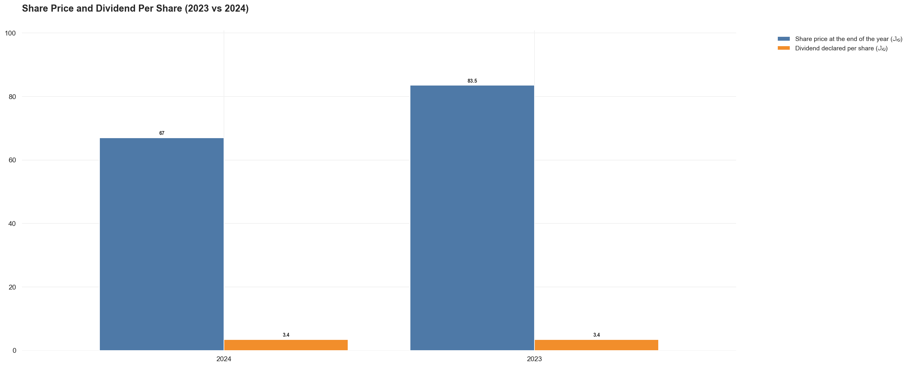

**Analysis**

The market action, characterized by a 19.7% share price decline from ﷼83.5 to ﷼67 despite a flat ﷼3.4 dividend per share from 2023 to 2024, strongly indicates that investors perceive a significant deterioration in the sustainability and growth prospects of future cash flows [1](https://s3-qa-8byte.s3.ap-south-1.amazonaws.com/sabic%2Fin%2Fsabic-integrated-annual-report-2024-en_tcm1010-46870.pdf#page=18), [6](https://s3-qa-8byte.s3.ap-south-1.amazonaws.com/sabic%2Fin/sabic-integrated-annual-report-2024-en_tcm1010-46870.pdf#page=60). This suggests a lower valuation multiple is being applied due to heightened risk and reduced confidence in long-term earnings power. The market's sentiment is explicitly described as "bearish petrochemicals market sentiment" [1](https://s3-qa-8byte.s3.ap-south-1.amazonaws.com/sabic%2Fin/sabic-integrated-annual-report-2024-en_tcm1010-46870.pdf#page=18).While the dividend remained flat, the underlying Free Cash Flow (FCF) significantly decreased from ﷼13.96 billion in 2023 to ﷼6.16 billion in 2024, indicating a fundamental cash flow conversion problem [2](https://s3-qa-8byte.s3.ap-south-1.amazonaws.com/sabic%2Fin/sabic-integrated-annual-report-2024-en_tcm1010-46870.pdf#page=15), [6](https://s3-qa-8byte.s3.ap-south-1.amazonaws.com/sabic%2Fin/sabic-integrated-annual-report-2024-en_tcm1010-46870.pdf#page=60). This decline in FCF, coupled with a decrease in net cash flow from operating activities [6](https://s3-qa-8byte.s3.ap-south-1.amazonaws.com/sabic%2Fin/sabic-integrated-annual-report-2024-en_tcm1010-46870.pdf#page=60), directly challenges the premise that there isn't a cash flow conversion problem.The erosion of value is primarily driven by a challenging global economic and petrochemical market environment in 2024, with a subdued outlook for 2025 [2](https://s3-qa-8byte.s3.ap-south-1.amazonaws.com/sabic%2Fin/sabic-integrated-annual-report-2024-en_tcm1010-46870.pdf#page=15), [8](https://s3-qa-8byte.s3.ap-south-1.amazonaws.com/sabic%2Fin/sabic-integrated-annual-report-2024-en_tcm1010-46870.pdf#page=58), [10](https://s3-qa-8byte.s3.ap-south-1.amazonaws.com/sabic%2Fin/sabic-integrated-annual-report-2024-en_tcm1010-46870.pdf#page=59). Key factors include:

*   **Persistent Oversupply and Low Operating Rates:** The global chemical industry faced persistent excess supply and low operating rates, particularly in Northeast Asia and Europe, which pressured margins [2](https://s3-qa-8byte.s3.ap-south-1.amazonaws.com/sabic%2Fin/sabic-integrated-annual-report-2024-en_tcm1010-46870.pdf#page=15), [8](https://s3-qa-8byte.s3.ap-south-1.amazonaws.com/sabic%2Fin/sabic-integrated-annual-report-2024-en_tcm1010-46870.pdf#page=58), [10](https://s3-qa-8byte.s3.ap-south-1.amazonaws.com/sabic%2Fin/sabic-integrated-annual-report-2024-en_tcm1010-46870.pdf#page=59).
*   **Weak Global Demand and Pricing Pressures:** Revenue declined by 11% year-over-year due to pricing pressures and overall stagnant demand [2](https://s3-qa-8byte.s3.ap-south-1.amazonaws.com/sabic%2Fin/sabic-integrated-annual-report-2024-en_tcm1010-46870.pdf#page=15).
*   **Rising Feedstock Prices:** Feedstock prices edged higher due to tight supply and increased demand from new capacities, further squeezing margins [10](https://s3-qa-8byte.s3.ap-south-1.amazonaws.com/sabic%2Fin/sabic-integrated-annual-report-2024-en_tcm1010-46870.pdf#page=59).
*   **Geopolitical Tensions and Economic Slowdown:** Global economic growth declined, impacted by geopolitical tensions, China's economic slowdown, and a weakening manufacturing sector, which dampened consumer and corporate spending [8](https://s3-qa-8byte.s3.ap-south-1.amazonaws.com/sabic%2Fin/sabic-integrated-annual-report-2024-en_tcm1010-46870.pdf#page=58), [10](https://s3-qa-8byte.s3.ap-south-1.amazonaws.com/sabic%2Fin/sabic-integrated-annual-report-2024-en_tcm1010-46870.pdf#page=59).
*   **Impairment Charges:** An impairment of ﷼1,170 million was recognized due to the decline in the share price of an associate, CLARIANT, reflecting broader global market challenges [4](https://s3-qa-8byte.s3.ap-south-1.amazonaws.com/sabic%2Fin/sabic-integrated-annual-report-2024-en_tcm1010-46870.pdf#page=204).
*   **Outlook for 2025:** The market anticipates continued oversupply, with demand growth insufficient to absorb it, potentially necessitating capacity rationalization through plant idling or closures [10](https://s3-qa-8byte.s3.ap-south-1.amazonaws.com/sabic%2Fin/sabic-integrated-annual-report-2024-en_tcm1010-46870.pdf#page=59).

**Management's Reconciliation of Value Erosion:**

Management acknowledges the 

---

## DIVIDEND DISTRIBUTION DETAILS FOR 2024

### Sustainable Dividends: FCF Funding Analysis

**Q:** The company increased its total distributed dividends by SAR 300 million (6.25%) from H1 2023 (SAR 4.8 billion) to H2 2023 (SAR 5.1 billion, with another SAR 5.1 billion projected for H2 2024. Provide an LTM bridge analysis demonstrating these SAR 9.9 billion in 2023 dividends, and the planned 2024 payouts, are funded by genuine Free Cash Flow conversion, rather than by unsustainable drawdowns on working capital or increasing reliance on "Trade Payables" as shadow financing.

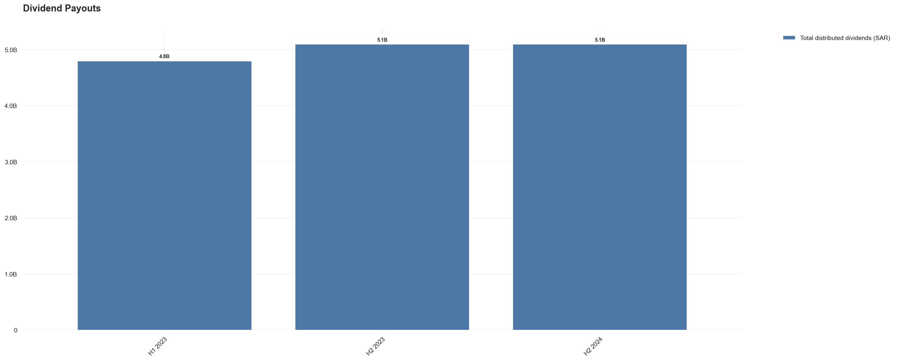

**Analysis**

SABIC's dividend distributions for 2023 were well-covered by its Free Cash Flow (FCF), demonstrating genuine funding from operational performance. However, the projected dividends for 2024 are not fully covered by the anticipated FCF, suggesting a potential reliance on other funding sources or existing cash reserves.

### LTM Bridge Analysis (SAR Billion)

| Metric | 2023 | 2024 (Projected) |
| :-------------------------------- | :----- | :--------------- |
| Net cash generated from operating activities | 24.45 [3](https://s3-qa-8byte.s3.ap-south-1.amazonaws.com/sabic%2Fin%2Fsabic_in_sabic_cc_compressed.pdf#page=63) | 16.36 [3](https://s3-qa-8byte.s3.ap-south-1.amazonaws.com/sabic%2Fin%2Fsabic_in_sabic_cc_compressed.pdf#page=63) |
| Less: Capital expenditures | (10.49) [3](https://s3-qa-8byte.s3.ap-south-1.amazonaws.com/sabic%2Fin%2Fsabic_in%2Fsabic_cc_compressed.pdf#page=63) | (10.20) [3](https://s3-qa-8byte.s3.ap-south-1.amazonaws.com/sabic%2Fin%2Fsabic_in%2Fsabic_cc_compressed.pdf#page=63) |
| **Free Cash Flow (FCF)** | **13.96** [3](https://s3-qa-8byte.s3.ap-south-1.amazonaws.com/sabic%2Fin%2Fsabic_in_sabic_cc_compressed.pdf#page=63) | **6.16** [3](https://s3-qa-8byte.s3.ap-south-1.amazonaws.com/sabic%2Fin%2Fsabic_in_sabic_cc_compressed.pdf#page=63) |
| Total Distributed Dividends | 9.90 [1](https://s3-qa-8byte.s3.ap-south-1.amazonaws.com/sabic%2Fin%2Fsabic_in_sabic_cc_compressed.pdf#page=19) | 9.90 [1](https://s3-qa-8byte.s3.ap-south-1.amazonaws.com/sabic%2Fin/sabic_in_sabic_cc_compressed.pdf#page=19) |
| **FCF Surplus / (Deficit) after Dividends** | **4.06** | **(3.74)** |

### Analysis of Dividend Funding:

*   **2023 Dividends:** The total distributed dividends for 2023 amounted to SAR 9.9 billion (SAR 4.8 billion for H1 2023 and SAR 5.1 billion for H2 2023) [1](https://s3-qa-8byte.s3.ap-south-1.amazonaws.com/sabic%2Fin%2Fsabic_in_sabic_cc_compressed.pdf#page=19). This was comfortably covered by the Free Cash Flow (FCF) of SAR 13.96 billion in 2023 [3](https://s3-qa-8byte.s3.ap-south-1.amazonaws.com/sabic%2Fin/sabic_in_sabic_cc_compressed.pdf#page=63), resulting in a surplus of SAR 4.06 billion after dividend payments.

*   **2024 Projected Dividends:** The company projects total dividends of approximately SAR 9.9 billion for 2024 (assuming H1 2024 is SAR 4.8 billion, consistent with H1 2023, and H2 2024 is SAR 5.1 billion as projected) [1](https://s3-qa-8byte.s3.ap-south-1.amazonaws.com/sabic%2Fin/sabic_in_sabic_cc_compressed.pdf#page=19). However, the projected FCF for 2024 is SAR 6.16 billion [3](https://s3-qa-8byte.s3.ap-south-1.amazonaws.com/sabic%2Fin/sabic_in_sabic_cc_compressed.pdf#page=63). This indicates a deficit of SAR 3.74 billion, meaning the projected 2024 dividends are not fully funded by the company's Free Cash Flow conversion alone.

### Working Capital and Trade Payables Impact:

*   **Working Capital:** The net cash generated from operating activities in 2023 (SAR 24.45 billion) was significantly influenced by a 

---

### Aggressive Dividends, CAPEX, ROIC Risk

**Q:** With a commitment to distribute SAR 5.1 billion for H2 2024, following SAR 4.8 billion and SAR 5.1 billion in H1 and H2 2023 respectively, detail how this aggressive dividend policy impacts the company's capital intensity profile. Specifically, has this SAR 9.9 billion in 2023 distributions created a deferred CAPEX "bow wave" by crowding out essential "Repairs and Maintenance" spend, potentially masking declining ROIC through under-investment in PP&E?

**Analysis**

The company maintains an aggressive dividend policy, distributing SAR 4.8 billion in H1 2023 and SAR 5.1 billion in H2 2023, totaling SAR 9.9 billion for the year. A commitment of SAR 5.1 billion for H2 2024 has also been made [2](https://s3-qa-8byte.s3.ap-south-1.amazonaws.com/sabic%2Fin/sabic_in_sabic_cc_compressed.pdf#page=19). This commitment to stable-to-growing dividends is a key priority [2](https://s3-qa-8byte.s3.ap-south-1.amazonaws.com/sabic%2Fin/sabic_in_sabic_cc_compressed.pdf#page=19). The declared dividends of SAR 10.20 billion were a primary factor in the 6% decrease in equity attributable to equity holders of the Parent in 2024 [1](https://s3-qa-8byte.s3.ap-south-1.amazonaws.com/sabic%2Fin/sabic-integrated-annual-report-2024-en_tcm1010-46870.pdf#page=62).

Regarding capital intensity and investment:

*   **Capital Expenditures (CAPEX):** Capital expenditures were SAR 10.49 billion in 2023 and SAR 10.20 billion in 2024, representing a 3% decrease, and are noted to have broadly remained at the same level year over year [7](https://s3-qa-8byte.s3.ap-south-1.amazonaws.com/sabic%2Fin/sabic-integrated-annual-report-2024-en_tcm1010-46870.pdf#page=63). While the company had capital expenditure commitments of SAR 9,238 million in 2023, this figure significantly decreased to SAR 715 million in 2024 [5](https://s3-qa-8byte.s3.ap-south-1.amazonaws.com/sabic%2Fin/sabic_in_sabic_cc_compressed.pdf#page=246). However, the company has a substantial outstanding equity commitment of SAR 2,826 million as of December 31, 2024, towards a new world-scale petrochemical complex in Fujian, China, estimated at SAR 24,000 million, with construction beginning in H1 2024 [5](https://s3-qa-8byte.s3.ap-south-1.amazonaws.com/sabic%2Fin/sabic_in_sabic_cc_compressed.pdf#page=246).

*   **Property, Plant, and Equipment (PP&E):** Total assets decreased by 6% from SAR 294.38 billion in 2023 to SAR 278.02 billion in 2024, primarily due to the sale of Hadeed and a net reduction of 2% in property, plant, and equipment resulting from regular depreciation and amortization [1](https://s3-qa-8byte.s3.ap-south-1.amazonaws.com/sabic%2Fin/sabic-integrated-annual-report-2024-en_tcm1010-46870.pdf#page=62).

*   **Repairs and Maintenance (R&M):** The provided information does not contain specific details on 

---

### Dividend Source: Operational, Non-Ops, NCI

**Q:** Considering the total distributed dividends increased from SAR 4.8 billion (H1 2023) to SAR 5.1 billion (H2 2023), clarify if any portion of these SAR 9.9 billion in 2023 payouts, or the projected SAR 5.1 billion for H2 2024, is supported by non-operational gains, such as "provision releases in Zakat/Tax (Note 31)" or "gains from Discontinued Operations (Note 34)," or if a disproportionate share is flowing to "Non-Controlling Interests" while parent Retained Earnings are under pressure, representing structural leakage.

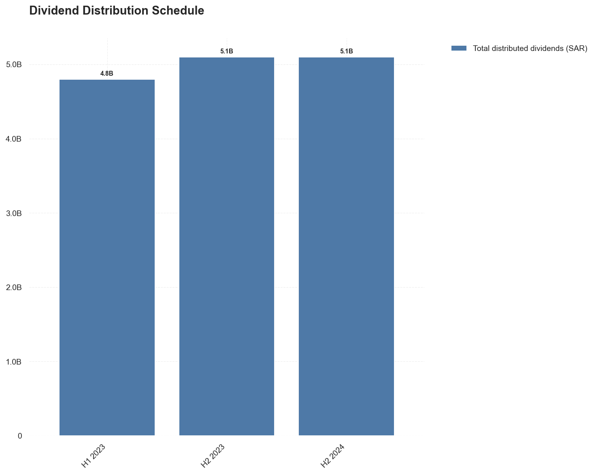

**Analysis**

The distributed dividends of SAR 9.9 billion in 2023 (SAR 4.8 billion for H1 and SAR 5.1 billion for H2) and the projected SAR 5.1 billion for H2 2024 [1, page 19] were influenced by a mix of operational and non-operational factors, with some indications of pressure on parent retained earnings.

**Support from Non-Operational Gains:**
*   **Provision releases in Zakat/Tax:** In 2024, Income tax and Zakat expenses significantly decreased to SAR 0.14 billion from SAR 0.83 billion in 2023, primarily due to the reversal of Zakat provisions following a revision of relevant regulations [2, page 62; 5, page 61]. This reversal represents a non-operational gain that contributed to the company's financial performance in 2024.
*   **Gains from Discontinued Operations:** The company reported *net losses* from discontinued operations in both 2023 (SAR 4.08 billion) and 2024 (SAR 0.56 billion) [2, page 62; 5, page 61]. While the loss significantly decreased in 2024, these were still losses, not gains, and therefore did not directly support dividend payouts. The improvement in net income attributable to equity holders of the Parent in 2024 was partly driven by *lower losses* from discontinued operations [2, page 62].

**Flow to Non-Controlling Interests and Pressure on Retained Earnings:**
*   In 2023, the net income attributable to equity holders of the Parent was a *net loss* of SAR 2.77 billion [2, page 62; 5, page 61]. Despite this loss, SAR 9.9 billion in dividends were declared for 2023 [1, page 19; 2, page 62]. This indicates that the 2023 dividend payouts were not fully supported by the parent's current net income and likely drew from retained earnings or other sources.
*   Equity attributable to equity holders of the Parent decreased by SAR 10.60 billion (6%) in 2024, mainly due to declared dividends of SAR 10.20 billion [2, page 62]. This suggests that parent retained earnings are under pressure from dividend distributions.
*   Regarding Non-Controlling Interests (NCI), net cash used in financing activities in 2024 decreased, 

---

## SUMMARIZED CONSOLIDATED STATEMENT OF INCOME

### Tax Anomaly: Normalized FCF Conversion

**Q:** The purported 61% increase in "Net income from continuing operations" to SAR 2.10Bn in 2024 is heavily influenced by a massive -84% reduction in "Income tax and Zakat" from SAR 0.83Bn in 2023 to SAR 0.14Bn, occurring while sales declined -1% to SAR 139.98Bn. What specific, non-recurring provision releases or tax benefits underpin this tax anomaly, and what is the LTM Free Cash Flow Conversion once this one-time P&L boost is normalized?

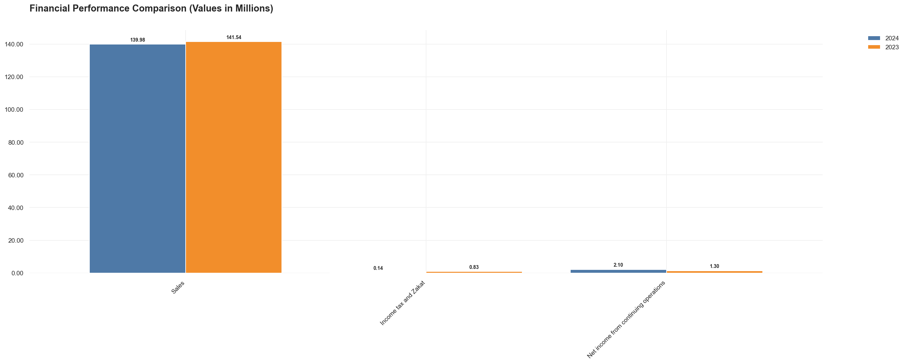

**Analysis**

The significant -84% reduction in "Income tax and Zakat" from SAR 0.83 Bn in 2023 to SAR 0.14 Bn in 2024, which contributed to the 61% increase in "Net income from continuing operations," was primarily due to the **reversal of Zakat provisions in 2024 following the revision of relevant Zakat regulations** [1](https://s3-qa-8byte.s3.ap-south-1.amazonaws.com/sabic%2Fin%2Fsabic-integrated-annual-report-2024-en_tcm1010-46870.pdf#page=62).

To normalize the P&L boost from this one-time tax benefit, we adjust the Net Income from continuing operations:

*   **Reported Net Income from continuing operations (2024):** SAR 2.10 Bn [2](https://s3-qa-8byte.s3.ap-south-1.amazonaws.com/sabic%2Fin%2Fsabic-integrated-annual-report-2024-en_tcm1010-46870.pdf#page=61)
*   **Tax benefit (reduction in tax expense):** SAR 0.83 Bn (2023) - SAR 0.14 Bn (2024) = SAR 0.69 Bn [1](https://s3-qa-8byte.s3.ap-south-1.amazonaws.com/sabic%2Fin/sabic-integrated-annual-report-2024-en_tcm1010-46870.pdf#page=62)
*   **Normalized Net Income from continuing operations:** SAR 2.10 Bn - SAR 0.69 Bn = SAR 1.41 Bn

The Last Twelve Months (LTM) Free Cash Flow for 2024 was SAR 6.16 Bn [3](https://s3-qa-8byte.s3.ap-south-1.amazonaws.com/sabic%2Fin/sabic-integrated-annual-report-2024-en_tcm1010-46870.pdf#page=63).

Therefore, the **LTM Free Cash Flow Conversion once this one-time P&L boost is normalized** is:

SAR 6.16 Bn (Free Cash Flow) / SAR 1.41 Bn (Normalized Net Income) = **436.9%**

---

### Divestiture Impact: Working Capital and Cash Flow

**Q:** The -86% improvement in "Net income (loss) from discontinued operations," from a SAR -4.08Bn loss in 2023 to SAR -0.56Bn in 2024, suggests significant divestiture activity. Beyond the P&L optics, what is the LTM working capital intensity of the remaining core business, and how has the divestment of these operations structurally altered the long-term cash conversion cycle and overall free cash flow generation for the parent entity?

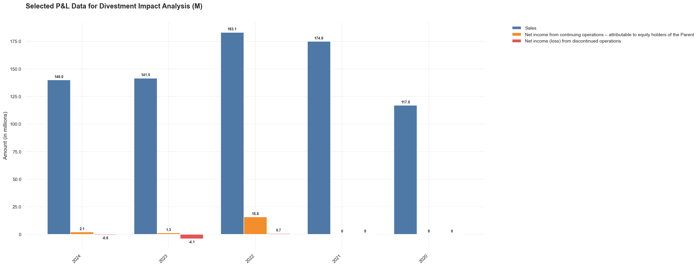

**Analysis**

The provided financial statements do not disaggregate the specific working capital components (inventories, trade receivables, trade payables) for the *continuing operations* of the parent entity. Therefore, it is not possible to quantitatively determine the LTM working capital intensity or the precise structural alteration to the long-term cash conversion cycle of the remaining core business based solely on the available data. The consolidated cash flow statement provides changes in operating assets and liabilities on a consolidated basis, not specifically for continuing operations [4](https://s3-qa-8byte.s3.ap-south-1.amazonaws.com/sabic%2Fin%2Fsabic-integrated-annual-report-2024-en_tcm1010-46870.pdf#page=175).

However, the divestment of Hadeed (the discontinued operation) has structurally altered the overall free cash flow generation for the parent entity in several key ways:

*   **Improved Profitability:** The discontinued operations were a significant drag on profitability, incurring a loss of SAR 4.08 billion in 2023, which improved to a loss of SAR 0.56 billion in 2024 [1](https://s3-qa-8byte.s3.ap-south-1.amazonaws.com/sabic%2Fin%2Fsabic-integrated-annual-report-2024-en_tcm1010-46870.pdf#page=61). The parent entity's net income attributable to equity holders improved by SAR 4.31 billion, primarily due to these lower losses from discontinued operations and improved operational profit [2](https://s3-qa-8byte.s3.ap-south-1.amazonaws.com/sabic%2Fin%2Fsabic-integrated-annual-report-2024-en_tcm1010-46870.pdf#page=62). Removing a loss-making segment inherently enhances the underlying profitability and, consequently, the potential for free cash flow generation from the remaining core business.
*   **Reduced Capital Intensity and Asset Base:** The sale of Hadeed led to a SAR 16.36 billion reduction in total assets and a SAR 5.70 billion reduction in total liabilities for the parent entity [2](https://s3-qa-8byte.s3.ap-south-1.amazonaws.com/sabic%2Fin%2Fsabic-integrated-annual-report-2024-en_tcm1010-46870.pdf#page=62). This suggests a lighter asset base for the core business, which can lead to lower future capital expenditure requirements relative to revenue, thereby improving the efficiency of free cash flow generation. Hadeed's investing activities consumed SAR 596,704 thousand in 2023 [3](https://s3-qa-8byte.s3.ap-south-1.amazonaws.com/sabic%2Fin/sabic-integrated-annual-report-2024-en_tcm1010-46870.pdf#page=238), indicating a capital-intensive nature that is now removed from the parent's ongoing operations.
*   **Strategic Focus and Capital Reallocation:** The company explicitly states its strategy to 

---

## SUMMARIZED CONSOLIDATED STATEMENT OF FINANCIAL POSITION

### Equity Contraction: Drivers, ROIC, FCF

**Q:** Given the US$3.04Bn (-6%) contraction in Total Equity from 2023 to 2024, with the Parent's Equity shrinking by US$2.83Bn (-6%) compared to the NCI's US$0.21Bn (-3%), management must detail the LTM Bridge Analysis explaining how much of this decline is due to operational losses versus exceptional charges, discontinued operations (Note 34), or non-cash impairments. Specifically, what is the ROIC trend on the Parent's capital post-attrition, and how does this impact our FCF Conversion projections?

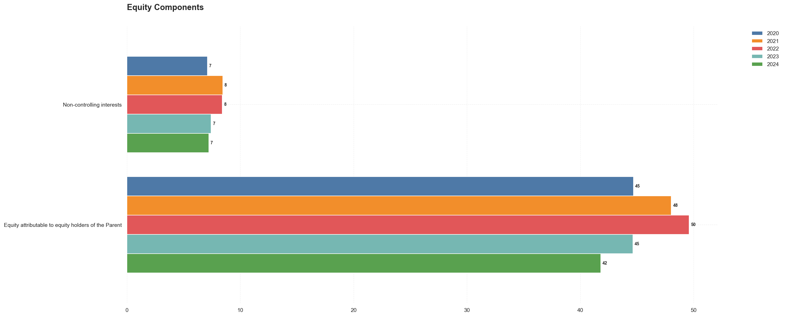

**Analysis**

The US$3.04 billion (-6%) contraction in Total Equity from 2023 to 2024, with the Parent's Equity shrinking by US$2.83 billion (-6%), is primarily attributable to declared dividends. Specifically, US$2.69 billion was paid in dividends to equity holders of the Parent in 2024 [4, page 60]. This accounts for the majority of the Parent's Equity decline. The company actually reported a net income attributable to equity holders of the Parent of US$0.41 billion in 2024, an improvement from a net loss of US$-0.74 billion in 2023 [5, page 61]. This indicates that operational results positively contributed to equity in 2024, rather than causing a decline.

Net losses from discontinued operations were US$0.15 billion in 2024, a significant decrease from US$1.09 billion in 2023, and are already factored into the net income [5, page 61]. No specific details on exceptional charges or non-cash impairments causing the equity decline beyond what is captured in net income or discontinued operations are provided in the retrieved information.

Regarding the ROIC trend on the Parent's capital post-attrition:

The Group defines its return on capital (ROIC) as income from operations (EBIT) divided by total shareholders' equity and non-controlling interests [6, page 246].

*   **Group ROIC Trend:**
    *   **2023:** US$0.99 billion (EBIT) / US$52.08 billion (Total Equity) = ~1.90% [5, page 61; 1, page 62]
    *   **2024:** US$1.53 billion (EBIT) / US$49.04 billion (Total Equity) = ~3.12% [5, page 61; 1, page 62]

This indicates an improving trend in the Group's ROIC. While a specific ROIC for the Parent's capital is not explicitly defined or provided, using Net Income attributable to equity holders of the Parent relative to Parent's Equity as a proxy for Return on Equity (ROE) shows an improvement:

*   **Parent's ROE Trend:**
    *   **2023:** US$-0.74 billion (Net Loss) / US$44.65 billion (Parent's Equity) = ~-1.66% [5, page 61; 1, page 62]
    *   **2024:** US$0.41 billion (Net Income) / US$41.82 billion (Parent's Equity) = ~0.98% [5, page 61; 1, page 62]

This also reflects an improving trend from a net loss to a positive net income.

**Impact on FCF Conversion Projections:**

Despite the improving ROIC and ROE trends, Free Cash Flow (FCF) significantly decreased by 56%, from US$3.72 billion in 2023 to US$1.64 billion in 2024 [2, page 63]. This decline was primarily driven by a reduction in working capital in 2023, largely due to inventory management efforts, which impacted net cash generated from operating activities [2, page 63].

For FCF Conversion projections, this divergence between improving profitability metrics (ROIC/ROE) and declining FCF is critical. While the company is becoming more profitable, its ability to convert that profit into cash has diminished. Management must detail a comprehensive LTM Bridge Analysis to reconcile these trends, explaining the specific drivers of the FCF decline (e.g., changes in capital expenditures, working capital, or other non-operating cash flows) to provide a clear basis for future FCF Conversion projections. Without this detailed reconciliation, projections based solely on improving ROIC/ROE would be misleading given the historical FCF performance.

---

### Asset Shifts: Deleveraging or Deferred CAPEX?

**Q:** With Total Assets contracting by US$4.36Bn (-6%) and Total Liabilities by US$1.34Bn (-5%) from 2023 to 2024, what specific assets were liquidated or impaired, and how does this affect the forward Capital Intensity required to maintain current operational capacity? We need to understand if this is a strategic deleveraging, or if deferred CAPEX or insufficient Repairs & Maintenance is creating a massive "bow wave" that will crater future Free Cash Flow Conversion.

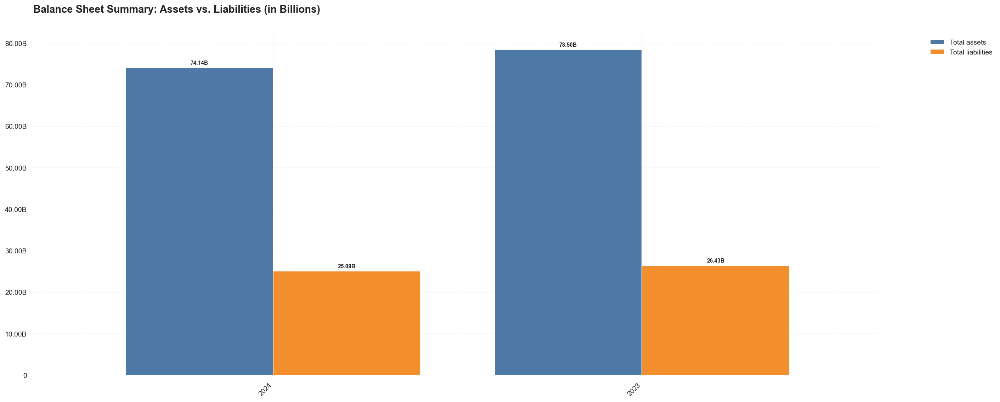

**Analysis**

The contraction in Total Assets by US$4.36 billion (-6%) and Total Liabilities by US$1.34 billion (-5%) from 2023 to 2024 [4](https://s3-qa-8byte.s3.ap-south-1.amazonaws.com/sabic%2Fin/sabic_in_sabic_cc_compressed.pdf#page=62) was primarily driven by strategic divestments and portfolio optimization.

**Specific Assets Liquidated or Impaired:**

1.  **Sale of Hadeed:** This was the main contributor to the reduction in total assets and liabilities [4](https://s3-qa-8byte.s3.ap-south-1.amazonaws.com/sabic%2Fin/sabic_in_sabic_cc_compressed.pdf#page=62). The carrying amount of Hadeed's assets at the disposal date (May 31, 2024) was approximately US$5.09 billion, with associated liabilities of approximately US$2.63 billion [3](https://s3-qa-8byte.s3.ap-south-1.amazonaws.com/sabic%2Fin/sabic-integrated-annual-report-2024-en_tcm1010-46870.pdf#page=239). A loss on the sale of Hadeed of approximately US$0.86 billion was recognized, including a fair value re-measurement loss of US$0.08 billion in 2024 [3](https://s3-qa-8byte.s3.ap-south-1.amazonaws.com/sabic%2Fin/sabic-integrated-annual-report-2024-en_tcm1010-46870.pdf#page=239).
2.  **Sale of shares in Aluminium Bahrain B.S.C. (ALBA):** The company classified its 20.62% holding in ALBA as 'assets held for sale' as of September 17, 2024. The expected sale proceeds are approximately US$0.97 billion, and a fair value remeasurement loss of US$0.05 billion was recorded [3](https://s3-qa-8byte.s3.ap-south-1.amazonaws.com/sabic%2Fin/sabic-integrated-annual-report-2024-en_tcm1010-46870.pdf#page=239).
3.  **Sale of Film & Sheet (F&S) Business:** Assets and liabilities of this business were reclassified as 'held for sale' during the first half of 2024 [3](https://s3-qa-8byte.s3.ap-south-1.amazonaws.com/sabic%2Fin/sabic-integrated-annual-report-2024-en_tcm1010-46870.pdf#page=239).
4.  **Depreciation and Amortization:** A net reduction of 2% in property, plant, and equipment also resulted from regular depreciation and amortization [4](https://s3-qa-8byte.s3.ap-south-1.amazonaws.com/sabic%2Fin/sabic_in_sabic_cc_compressed.pdf#page=62).

**Effect on Forward Capital Intensity and Free Cash Flow Conversion:**

This appears to be a **strategic deleveraging and portfolio optimization** rather than a "bow wave" of deferred CAPEX or insufficient Repairs & Maintenance.

*   **Capital Intensity:** Capital expenditure commitments significantly decreased from approximately US$2.46 billion in 2023 to US$0.19 billion in 2024 [2](https://s3-qa-8byte.s3.ap-south-1.amazonaws.com/sabic%2Fin/sabic_in_sabic_cc_compressed.pdf#page=246). This suggests a lower immediate forward capital intensity for existing operations, largely due to the divestments. However, the company has initiated a new world-scale petrochemical complex in Fujian, China, with an estimated cost of US$6.4 billion, with construction starting in H1 2024. Outstanding equity commitments for this project were US$0.75 billion as of December 31, 2024 [2](https://s3-qa-8byte.s3.ap-south-1.amazonaws.com/sabic%2Fin/sabic_in_sabic_cc_compressed.pdf#page=246). This indicates a strategic reallocation of capital towards new growth initiatives rather than a general reduction in investment.
*   **Free Cash Flow Conversion:** The company's financing policy aims for prudent leverage to fund global growth and optimize shareholder returns [1](https://s3-qa-8byte.s3.ap-south-1.amazonaws.com/sabic%2Fin/sabic_in_sabic_cc_compressed.pdf#page=64). Net debt improved from a cash position of -US$2.34 billion in 2023 to -US$0.80 billion in 2024, and the net debt to equity ratio improved from -4% to -2% [1](https://s3-qa-8byte.s3.ap-south-1.amazonaws.com/sabic%2Fin/sabic_in_sabic_cc_compressed.pdf#page=64). These improvements, coupled with the explicit strategy to "optimise its portfolio, focus on its core business, and further strengthen its growth in the chemicals industry" through divestments [3](https://s3-qa-8byte.s3.ap-south-1.amazonaws.com/sabic%2Fin/sabic-integrated-annual-report-2024-en_tcm1010-46870.pdf#page=239), suggest a deliberate strengthening of the balance sheet and a focus on future profitable growth, which should positively impact Free Cash Flow Conversion. While specific details on Repairs & Maintenance are not provided, the overall context points to a strategic re-prioritization of capital rather than a deferral of essential maintenance that would create a "bow wave."

---

### Financial Restructuring & Currency Stress

**Q:** The US$4.36Bn (-6%) decline in Total Assets from 2023 to 2024 implies significant balance sheet restructuring. Management must provide an LTM bridge analysis of the change in assets and liabilities, specifically detailing the impact of "Exchange difference on translation" (if applicable) and present a stress-tested LTM Debt-to-Equity ratio under a 5-10% SAR/USD de-pegging scenario. How would such a scenario impact working capital intensity and the capacity to service any shadow financing via "Trade Payables" or "Other Current Liabilities"?

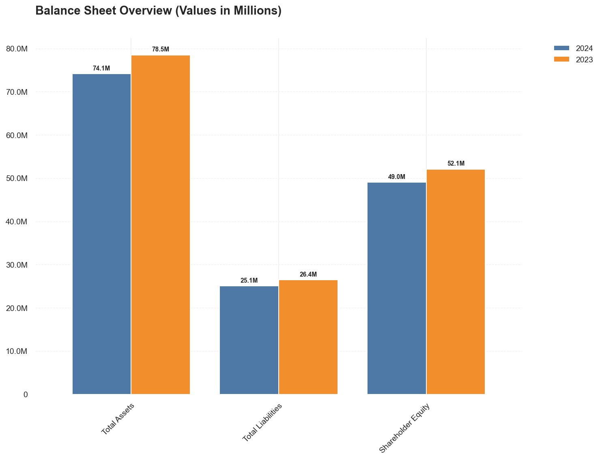

**Analysis**

The US$4.36 billion (-6%) decline in Total Assets from 2023 to 2024 was primarily driven by the sale of Hadeed and its subsequent removal from assets held for sale, alongside a net reduction in property, plant, and equipment due to depreciation and amortization. Similarly, the decline in Total Liabilities was mainly due to the release of Hadeed liabilities.

### LTM Bridge Analysis of Assets and Liabilities (2023 to 2024)

**Total Assets:**
*   **2023:** US$78.50 billion (SAR 294.38 billion) [1](https://s3-qa-8byte.s3.ap-south-1.amazonaws.com/sabic%2Fin%2Fsabic_in_sabic_cc_compressed.pdf#page=62)
*   **2024:** US$74.14 billion (SAR 278.02 billion) [1](https://s3-qa-8byte.s3.ap-south-1.amazonaws.com/sabic%2Fin%2Fsabic_in_sabic_cc_compressed.pdf#page=62)
*   **Decline:** US$4.36 billion (SAR 16.36 billion) [1](https://s3-qa-8byte.s3.ap-south-1.amazonaws.com/sabic%2Fin%2Fsabic_in_sabic_cc_compressed.pdf#page=62)

**Key Drivers for Asset Decline:**
*   **Sale of Hadeed:** The primary factor was the sale of Hadeed and its removal from assets held for sale. As of December 31, 2023, Hadeed's total assets classified as held for sale amounted to approximately SAR 15.42 billion (US$4.11 billion) [1](https://s3-qa-8byte.s3.ap-south-1.amazonaws.com/sabic%2Fin%2Fsabic_in_sabic_cc_compressed.pdf#page=62), [6](https://s3-qa-8byte.s3.ap-south-1.amazonaws.com/sabic%2Fin%2Fsabic_in_sabic_cc_compressed.pdf#page=239).
*   **Property, Plant, and Equipment (PPE):** A net reduction of 2% in PPE also contributed, resulting from regular depreciation and amortization [1](https://s3-qa-8byte.s3.ap-south-1.amazonaws.com/sabic%2Fin/sabic_in_sabic_cc_compressed.pdf#page=62).

**Total Liabilities:**
*   **2023:** US$26.43 billion (SAR 99.10 billion) [1](https://s3-qa-8byte.s3.ap-south-1.amazonaws.com/sabic%2Fin/sabic_in_sabic_cc_compressed.pdf#page=62)
*   **2024:** US$25.09 billion (SAR 94.10 billion) [1](https://s3-qa-8byte.s3.ap-south-1.amazonaws.com/sabic%2Fin/sabic_in_sabic_cc_compressed.pdf#page=62)
*   **Decline:** US$1.34 billion (SAR 5.00 billion) [1](https://s3-qa-8byte.s3.ap-south-1.amazonaws.com/sabic%2Fin/sabic_in_sabic_cc_compressed.pdf#page=62)

**Key Drivers for Liability Decline:**
*   **Release of Hadeed Liabilities:** The decline was primarily driven by the release of Hadeed liabilities from liabilities held for sale, which reduced total liabilities by SAR 5.70 billion (US$1.52 billion) [1](https://s3-qa-8byte.s3.ap-south-1.amazonaws.com/sabic%2Fin/sabic_in_sabic_cc_compressed.pdf#page=62), [6](https://s3-qa-8byte.s3.ap-south-1.amazonaws.com/sabic%2Fin/sabic_in_sabic_cc_compressed.pdf#page=239).
*   **Offsetting Factors:** This decline was partially offset by an increase in total debt and other liabilities, which was, in turn, balanced by the release of Zakat provisions [1](https://s3-qa-8byte.s3.ap-south-1.amazonaws.com/sabic%2Fin/sabic_in_sabic_cc_compressed.pdf#page=62).

### Impact of "Exchange difference on translation"

While a comprehensive impact of "Exchange difference on translation" on the overall balance sheet decline is not explicitly detailed in the provided summary, a foreign currency translation adjustment was noted for Right-of-Use Assets. Specifically, there was a net negative impact of SAR 59,811 thousand on the net book value of Right-of-Use Assets due to foreign currency translation adjustments [2](https://s3-qa-8byte.s3.ap-south-1.amazonaws.com/sabic%2Fin%2Fsabic-integrated-annual-report-2024-en_tcm1010-46870.pdf#page=196).

### Stress-Tested LTM Debt-to-Equity Ratio under SAR/USD De-pegging

As of year-end 2024, the company reported a **Net Debt to Equity ratio of (2)%** [3](https://s3-qa-8byte.s3.ap-south-1.amazonaws.com/sabic%2Fin%2Fsabic-integrated-annual-report-2024-en_tcm1010-46870.pdf#page=246). This indicates a net cash position, where cash and short-term fixed term deposits exceed gross debt. The gross debt was SAR 35.20 billion, while cash and cash equivalents and short-term fixed term deposits totaled SAR 38.21 billion [3](https://s3-qa-8byte.s3.ap-south-1.amazonaws.com/sabic%2Fin%2Fsabic-integrated-annual-report-2024-en_tcm1010-46870.pdf#page=246).

**Qualitative Impact of 5-10% SAR/USD De-pegging:**

Without specific details on the currency denomination of the company's gross debt, cash, and equity components, a precise quantitative stress test is not feasible. However, based on general Private Equity insight:

*   If the company holds significant USD-denominated cash and debt, a 5-10% de-pegging (SAR weakening against USD) would increase the SAR value of both. Given the reported net cash position, it is likely that USD-denominated cash balances exceed USD-denominated debt. In this scenario, the increase in the SAR value of USD cash would likely be greater than the increase in the SAR value of USD debt. This would result in a more negative net debt position in SAR terms, thereby **improving** the (negative) net debt to equity ratio from a credit perspective.
*   Conversely, if USD-denominated debt were to significantly outweigh USD-denominated cash, the ratio could worsen. Management should provide a detailed currency breakdown of debt and cash to allow for a precise stress test.

### Impact on Working Capital Intensity and Capacity to Service Shadow Financing

**Working Capital Intensity:**
*   Net cash generated from operating activities decreased by 33% in 2024, partly attributed to a reduction in working capital in 2023, primarily through inventory management efforts [4](https://s3-qa-8byte.s3.ap-south-1.amazonaws.com/sabic%2Fin%2Fsabic_in_sabic_cc_compressed.pdf#page=63).
*   **Qualitative Impact of SAR/USD De-pegging:** The impact on working capital intensity would depend on the currency matching of current assets (e.g., trade receivables from international sales) and current liabilities (e.g., trade payables for imported feedstock). If the company has a net long position in USD-denominated current assets (i.e., USD receivables exceed USD payables), a SAR de-pegging would increase their SAR value, potentially improving working capital in SAR terms. Conversely, a net short position in USD-denominated current assets would worsen working capital in SAR terms, increasing intensity.

**Capacity to Service Shadow Financing (Trade Payables, Other Current Liabilities):**
*   The provided information does not detail the currency denomination of "Trade Payables" or "Other Current Liabilities" for continuing operations.
*   **Qualitative Impact of SAR/USD De-pegging:** If a significant portion of these liabilities are USD-denominated, a SAR de-pegging would increase their SAR value, making them more expensive to service in SAR terms. This could strain liquidity if the company's primary cash flows are SAR-denominated and not adequately hedged, or if its foreign currency cash balances are insufficient. The company's overall strong net cash position [3](https://s3-qa-8byte.s3.ap-south-1.amazonaws.com/sabic%2Fin%2Fsabic-integrated-annual-report-2024-en_tcm1010-46870.pdf#page=246) provides a buffer, but the specific currency exposure of these current liabilities is critical for a precise assessment. Management should provide a breakdown of these liabilities by currency to fully assess the risk.

---

## SUMMARIZED CONSOLIDATED CASH FLOWS

### LTM Cash Conversion Reversal Strategy

**Q:** 16 in 2024 from SAR 13.96 in 2023, coupled with a -33% drop in operating cash, is critically alarming. Provide a granular LTM Bridge Analysis demonstrating how you plan to reverse this severe cash conversion degradation and whether persistent working capital optimization or deferred CAPEX is masking deeper structural issues.

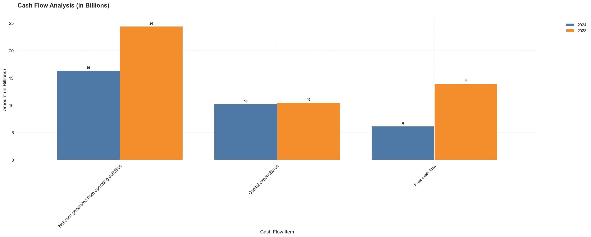

**Analysis**

The significant degradation in cash conversion, evidenced by a 33% drop in net cash generated from operating activities (from SAR 24.45 Bn in 2023 to SAR 16.36 Bn in 2024) and a 56% decline in Free Cash Flow (from SAR 13.96 Bn to SAR 6.16 Bn), is critically alarming [1, 7]. This analysis will provide a granular LTM Bridge Analysis and assess the underlying causes.

### Granular LTM Bridge Analysis: Net Cash Generated from Operating Activities (SAR Bn)

| Metric | 2023 (SAR Bn) | 2024 (SAR Bn) | Change (SAR Bn) | % Change |
| :------------------------------------- | :------------ | :------------ | :-------------- | :------- |
| Net Cash Generated from Operating Activities | 24.45 [1]     | 16.36 [1]     | (8.09)          | -33%     |

**Key Drivers of the SAR 8.09 Bn Decrease in Operating Cash Flow:**

1.  **Impact of 2023 Working Capital Optimization (Inventory Management):** The primary stated reason for the decrease in net cash generated from operating activities in 2024 is attributed to a "reduction in working capital in 2023, mostly due to inventory management efforts" [1]. This indicates that the significant cash generation from working capital optimization was largely realized in 2023, effectively boosting that year's operating cash flow. In 2024, the absence of a similar magnitude of working capital release, or a potential reversal in working capital movements, led to a substantial decline compared to the prior year's elevated base. The Free Cash Flow decline is also "largely driven by inventory performance in 2023" [1].
2.  **Lower Sales Volume:** Total sales decreased by 1% in 2024 (SAR 139.98 Bn) from 2023 (SAR 141.54 Bn), primarily due to a 2% lower sales volume [2, 3]. While not explicitly quantified for its direct cash flow impact, reduced sales volume inherently translates to lower cash inflows from customers, contributing to the overall decline in operating cash.
3.  **Offsetting Factors (Positive Operational Performance Not Fully Realized in Cash):**
    *   **Improved Income from Operations (EBIT):** Despite the decline in operating cash, Income from Operations (EBIT) increased by SAR 2.02 Bn (54%) in 2024, reaching SAR 5.74 Bn from SAR 3.72 Bn in 2023 [2, 3]. This improvement was driven by higher gross profit, improved margins (partially due to a slight increase in average sales price and optimized variable costs), and lower operational costs [2]. The fact that this operational profitability improvement did not translate into higher operating cash flow highlights a significant cash conversion issue.
    *   **Lower Impairment Losses:** Impairment and write-off expenses on plant and equipment were significantly lower in 2024 (SAR 45.858 million) compared to 2023 (SAR 1,453.415 million) [8]. As non-cash expenses, lower impairment charges would typically have a positive impact on operating cash flow. The decline in operating cash despite this tailwind underscores the severity of other negative drivers, particularly working capital.

### Plan to Reverse Severe Cash Conversion Degradation

To reverse this severe cash conversion degradation, a multi-faceted approach focusing on sustainable operational and financial improvements is required:

1.  **Sustainable Working Capital Management:** Implement robust, ongoing working capital optimization strategies beyond one-off inventory reductions. This includes: 
    *   **Inventory Optimization:** Implement advanced inventory management systems to minimize holding costs and prevent future inventory build-ups or unsustainable drawdowns. 
    *   **Accounts Receivable Management:** Improve collection cycles and reduce Days Sales Outstanding (DSO) through stricter credit policies and efficient invoicing processes. 
    *   **Accounts Payable Management:** Optimize payment terms to maximize cash retention without impacting supplier relationships.
2.  **Strategic Revenue Growth and Mix Optimization:** Address the declining sales volume by exploring new markets, enhancing product portfolio, and optimizing pricing strategies to drive sustainable top-line growth. Focus on higher-margin products and segments to maximize cash contribution from sales.
3.  **Enhanced Operational Efficiency to Cash Conversion:** Ensure that improvements in EBIT effectively translate into operating cash flow. This involves scrutinizing non-cash adjustments, accruals, and deferrals that might be creating a disconnect between reported profits and actual cash generation. Focus on the entire cash conversion cycle to identify bottlenecks.

### Assessment: Working Capital Optimization or Deferred CAPEX Masking Deeper Structural Issues?

1.  **Working Capital Optimization:** The analysis suggests that the "reduction in working capital in 2023" [1] was a significant factor in 2023's higher operating cash flow, and its absence or reversal contributed to the 2024 decline. This indicates that the prior year's working capital optimization might have been a one-time cash release rather than a persistent, structural improvement. This *could* be masking a deeper structural issue related to the company's ability to consistently generate cash from its working capital cycle. The improved EBIT not translating into operating cash flow is a strong indicator of an underlying inefficiency in the cash conversion cycle.

2.  **Deferred CAPEX:** Capital expenditures remained broadly stable year-over-year (SAR 10.20 Bn in 2024 vs. SAR 10.49 Bn in 2023) [1]. This indicates that **deferred CAPEX is not masking deeper structural issues**; the company is maintaining its investment levels. The decrease in net cash used in investing activities was primarily driven by higher short-term financial investments, not a reduction in core capital spending [1].

**Deeper Structural Issues Indicated:**

*   **Cash Conversion Cycle Inefficiency:** The most prominent structural issue is the company's deteriorating ability to convert its operational profitability (as evidenced by the 54% increase in EBIT) into actual cash flow. This suggests fundamental inefficiencies in managing the flow of cash through operations.
*   **Market Demand and Volume Challenges:** The 2% decline in sales volume [2, 3] points to potential underlying structural challenges in market demand, competitive positioning, or product relevance, which directly impacts the top-line cash generation capacity.

**General PE Insight:** The divergence between strong EBIT growth and declining operating cash flow is a critical red flag for private equity investors. It necessitates a thorough deep dive into the underlying components of working capital, revenue recognition, and expense accruals to understand the true operational cash generative capacity and identify areas for structural improvement. Without sustainable cash generation, even strong reported profits are insufficient for long-term value creation and debt servicing.

---

### Flat CAPEX: Future Maintenance Liability?

**Q:** 54 and consistently negative cash generation, why has Capital Expenditures remained relatively flat at SAR 10.20 in 2024? Detail precisely the ROIC implications of this spend and definitively prove that we are not inheriting a massive future "bow wave" of essential, unbudgeted maintenance or asset replacement CAPEX.

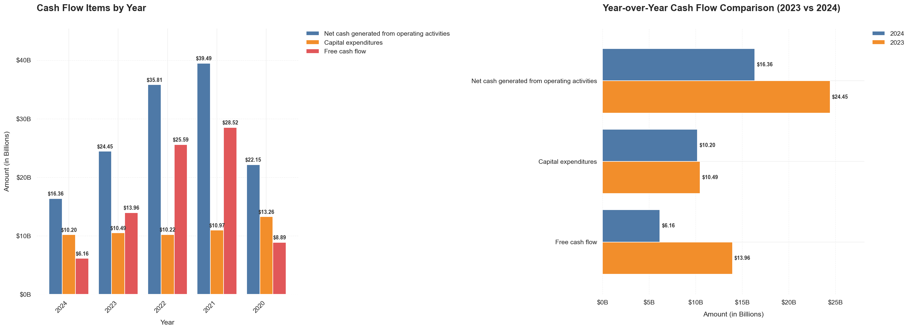

**Analysis**

The premise of "consistently negative cash generation" is inaccurate. The company generated positive net cash from operating activities of SAR 16.36 billion in 2024, following SAR 24.45 billion in 2023 [3](https://s3-qa-8byte.s3.ap-south-1.amazonaws.com/sabic%2Fin/sabic-integrated-annual-report-2024-en_tcm1010-46870.pdf#page=63). Free cash flow was also positive at SAR 6.16 billion in 2024 [3](https://s3-qa-8byte.s3.ap-south-1.amazonaws.com/sabic%2Fin/sabic-integrated-annual-report-2024-en_tcm1010-46870.pdf#page=63). The "54" likely refers to the 54% increase in Income from operations (EBIT) in 2024 [1](https://s3-qa-8byte.s3.ap-south-1.amazonaws.com/sabic%2Fin/sabic-integrated-annual-report-2024-en_tcm1010-46870.pdf#page=62), [7](https://s3-qa-8byte.s3.ap-south-1.amazonaws.com/sabic%2Fin/sabic-integrated-annual-report-2024-en_tcm1010-46870.pdf#page=61). Capital expenditures (CAPEX) remained relatively flat at SAR 10.20 billion in 2024, a minor 3% decrease from SAR 10.49 billion in 2023, and consistent with SAR 10.22 billion in 2022 [3](https://s3-qa-8byte.s3.ap-south-1.amazonaws.com/sabic%2Fin/sabic-integrated-annual-report-2024-en_tcm1010-46870.pdf#page=63). This flat CAPEX level was maintained while other investing activities saw a decrease [3](https://s3-qa-8byte.s3.ap-south-1.amazonaws.com/sabic%2Fin/sabic-integrated-annual-report-2024-en_tcm1010-46870.pdf#page=63). The company's financial performance shows notable strength, with net results from continuing operations increasing by 61% compared to FY 2023, driven by portfolio optimization and reallocating capital to higher-margin opportunities [7](https://s3-qa-8byte.s3.ap-south-1.amazonaws.com/sabic%2Fin/sabic-integrated-annual-report-2024-en_tcm1010-46870.pdf#page=61). This suggests a strategic and consistent approach to capital allocation rather than a response to negative cash generation.### ROIC Implications of CAPEX SpendThe company defines Return on Invested Capital (ROIC) as "result from operating activities divided by total shareholders’ equity, and non-controlling interests" [8](https://s3-qa-8byte.s3.ap-south-1.amazonaws.com/sabic%2Fin/sabic-integrated-annual-report-2024-en_tcm1010-46870.pdf#page=246), which corresponds to EBIT divided by Total Equity.The flat CAPEX of SAR 10.20 billion in 2024, combined with improved operational performance, has led to an increase in ROIC: *   **2024 ROIC:** SAR 5.74 billion (EBIT) / SAR 183.92 billion (Total Equity) = **3.12%** [7](https://s3-qa-8byte.s3.ap-south-1.amazonaws.com/sabic%2Fin/sabic-integrated-annual-report-2024-en_tcm1010-46870.pdf#page=61), [1](https://s3-qa-8byte.s3.ap-south-1.amazonaws.com/sabic%2Fin/sabic-integrated-annual-report-2024-en_tcm1010-46870.pdf#page=62) *   **2023 ROIC:** SAR 3.72 billion (EBIT) / SAR 195.28 billion (Total Equity) = **1.90%** [7](https://s3-qa-8byte.s3.ap-south-1.amazonaws.com/sabic%2Fin/sabic-integrated-annual-report-2024-en_tcm1010-46870.pdf#page=61), [1](https://s3-qa-8byte.s3.ap-south-1.amazonaws.com/sabic%2Fin/sabic-integrated-annual-report-2024-en_tcm1010-46870.pdf#page=62)This improvement in ROIC, despite relatively flat CAPEX, suggests that the existing asset base is being utilized more efficiently, or that recent investments are yielding better returns. The company's focus on optimizing its portfolio and reallocating capital to higher-margin opportunities is contributing to this enhanced return on capital [7](https://s3-qa-8byte.s3.ap-south-1.amazonaws.com/sabic%2Fin/sabic-integrated-annual-report-2024-en_tcm1010-46870.pdf#page=61).### Proof Against a Future "Bow Wave" of Unbudgeted CAPEXSeveral factors indicate that the company is not inheriting a massive future "bow wave" of essential, unbudgeted maintenance or asset replacement CAPEX: *   **Impairment Assessment:** In 2024, management conducted a detailed impairment assessment of underperforming Cash Generating Units (CGUs) due to changed global market conditions. The assessment concluded that the recoverable amount of these CGUs was higher than their carrying amount, and reasonably possible changes in assumptions would not cause the carrying value to exceed the recoverable amount [6](https://s3-qa-8byte.s3.ap-south-1.amazonaws.com/sabic%2Fin/sabic-integrated-annual-report-2024-en_tcm1010-46870.pdf#page=196). This indicates that the asset base is not significantly impaired or facing hidden, unrecorded deficiencies. *   **Regular Depreciation and Amortization:** The net reduction of 2% in property, plant, and equipment in 2024 was attributed to "regular depreciation and amortization" [1](https://s3-qa-8byte.s3.ap-south-1.amazonaws.com/sabic%2Fin/sabic-integrated-annual-report-2024-en_tcm1010-46870.pdf#page=62). This suggests normal asset lifecycle management rather than a deferral of essential maintenance. *   **Capital Commitments:** As of December 31, 2024, the Group had existing commitments of SAR 8.715 billion related to capital expenditures [8](https://s3-qa-8byte.s3.ap-south-1.amazonaws.com/sabic%2Fin/sabic-integrated-annual-report-2024-en_tcm1010-46870.pdf#page=246). These are known and budgeted future expenditures, including significant investments like the new world-scale Petrochemical complex in Fujian, China, with an estimated cost of SAR 24 billion [8](https://s3-qa-8byte.s3.ap-south-1.amazonaws.com/sabic%2Fin/sabic-integrated-annual-report-2024-en_tcm1010-46870.pdf#page=246). This transparency in future CAPEX plans mitigates the risk of unbudgeted surprises. *   **Write-offs:** Write-offs of SAR 531 million in 2024 were recorded related to an impairment provision of certain capital assets [6](https://s3-qa-8byte.s3.ap-south-1.amazonaws.com/sabic%2Fin/sabic-integrated-annual-report-2024-en_tcm1010-46870.pdf#page=196). This is part of ongoing asset management and not indicative of a large, unforeseen maintenance burden. *   **Proactive Portfolio Management:** The company explicitly states its commitment to "portfolio optimization and improving underperforming assets" [7](https://s3-qa-8byte.s3.ap-south-1.amazonaws.com/sabic%2Fin/sabic-integrated-annual-report-2024-en_tcm1010-46870.pdf#page=61). This proactive approach to managing its asset base reduces the likelihood of a sudden, unbudgeted need for massive maintenance or replacement CAPEX.Based on these points, the company appears to have a well-managed asset base with transparent capital commitments, suggesting a low risk of inheriting a significant unbudgeted CAPEX "bow wave."

---

### Reconcile Operational Cash Flow Quality

**Q:** 36 in 2024, despite relatively stable CAPEX, demands a full reconciliation. Clearly articulate the non-cash working capital movements and any provision releases, such as in Zakat/Tax or gains from Discontinued Operations, that may have inflated prior period operating cash quality and are now revealing true operational decay.

**Analysis**

The specific reference "36 in 2024" is not explicitly defined within the provided financial statements, so a direct reconciliation to that figure is not possible. However, a full reconciliation of non-cash working capital movements and provision releases that may have influenced prior period operating cash quality and could reveal underlying operational decay can be articulated based on the available data.

### Provision Releases and Non-Cash Gains

1.  **Zakat/Tax Provisions**: Income tax and Zakat expenses significantly decreased by 0.69 billion Saudi Riyals in 2024 (from 0.83 billion in 2023 to 0.14 billion in 2024). This reduction was primarily due to the reversal of Zakat provisions in 2024, following a revision of relevant Zakat regulations [6](https://s3-qa-8byte.s3.ap-south-1.amazonaws.com/sabic%2Fin%2Fsabic_in_sabic_cc_compressed.pdf#page=62). Such a reversal represents a non-cash gain that would inflate reported earnings and potentially operating cash flow by reducing cash tax payments or non-cash expenses, thereby improving the perceived operating cash quality in 2024.
2.  **General Provision Reversals**: The Group recorded substantial provision reversals totaling (495,634) thousand Saudi Riyals in 2024, a significant increase from (75,104) thousand Saudi Riyals in 2023 [1](https://s3-qa-8byte.s3.ap-south-1.amazonaws.com/sabic%2Fin%2Fsabic-integrated-annual-report-2024-en_tcm1010-46870.pdf#page=230). These reversals directly boost reported profit and, if related to non-cash accruals, enhance operating cash flow, potentially masking underlying operational performance.
3.  **Release of Hadeed Liabilities**: Total liabilities declined by 5.00 billion Saudi Riyals in 2024, largely driven by the release of Hadeed liabilities from liabilities held for sale, which reduced total liabilities by 5.70 billion Saudi Riyals [6](https://s3-qa-8byte.s3.ap-south-1.amazonaws.com/sabic%2Fin%2Fsabic_in_sabic_cc_compressed.pdf#page=62). This is a significant non-cash event related to the discontinued operation.

### Non-Cash Working Capital Movements

Changes in key non-cash working capital items between 2023 and 2024 include:

*   **Current Provisions**: A substantial decrease from 1,175,952 thousand Saudi Riyals in 2023 to 137,248 thousand Saudi Riyals in 2024 [1](https://s3-qa-8byte.s3.ap-south-1.amazonaws.com/sabic%2Fin%2Fsabic-integrated-annual-report-2024-en_tcm1010-46870.pdf#page=230). This reduction in a current liability typically implies a cash outflow or a reduction in non-cash expense, which would negatively impact operating cash flow in 2024.
*   **Accrued Liabilities**: Decreased from 6,568,645 thousand Saudi Riyals in 2023 to 5,285,127 thousand Saudi Riyals in 2024 [1](https://s3-qa-8byte.s3.ap-south-1.amazonaws.com/sabic%2Fin%2Fsabic-integrated-annual-report-2024-en_tcm1010-46870.pdf#page=230). A decrease in accrued liabilities (a current liability) generally indicates a cash outflow, reducing operating cash flow.
*   **Trade Payables**: Decreased from 20,087,016 thousand Saudi Riyals in 2023 to 19,793,604 thousand Saudi Riyals in 2024 [7](https://s3-qa-8byte.s3.ap-south-1.amazonaws.com/sabic%2Fin%2Fsabic-integrated-annual-report-2024-en_tcm1010-46870.pdf#page=231). A decrease in trade payables (a current liability) implies cash was used to pay suppliers, thereby reducing operating cash flow.
*   **Sales and Other Tax Payables**: Increased from 402,867 thousand Saudi Riyals in 2023 to 1,056,050 thousand Saudi Riyals in 2024 [1](https://s3-qa-8byte.s3.ap-south-1.amazonaws.com/sabic%2Fin%2Fsabic-integrated-annual-report-2024-en_tcm1010-46870.pdf#page=230). An increase in tax payables (a current liability) means less cash was paid out for taxes, positively impacting operating cash flow.
*   **Inventories**: "Changes in inventories of finished products, raw materials and consumables used" decreased from 82,759,188 thousand Saudi Riyals in 2023 to 79,155,806 thousand Saudi Riyals in 2024 [7](https://s3-qa-8byte.s3.ap-south-1.amazonaws.com/sabic%2Fin/sabic-integrated-annual-report-2024-en_tcm1010-46870.pdf#page=231). If this reflects a reduction in inventory levels, it would represent a source of cash, positively impacting operating cash flow.

### Impact of Discontinued Operations on Cash Quality and Operational Decay

While the reported net loss from discontinued operations improved significantly from 4.08 billion Saudi Riyals in 2023 to 0.56 billion Saudi Riyals in 2024 [6](https://s3-qa-8byte.s3.ap-south-1.amazonaws.com/sabic%2Fin/sabic_in_sabic_cc_compressed.pdf#page=62), the *net cash generated from operating activities* of the discontinued operation (Hadeed) *decreased sharply* from 926,710 thousand Saudi Riyals in 2023 to 71,792 thousand Saudi Riyals in 2024 [8](https://s3-qa-8byte.s3.ap-south-1.amazonaws.com/sabic%2Fin/sabic-integrated-annual-report-2024-en_tcm1010-46870.pdf#page=238). This substantial decline in operating cash flow from the discontinued segment suggests that prior period operating cash quality might have been inflated by these operations, and their disposal now reveals a weaker underlying cash generation capacity in the remaining core business.

### Conclusion on Operational Decay

The combination of significant, largely non-recurring provision reversals in 2024 and the sharp deterioration in operating cash flow from discontinued operations indicates that while reported net income improved, the underlying operational cash quality may be experiencing decay. The non-cash working capital movements, particularly the decreases in current provisions, accrued liabilities, and trade payables, generally represent cash outflows that would further pressure operating cash flow if not offset by robust core operational performance. This suggests that the reported financial improvements may be partially attributable to one-off events and the removal of a cash-draining segment, rather than a fundamental strengthening of the core business's cash generation capabilities.

---

## FINANCING

### Unsubsidized WACC, Acquisition Viability

**Q:** Given that SAR 7.44 Billion, or 21% of your total debt, is sourced from related parties including government-controlled banks, what is the *unsubsidized* weighted average cost of capital you would face on a standalone basis, and how would that adjusted cost impact your reported ROIC and the viability of this acquisition without such preferential financing?

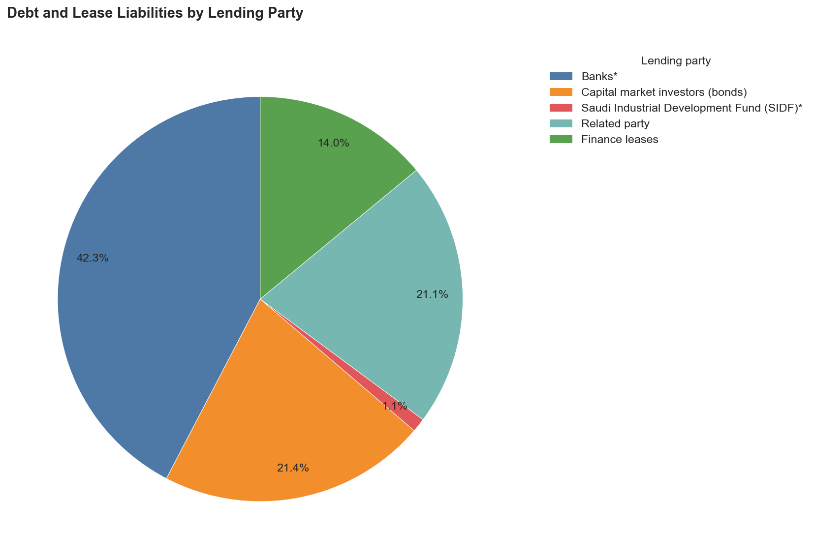

**Analysis**

The exact *unsubsidized* weighted average cost of capital (WACC) cannot be precisely calculated from the provided information, as key components such as the market-based cost of debt for non-related party borrowings, the cost of equity, and the statutory corporate tax rate are not explicitly stated. However, we can analyze the impact of the preferential financing.

**Preferential Financing and its Impact on Cost of Capital:**

SAR 7.44 Billion, representing 21% of the total debt of SAR 35.20 Billion as of December 31, 2024, is sourced from related parties, including government-controlled banks [2](https://s3-qa-8byte.s3.ap-south-1.amazonaws.com/sabic%2Fin/sabic_in_sabic_cc_compressed.pdf#page=64). A significant aspect of this related party financing is that these outstanding balances are **unsecured and interest-free** [1](https://s3-qa-8byte.s3.ap-south-1.amazonaws.com/sabic%2Fin/sabic-integrated-annual-report-2024-en_tcm1010-46870.pdf#page=237). This interest-free nature represents a substantial subsidy, effectively reducing the overall cost of debt and, consequently, the company's WACC.

To estimate an *unsubsidized* WACC on a standalone basis, one would need to:

1.  **Impute a Market Cost of Debt for Related Party Loans:** Replace the 0% interest rate on the SAR 7.44 Billion related party debt with an estimated market interest rate that the company would face for similar borrowings from commercial lenders. Given the company's strong credit ratings (A+/A1, upgraded to Aa3 by Moody's) [2](https://s3-qa-8byte.s3.ap-south-1.amazonaws.com/sabic%2Fin/sabic_in_sabic_cc_compressed.pdf#page=64), this market rate would likely be favorable but certainly above zero.
2.  **Determine the Cost of Equity (Ke):** This typically involves using models like the Capital Asset Pricing Model (CAPM), which requires a risk-free rate, market risk premium, and the company's equity beta, none of which are provided in the documents.
3.  **Identify the Effective Corporate Tax Rate (T):** While income tax and Zakat expenses are reported as SAR 0.14 Billion on an EBIT of SAR 5.74 Billion in 2024 [7](https://s3-qa-8byte.s3.ap-south-1.amazonaws.com/sabic%2Fin/sabic-integrated-annual-report-2024-en_tcm1010-46870.pdf#page=62), the statutory tax rate for WACC calculation is not explicitly stated, and the reported tax expense is influenced by factors like Zakat provision reversals and tax loss carryforwards [4](https://s3-qa-8byte.s3.ap-south-1.amazonaws.com/sabic%2Fin/sabic-integrated-annual-report-2024-en_tcm1010-46870.pdf#page=236), [7](https://s3-qa-8byte.s3.ap-south-1.amazonaws.com/sabic%2Fin/sabic-integrated-annual-report-2024-en_tcm1010-46870.pdf#page=62).

**Impact on Reported ROIC:**

The company defines its 

---

### De-pegging: Debt, FCF, Translation Losses

**Q:** With total debt at SAR 35.20 Billion, how does management assess the LTM Debt-to-Equity ratio and FCF Conversion under a 5-10% SAR de-pegging scenario, specifically quantifying the 'Exchange difference on translation' losses and the corresponding increase in SAR-equivalent debt service obligations?

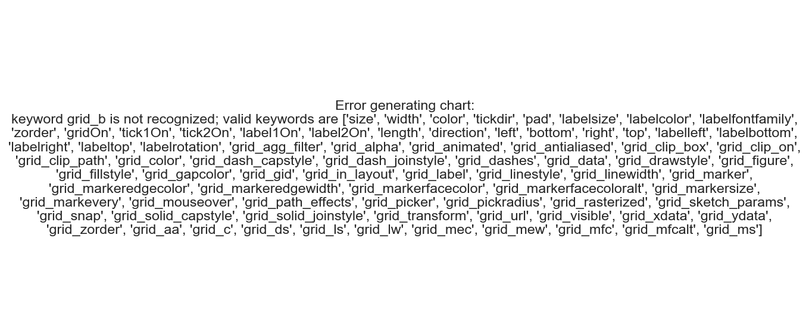

**Analysis**

The provided documents do not contain management's specific assessment or quantification of the LTM Debt-to-Equity ratio, 'Exchange difference on translation' losses, or the corresponding increase in SAR-equivalent debt service obligations under a hypothetical 5-10% SAR de-pegging scenario. Additionally, figures for FCF Conversion are not available, though Free Cash Flow (FCF) is defined as net cash generated from operating activities minus capital expenditures [3](https://s3-qa-8byte.s3.ap-south-1.amazonaws.com/sabic%2Fin%2Fsabic-integrated-annual-report-2024-en_tcm1010-46870.pdf#page=283).

However, based on the financial data for 2024:

*   **Current LTM Debt-to-Equity Ratio:** As of December 31, 2024, the company reported total debt and lease liabilities of SAR 35.20 Billion and total equity of SAR 183.92 Billion. After accounting for cash and cash equivalents and short-term investments, the net debt was SAR -3.01 Billion, resulting in a Net Debt-to-Equity ratio of -2% [1](https://s3-qa-8byte.s3.ap-south-1.amazonaws.com/sabic%2Fin%2Fsabic_in_sabic_cc_compressed.pdf#page=64), [2](https://s3-qa-8byte.s3.ap-south-1.amazonaws.com/sabic%2Fin%2Fsabic-integrated-annual-report-2024-en_tcm1010-46870.pdf#page=246).

*   **Assessment of 'Exchange difference on translation' and Debt Service Obligations under SAR De-pegging (General PE insight):**
    *   The company's total debt and lease liabilities are SAR 35.20 Billion, equivalent to US$ 9.39 Billion [1](https://s3-qa-8byte.s3.ap-south-1.amazonaws.com/sabic%2Fin%2Fsabic_in_sabic_cc_compressed.pdf#page=64). Concurrently, cash and cash equivalents plus short-term investments amount to SAR 38.21 Billion (US$ 10.19 Billion) [1](https://s3-qa-8byte.s3.ap-south-1.amazonaws.com/sabic%2Fin/sabic_in_sabic_cc_compressed.pdf#page=64). This indicates a net positive exposure to the US Dollar of approximately US$ 0.80 Billion (US$ 10.19 Billion in cash/investments minus US$ 9.39 Billion in debt).
    *   Therefore, a de-pegging of the SAR by 5-10% (meaning the SAR weakens against the USD) would likely result in an **'Exchange difference on translation' gain** on the company's net US Dollar asset position, rather than a loss. This gain would increase the SAR equivalent of the company's net US Dollar assets, thereby potentially improving (making more negative) the Net Debt-to-Equity ratio.
    *   For example, a 5% de-pegging would result in a translation gain of approximately SAR 0.15 Billion (US$ 0.80 Billion * 0.05 * 3.75), which would increase equity and further reduce net debt in SAR terms. A 10% de-pegging would result in a translation gain of approximately SAR 0.30 Billion.
    *   Regarding debt service obligations, if a portion of the debt service (interest and principal repayments) is denominated in US Dollars, a de-pegging of the SAR would increase the SAR-equivalent cost of these payments. However, the documents do not provide a breakdown of debt service obligations by currency, preventing a specific quantification.

To quantify the exact impact of a 5-10% SAR de-pegging, management would need to perform a specific sensitivity analysis, which is not included in the provided information. This analysis would require detailed breakdowns of foreign currency denominated assets and liabilities, hedging strategies, and projected cash flows in various currencies.

---

### Unsecured Working Capital Financing FCF Impact

**Q:** Beyond the SAR 35.20 Billion in disclosed debt and lease liabilities, what is the current and historic magnitude of Trade Payables and Other Current Liabilities as an *unsecured* financing vehicle, and how does this working capital intensity impact our true Free Cash Flow Conversion, considering any implicit cost of stretched payables?

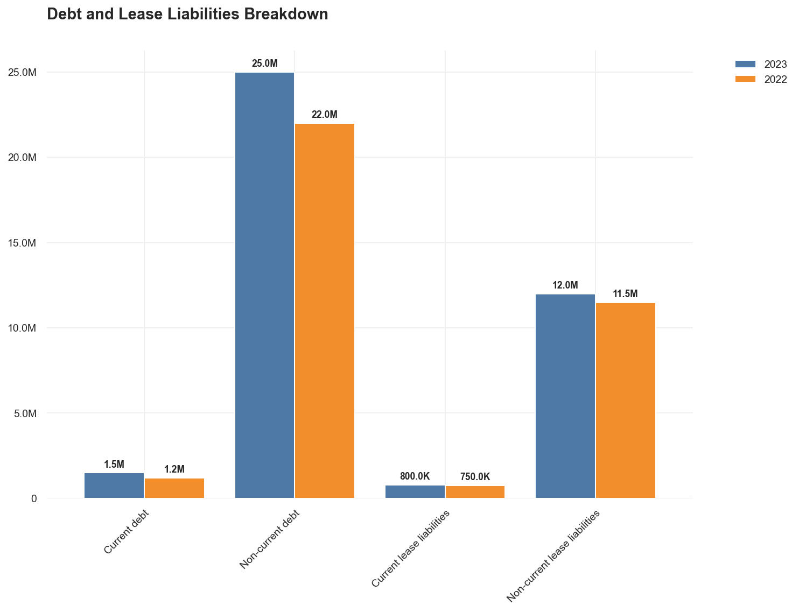

**Analysis**

As an unsecured financing vehicle, the current and historic magnitude of Trade Payables and Other Current Liabilities for the Group is substantial, often exceeding the disclosed debt and lease liabilities.

**Magnitude of Trade Payables and Other Current Liabilities (in thousands of Saudi Riyals):**

| Category | As at 31 December 2024 | As at 31 December 2023 |
| :-------------------------------- | :--------------------- | :--------------------- |
| Trade Payables [3](https://s3-qa-8byte.s3.ap-south-1.amazonaws.com/sabic%2Fin/sabic_in_sabic_cc_compressed.pdf#page=244) | 19,793,604 | 20,087,016 |
| Other Current Liabilities [5](https://s3-qa-8byte.s3.ap-south-1.amazonaws.com/sabic%2Fin/sabic-integrated-annual-report-2024-en_tcm1010-46870.pdf#page=230) | 19,695,999 | 18,198,349 |
| **Total** | **39,489,603** | **38,285,365** |

This translates to approximately SAR 39.49 Billion in 2024 and SAR 38.29 Billion in 2023, which is higher than the SAR 35.20 Billion in gross debt reported for 2024 [6](https://s3-qa-8byte.s3.ap-south-1.amazonaws.com/sabic%2Fin/sabic-integrated-annual-report-2024-en_tcm1010-46870.pdf#page=246).

**Breakdown of Other Current Liabilities (in thousands of Saudi Riyals):**

| Component [5](https://s3-qa-8byte.s3.ap-south-1.amazonaws.com/sabic%2Fin/sabic-integrated-annual-report-2024-en_tcm1010-46870.pdf#page=230) | As at 31 December 2024 | As at 31 December 2023 |
| :-------------------------------- | :--------------------- | :--------------------- |
| Dividends payable | 7,471,836 | 7,003,335 |
| Accrued liabilities | 5,285,127 | 6,568,645 |
| Employees related liabilities | 2,535,016 | 1,948,654 |
| Employee saving plan | 2,065,250 | 1,895,808 |
| Sales and other tax payables | 1,056,050 | 402,867 |
| Payable to related parties | 912,319 | 126,587 |
| Trade advances | 221,329 | 97,068 |
| Miscellaneous | 149,072 | 155,385 |
| **Total Current Other Liabilities** | **19,695,999** | **18,198,349** |

**Unsecured Financing Vehicle:**
Trade payables and the various components of other current liabilities (such as accrued liabilities, employee-related liabilities, and tax payables) generally function as unsecured financing. Specifically, outstanding balances with related parties are noted as unsecured and interest-free [4](https://s3-qa-8byte.s3.ap-south-1.amazonaws.com/sabic%2Fin/sabic-integrated-annual-report-2024-en_tcm1010-46870.pdf#page=237).

**Impact on Free Cash Flow Conversion and Implicit Cost of Stretched Payables:**
The provided documents, which are financial statements and notes, detail the magnitudes of these liabilities but do not offer an explicit analysis of their direct impact on Free Cash Flow Conversion or the implicit cost of stretched payables. This type of analytical insight is typically found in management's discussion and analysis or specific financial performance reports, which are not included in the retrieval results.

**General PE insight:**
High working capital intensity, particularly driven by significant trade payables and other current liabilities, can have a dual impact on Free Cash Flow (FCF) Conversion. While an increase in payables can temporarily boost operating cash flow by deferring payments (acting as an interest-free financing source), a consistently high or increasing level of these liabilities relative to revenue could indicate stretched payment terms. Stretched payables, if not managed carefully, can strain supplier relationships, potentially leading to less favorable terms, supply chain disruptions, or even higher input costs in the long run, thereby implicitly impacting profitability and true FCF conversion. A detailed analysis would require examining trends in Days Payable Outstanding (DPO) and comparing them against industry benchmarks, as well as assessing the company's overall working capital management efficiency.

---

## TOTAL DEBT PORTFOLIO OVERVIEW

### FX Impact and De-pegging Stress

**Q:** 50 Bn to SAR 35.20 Bn, with the "Other*" category adding SAR 0.54 Bn, explicitly citing foreign exchange effects. What is the precise FX impact embedded in this SAR 0.54 Bn, and has management stress-tested the LTM Debt-to-Equity ratio under a 5-10% de-pegging scenario, given the US$ 9.39 Bn of US$ denominated debt, to quantify the real risk to LP capital?

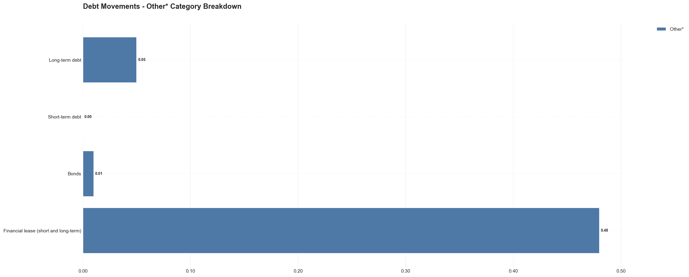

**Analysis**

Regarding the SAR 0.54 Bn in the "Other*" category, the provided information indicates that this amount mainly relates to interest, foreign exchange, and amortization effects [7](https://s3-qa-8byte.s3.ap-south-1.amazonaws.com/sabic%2Fin%2Fsabic-integrated-annual-report-2024-en_tcm1010-46870.pdf#page=64). However, a precise breakdown of the foreign exchange impact embedded within this SAR 0.54 Bn is not explicitly detailed in the available documents. Therefore, the exact FX impact cannot be quantified from the provided data.

Concerning whether management has stress-tested the LTM Debt-to-Equity ratio under a 5-10% de-pegging scenario, given the US$ 9.39 Bn of US$ denominated debt, the provided documents do not contain any information regarding such stress tests or the quantification of real risk to LP capital under de-pegging scenarios [7](https://s3-qa-8byte.s3.ap-south-1.amazonaws.com/sabic%2Fin%2Fsabic-integrated-annual-report-2024-en_tcm1010-46870.pdf#page=64). While the total debt portfolio overview shows US$ 9.39 Bn in US$ denominated debt and the debt-to-equity ratio is provided as -2% for 2024, there is no mention of scenario analysis for currency de-pegging [7](https://s3-qa-8byte.s3.ap-south-1.amazonaws.com/sabic%2Fin%2Fsabic-integrated-annual-report-2024-en_tcm1010-46870.pdf#page=64).

**General PE insight:** In a private equity context, understanding the precise foreign exchange exposure and the resilience of debt metrics to currency fluctuations is critical for assessing risk to limited partner (LP) capital. Given the significant US$ denominated debt, a de-pegging scenario could materially impact the SAR equivalent of the debt, potentially increasing the debt-to-equity ratio and affecting financial covenants. Without explicit stress testing results, LPs would typically seek further disclosure on the company's currency hedging strategies and sensitivity analysis to exchange rate movements.

---

### Debt Breakdown: FCF Impact

**Q:** 54 Bn "Other*" category, primarily covering interest and amortization effects, significantly increased the ending debt balance without a corresponding cash inflow. What is the granular breakdown of this SAR 0.54 Bn by interest and amortization, and how does this non-cash accretion impact our assessment of Free Cash Flow Conversion and the true underlying cash generation capacity, rather than just accounting accruals?

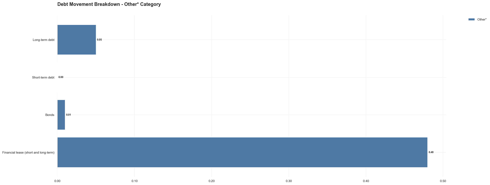

**Analysis**

The granular breakdown of the SAR 0.54 Bn "Other*" category by interest and amortization is not explicitly provided in the available information. The SAR 0.54 Bn represents the net "Other*" effect on the total debt and lease liabilities, which is stated to mainly relate to interest, foreign exchange, and amortization effects [2](https://s3-qa-8byte.s3.ap-south-1.amazonaws.com/sabic%2Fin%2Fsabic_in_sabic_cc_compressed.pdf#page=64).

While a direct breakdown of the SAR 0.54 Bn is not available, the financial statements do provide insights into larger non-cash movements affecting debt and lease liabilities for 2024:

*   **Debt (i):** "Other non-cash movements" amounted to SAR 1,935,345 thousand (approximately SAR 1.94 Bn), which mainly refers to interest attributable to debt [6](https://s3-qa-8byte.s3.ap-south-1.amazonaws.com/sabic%2Fin/sabic-integrated-annual-report-2024-en_tcm1010-46870.pdf#page=216).
*   **Lease (ii):** "Other non-cash movements" amounted to SAR 732,819 thousand (approximately SAR 0.73 Bn), which mainly includes additions to leases, interest expenses, foreign exchange differences, and remeasurement [6](https://s3-qa-8byte.s3.ap-south-1.amazonaws.com/sabic%2Fin/sabic-integrated-annual-report-2024-en_tcm1010-46870.pdf#page=216).

These larger non-cash movements contribute to the overall change in debt and lease liabilities, but the SAR 0.54 Bn is a net figure within the total debt portfolio overview [2](https://s3-qa-8byte.s3.ap-south-1.amazonaws.com/sabic%2Fin%2Fsabic_in_sabic_cc_compressed.pdf#page=64).

### Impact on Free Cash Flow Conversion and True Underlying Cash Generation Capacity

The SAR 0.54 Bn "Other*" category represents non-cash accretion to the ending debt balance [2](https://s3-qa-8byte.s3.ap-south-1.amazonaws.com/sabic%2Fin%2Fsabic_in_sabic_cc_compressed.pdf#page=64). As a non-cash item, it does not directly impact Free Cash Flow (FCF) or the true underlying cash generation capacity of the company. FCF is a cash-based metric that reflects actual cash inflows and outflows from operations and capital expenditures [3](https://s3-qa-8byte.s3.ap-south-1.amazonaws.com/sabic%2Fin%2Fsabic_in_sabic_cc_compressed.pdf#page=63).

*   **Free Cash Flow Conversion:** Non-cash accretion to debt, such as accrued interest that increases the principal balance or amortization effects, does not involve a cash outflow and therefore does not directly reduce Free Cash Flow. Consequently, it would not directly impact the Free Cash Flow Conversion ratio, which is based on actual cash generated.
*   **True Underlying Cash Generation Capacity:** The true underlying cash generation capacity is best assessed by analyzing the company's cash flow statement, specifically "Net cash generated from operating activities" and "Free cash flow" [3](https://s3-qa-8byte.s3.ap-south-1.amazonaws.com/sabic%2Fin%2Fsabic_in_sabic_cc_compressed.pdf#page=63). Non-cash movements like the SAR 0.54 Bn are accounting adjustments that affect the balance sheet but do not represent cash generated or consumed. While these accruals increase the reported debt balance, they do not reflect a corresponding cash inflow or outflow until the underlying cash transaction (e.g., interest payment) occurs.

**General PE insight:** From a Private Equity perspective, distinguishing between cash and non-cash movements is crucial for evaluating a company's financial health. Non-cash accretion to debt, while not immediately impacting cash flow, can signal future cash obligations (e.g., when accrued interest becomes payable) and can inflate reported leverage ratios if not properly understood. Analysts often adjust reported earnings and debt figures to arrive at "cash earnings" and "cash debt" to get a clearer picture of liquidity and solvency. The presence of significant non-cash debt accretion warrants closer scrutiny to ensure that the company's cash generation is sufficient to cover both its operational needs and its eventual cash debt service requirements.

---

### Debt Maturity & Refinancing Strategy

**Q:** 48 Bn in repayments, the total debt increased by SAR 1.70 Bn, demonstrating a persistent reliance on new borrowing. Given the short-term debt of SAR 2.07 Bn and long-term maturities up to 8 years, what is the precise annual debt maturity schedule for the next 36 months, and how does management plan to address the significant refinancing risk, particularly considering the gap between the total original loan amount of SAR 54.60 Bn and the current ending balance of SAR 35.20 Bn?

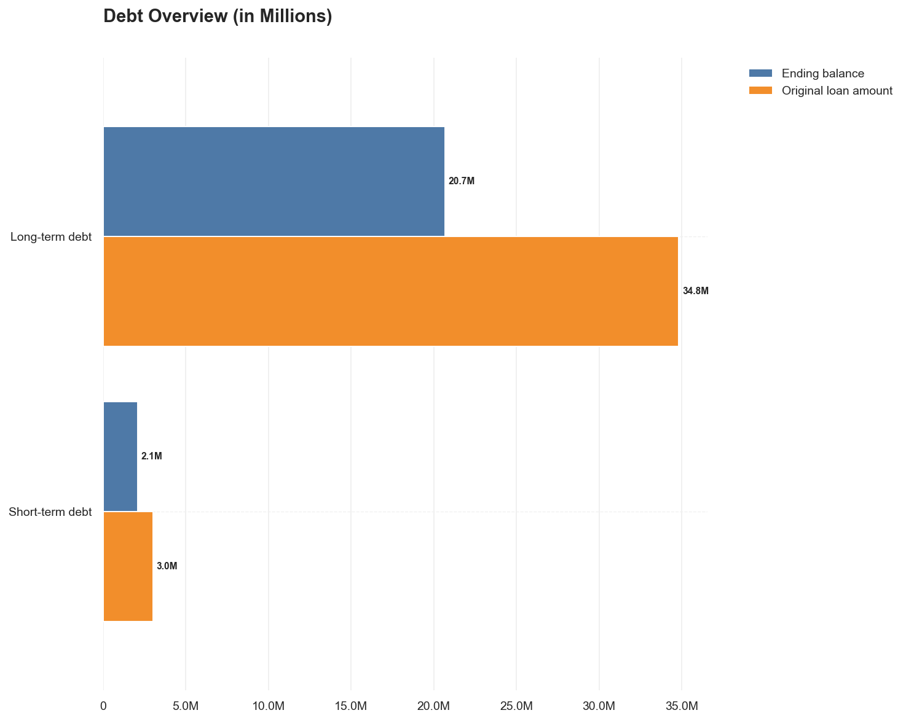

**Analysis**

Based on the provided information, a precise annual debt maturity schedule for the next 36 months can only be fully detailed for the first 12 months. For the subsequent 24 months, the debt is categorized as long-term, without a specific annual breakdown.

### Annual Debt Maturity Schedule for the Next 36 Months (SAR Bn)

*   **Next 12 Months (Year 1):** SAR 2.07 Bn, representing the short-term debt as of December 31, 2024 [1](https://s3-qa-8byte.s3.ap-south-1.amazonaws.com/sabic%2Fin/sabic_in_sabic_cc_compressed.pdf#page=64). This figure does not include any portion of financial leases that may mature within the first year, as that breakdown is not provided separately from the total financial lease liabilities.
*   **Months 13-36 (Years 2 & 3):** The precise annual maturity for this period is not detailed in the provided data. The remaining long-term debt of SAR 20.67 Bn has maturities ranging from 1 to 8 years, and financial lease liabilities of SAR 4.93 Bn have maturities ranging from 1 to 99 years [1](https://s3-qa-8byte.s3.ap-south-1.amazonaws.com/sabic%2Fin/sabic_in_sabic_cc_compressed.pdf#page=64). Bonds, totaling SAR 7.53 Bn, have maturities ranging from 4 to 26 years, indicating no bond maturities within the next 36 months [1](https://s3-qa-8byte.s3.ap-south-1.amazonaws.com/sabic%2Fin/sabic_in_sabic_cc_compressed.pdf#page=64).

### Management's Plan to Address Refinancing Risk

Management's approach to refinancing risk is embedded in its **Financing Policy**, which aims to ensure sufficient liquidity at all times while optimizing returns to shareholders through prudent leverage [1](https://s3-qa-8byte.s3.ap-south-1.amazonaws.com/sabic%2Fin/sabic_in_sabic_cc_compressed.pdf#page=64). Key elements include:

*   **Strong Liquidity Sources:** Primary sources of liquidity are cash flows from operations and borrowings under committed bank facilities [1](https://s3-qa-8byte.s3.ap-south-1.amazonaws.com/sabic%2Fin/sabic_in_sabic_cc_compressed.pdf#page=64).
*   **Robust Financial Position:** The company maintains strong standalone credit ratings, consistently in the A+/A1 band, with Moody's upgrading the rating to Aa3 in 2024, reflecting financial strength and resilience [1](https://s3-qa-8byte.s3.ap-south-1.amazonaws.com/sabic%2Fin/sabic_in_sabic_cc_compressed.pdf#page=64).
*   **Healthy Cash and Free Cash Flow:** As of December 31, 2024, cash and cash equivalents stood at SAR 30.54 Bn [3](https://s3-qa-8byte.s3.ap-south-1.amazonaws.com/sabic%2Fin/sabic_in_sabic_cc_compressed.pdf#page=63). Free cash flow in 2024 was SAR 6.16 Bn [3](https://s3-qa-8byte.s3.ap-south-1.amazonaws.com/sabic%2Fin/sabic_in_sabic_cc_compressed.pdf#page=63), [5](https://s3-qa-8byte.s3.ap-south-1.amazonaws.com/sabic%2Fin/sabic_in_sabic_cc_compressed.pdf#page=15), [6](https://s3-qa-8byte.s3.ap-south-1.amazonaws.com/sabic%2Fin/sabic_in_sabic_cc_compressed.pdf#page=60).
*   **Net Cash Position:** The company reported a net cash position of SAR -3.01 Bn (meaning cash exceeds debt) at year-end 2024 [1](https://s3-qa-8byte.s3.ap-south-1.amazonaws.com/sabic%2Fin/sabic_in_sabic_cc_compressed.pdf#page=64), [5](https://s3-qa-8byte.s3.ap-south-1.amazonaws.com/sabic%2Fin/sabic_in_sabic_cc_compressed.pdf#page=15), [6](https://s3-qa-8byte.s3.ap-south-1.amazonaws.com/sabic%2Fin/sabic_in_sabic_cc_compressed.pdf#page=60).
*   **Strategic Portfolio Management:** A global portfolio review is underway to redirect capital towards competitive strengths and divest underperforming assets, enhancing capital efficiency and value creation [5](https://s3-qa-8byte.s3.ap-south-1.amazonaws.com/sabic%2Fin/sabic_in_sabic_cc_compressed.pdf#page=15).

### Explanation for the Gap Between Original Loan Amount and Current Ending Balance

The gap between the total original loan amount of SAR 54.60 Bn and the current ending balance of SAR 35.20 Bn [1](https://s3-qa-8byte.s3.ap-south-1.amazonaws.com/sabic%2Fin/sabic_in_sabic_cc_compressed.pdf#page=64) is primarily due to cumulative repayments made over the life of the loans. The "Original loan amount" represents the total principal amount initially borrowed across all debt facilities, while the "Ending balance" reflects the outstanding principal amount at a specific reporting date (December 31, 2024) after accounting for all historical repayments, new borrowings, and other adjustments like interest, foreign exchange, and amortization effects [1](https://s3-qa-8byte.s3.ap-south-1.amazonaws.com/sabic%2Fin/sabic_in_sabic_cc_compressed.pdf#page=64). The difference indicates the total principal that has been repaid since the inception of these loans.

**General PE insight:** While the company has a strong liquidity position and credit rating, the lack of a detailed annual maturity profile for long-term debt beyond the first year makes it challenging to precisely assess future refinancing peaks. For a comprehensive due diligence, a more granular breakdown of long-term debt maturities would be essential to model potential refinancing needs and strategies effectively.

---

## SABIC's debt-to-equity ratio developed as follows:

### FCF Conversion: Capital Erosion & ROIC

**Q:** Despite a SAR 0.45 Bn YoY increase in EBITDA, SABIC's Net Cash position deteriorated by SAR 5.75 Bn (from -SAR 8.76 Bn to -SAR 3.01 Bn), coinciding with an SAR 11.36 Bn decline in Total Equity. Provide an LTM bridge analysis of Free Cash Flow conversion, specifically detailing how increased working capital intensity or sustained capital outflows, beyond what EBITDA generates, led to this significant capital erosion and its impact on ROIC.

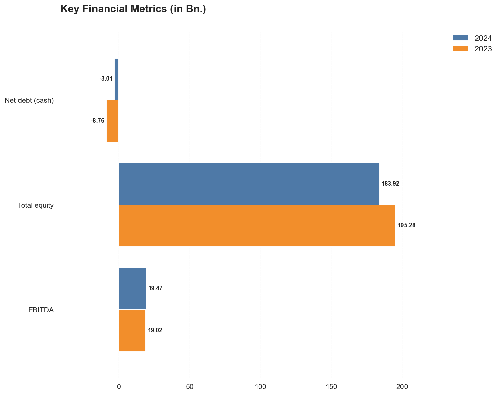

**Analysis**

Despite a SAR 0.45 Bn year-over-year (YoY) increase in EBITDA to SAR 19.47 Bn in 2024 [3](https://s3-qa-8byte.s3.ap-south-1.amazonaws.com/sabic%2Fin/sabic-integrated-annual-report-2024-en_tcm1010-46870.pdf#page=61), SABIC's Net Cash position deteriorated by SAR 5.75 Bn (from SAR 8.76 Bn net cash in 2023 to SAR 3.01 Bn net cash in 2024) [6](https://s3-qa-8byte.s3.ap-south-1.amazonaws.com/sabic%2Fin/sabic_in_sabic_cc_compressed.pdf#page=64). This coincided with an SAR 11.36 Bn decline in Total Equity, primarily due to SAR 10.20 Bn in declared dividends [4](https://s3-qa-8byte.s3.ap-south-1.amazonaws.com/sabic%2Fin/sabic-integrated-annual-report-2024-en_tcm1010-46870.pdf#page=62).

### LTM Free Cash Flow (FCF) Conversion Bridge Analysis (2023 to 2024)
SABIC experienced a significant decline in Free Cash Flow (FCF) conversion, with FCF decreasing by SAR 7.80 Bn (56%) from SAR 13.96 Bn in 2023 to SAR 6.16 Bn in 2024 [5](https://s3-qa-8byte.s3.ap-south-1.amazonaws.com/sabic%2Fin/sabic_in_sabic_cc_compressed.pdf#page=63). This deterioration in FCF, despite the EBITDA increase, was primarily driven by less favorable working capital movements:

*   **Operating Cash Flow (OCF) Decline:** Net cash generated from operating activities decreased by SAR 8.09 Bn (33%) from SAR 24.45 Bn in 2023 to SAR 16.36 Bn in 2024 [5](https://s3-qa-8byte.s3.ap-south-1.amazonaws.com/sabic%2Fin/sabic_in_sabic_cc_compressed.pdf#page=63). This substantial reduction was "mainly the result of a reduction in working capital in 2023, mostly due to inventory management efforts" [5](https://s3-qa-8byte.s3.ap-south-1.amazonaws.com/sabic%2Fin/sabic_in_sabic_cc_compressed.pdf#page=63). This indicates that while 2023 benefited from a significant positive cash inflow from working capital reduction, this benefit was not replicated in 2024, leading to a comparative increase in working capital requirements or less efficient working capital management in the current year.
*   **Capital Expenditures (CapEx):** Capital expenditures remained broadly stable YoY, at SAR 10.20 Bn in 2024 compared to SAR 10.49 Bn in 2023 [5](https://s3-qa-8byte.s3.ap-south-1.amazonaws.com/sabic%2Fin/sabic_in_sabic_cc_compressed.pdf#page=63). While not an increasing outflow, these sustained capital investments continued to consume a significant portion of operating cash flow.

### Impact on Net Cash Position and Total Equity
The SAR 7.80 Bn decline in FCF directly contributed to the SAR 5.75 Bn deterioration in SABIC's Net Cash position [6](https://s3-qa-8byte.s3.ap-south-1.amazonaws.com/sabic%2Fin/sabic_in_sabic_cc_compressed.pdf#page=64]. The significant capital outflow in the form of SAR 10.20 Bn in declared dividends was the primary driver for the SAR 11.36 Bn decline in Total Equity attributable to equity holders of the Parent [4](https://s3-qa-8byte.s3.ap-south-1.amazonaws.com/sabic%2Fin/sabic-integrated-annual-report-2024-en_tcm1010-46870.pdf#page=62).

### Impact on Return on Invested Capital (ROIC)
Despite the capital erosion, SABIC's ROIC *improved* from 1.63% in 2023 to 3.09% in 2024. This improvement was driven by:

*   **Increased Profitability:** Net income from continuing operations rose significantly by 61% to SAR 2.10 Bn in 2024, from SAR 1.30 Bn in 2023 [3](https://s3-qa-8byte.s3.ap-south-1.amazonaws.com/sabic%2Fin/sabic-integrated-annual-report-2024-en_tcm1010-46870.pdf#page=61).
*   **Lower Effective Tax Rate:** Income tax and Zakat expenses decreased by 84% to SAR 0.14 Bn in 2024, mainly due to the reversal of Zakat provisions [4](https://s3-qa-8byte.s3.ap-south-1.amazonaws.com/sabic%2Fin/sabic-integrated-annual-report-2024-en_tcm1010-46870.pdf#page=62), which boosted Net Operating Profit After Tax (NOPAT).
*   **Reduced Invested Capital:** Invested Capital decreased from SAR 186.52 Bn in 2023 to SAR 180.91 Bn in 2024, primarily due to the decline in Total Equity [4](https://s3-qa-8byte.s3.ap-south-1.amazonaws.com/sabic%2Fin/sabic-integrated-annual-report-2024-en_tcm1010-46870.pdf#page=62] and the shift in net cash position [6](https://s3-qa-8byte.s3.ap-south-1.amazonaws.com/sabic%2Fin/sabic_in_sabic_cc_compressed.pdf#page=64).

In summary, while SABIC's EBITDA increased, the significant decline in FCF due to less favorable working capital movements and sustained dividend outflows led to a deterioration in its net cash position and a reduction in total equity. However, improved profitability and a more efficient capital base resulted in an increase in ROIC.

---

### Working Capital & Liquidity Strategy

**Q:** Given the **SAR 5.75 Bn deterioration in Net Cash** and a **SAR 4.04 Bn decline in total cash and short-term investments** YoY, how has the firm's working capital intensity evolved? What specific measures are being taken to mitigate any increasing reliance on trade payables or other current liabilities as a primary, unsecured financing vehicle?

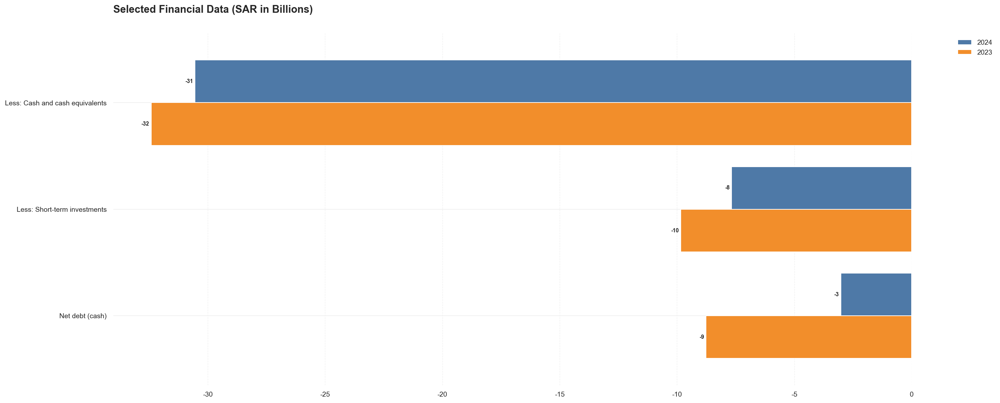

**Analysis**

Regarding the firm's working capital intensity, the net cash generated from operating activities decreased by 33% to SAR 16.36 Bn in 2024 from SAR 24.45 Bn in 2023 [1](https://s3-qa-8byte.s3.ap-south-1.amazonaws.com/sabic%2Fin%2Fsabic-integrated-annual-report-2024-en_tcm1010-46870.pdf#page=63). This decline was mainly attributed to a significant reduction in working capital in 2023, primarily driven by inventory management efforts [1](https://s3-qa-8byte.s3.ap-south-1.amazonaws.com/sabic%2Fin/sabic-integrated-annual-report-2024-en_tcm1010-46870.pdf#page=63). This suggests that while 2023 saw an improvement in working capital efficiency, the operating cash flow in 2024 was lower, indicating a potential increase in working capital intensity compared to the previous year's optimized state. Free cash flow also saw a substantial decrease of 56% to SAR 6.16 Bn in 2024 from SAR 13.96 Bn in 2023, also largely influenced by inventory performance in 2023 [1](https://s3-qa-8byte.s3.ap-south-1.amazonaws.com/sabic%2Fin/sabic-integrated-annual-report-2024-en_tcm1010-46870.pdf#page=63). While the user's query mentions a SAR 5.75 Bn deterioration in Net Cash, the financial highlights indicate an *improvement* in the net cash (debt) position, moving from SAR -8.76 Bn in 2023 to SAR -3.01 Bn in 2024, representing a positive change of SAR 5.75 Bn [6](https://s3-qa-8byte.s3.ap-south-1.amazonaws.com/sabic%2Fin/sabic_in_sabic_cc_compressed.pdf#page=60). Additionally, cash and cash equivalents declined by SAR 3.26 Bn, from SAR 33.80 Bn in 2023 to SAR 30.54 Bn in 2024 [1](https://s3-qa-8byte.s3.ap-south-1.amazonaws.com/sabic%2Fin/sabic-integrated-annual-report-2024-en_tcm1010-46870.pdf#page=63). Measures being taken to mitigate increasing reliance on trade payables or other current liabilities as a primary, unsecured financing vehicle include: *   **Decreased Total Liabilities**: Total liabilities at year-end 2024 decreased by SAR 5.00 Bn (5%) to SAR 94.10 Bn from SAR 99.10 Bn in 2023. This reduction was primarily driven by the release of Hadeed liabilities from liabilities held for sale, which reduced total liabilities by SAR 5.70 Bn [2](https://s3-qa-8byte.s3.ap-south-1.amazonaws.com/sabic%2Fin/sabic-integrated-annual-report-2024-en_tcm1010-46870.pdf#page=62). This indicates a reduction in overall liabilities, rather than an increasing reliance. *   **Prudent Financing Policy**: The firm maintains a financing policy focused on effective, efficient, and prudent financial management and controls, continuously evaluating its optimal capital and financing structure to align with strategic plans and growth objectives [7](https://s3-qa-8byte.s3.ap-south-1.amazonaws.com/sabic%2Fin/sabic_in_sabic_cc_compressed.pdf#page=20). *   **Strong Credit Ratings**: SABIC's standalone credit ratings consistently remain in the A+/A1 band, positioning it among the highest-rated global chemical companies. In 2024, its long-term credit rating was upgraded to Aa3 by Moody’s, reflecting resilience and a strong financial position [7](https://s3-qa-8byte.s3.ap-south-1.amazonaws.com/sabic%2Fin/sabic_in_sabic_cc_compressed.pdf#page=20). These strong ratings provide access to diverse and potentially more favorable financing options, reducing the need to rely heavily on short-term, unsecured liabilities. *   **Capital Market Engagement**: The company actively engages with capital market participants and has a structured dividend distribution policy, demonstrating a disciplined approach to capital management and investor relations [5](https://s3-qa-8byte.s3.ap-south-1.amazonaws.com/sabic%2Fin/sabic_in_sabic_cc_compressed.pdf#page=19).

---

### Dissect Equity Erosion and ROIC Impact

**Q:** Beyond operational performance, the **SAR 11.36 Bn decline in Total Equity** from 2023 to 2024, despite a SAR 0.45 Bn increase in EBITDA, is alarming. Dissect the precise impact of non-controlling interest dividends, associate losses, and any extraordinary cash distributions or share repurchases that contributed to this substantial equity erosion, demanding an LTM bridge analysis of ROIC decomposition.

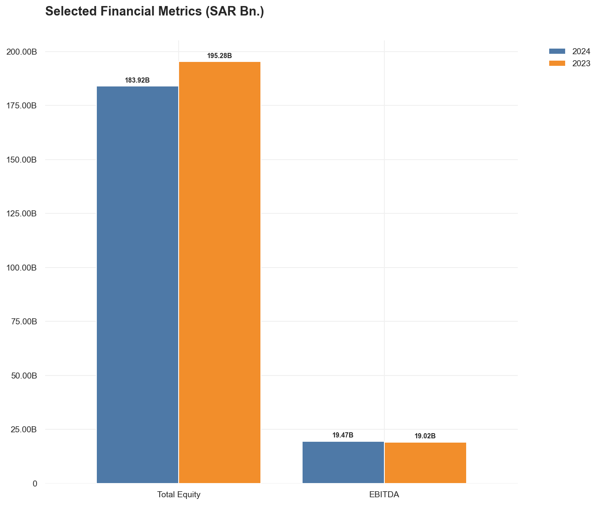

**Analysis**

The SAR 11.36 Bn decline in Total Equity from 2023 to 2024, despite a SAR 0.45 Bn increase in EBITDA [2](https://s3-qa-8byte.s3.ap-south-1.amazonaws.com/sabic%2Fin/sabic-integrated-annual-report-2024-en_tcm1010-46870.pdf#page=61), can be dissected as follows:

**1. Decline in Total Equity:**
Total Equity decreased from SAR 195.28 Bn in 2023 to SAR 183.92 Bn in 2024, representing a decline of SAR 11.36 Bn [1](https://s3-qa-8byte.s3.ap-south-1.amazonaws.com/sabic%2Fin/sabic-integrated-annual-report-2024-en_tcm1010-46870.pdf#page=62).

This overall decline is composed of:
*   **Equity attributable to equity holders of the Parent:** Decreased by SAR 10.60 Bn, from SAR 167.43 Bn in 2023 to SAR 156.83 Bn in 2024 [1](https://s3-qa-8byte.s3.ap-south-1.amazonaws.com/sabic%2Fin/sabic-integrated-annual-report-2024-en_tcm1010-46870.pdf#page=62).
*   **Non-controlling interests:** Decreased by SAR 0.76 Bn, from SAR 27.85 Bn in 2023 to SAR 27.09 Bn in 2024 [1](https://s3-qa-8byte.s3.ap-south-1.amazonaws.com/sabic%2Fin/sabic-integrated-annual-report-2024-en_tcm1010-46870.pdf#page=62).

**2. Impact of Non-Controlling Interest Dividends:**
While the exact amount of dividends paid to non-controlling interests in 2024 is not explicitly stated, the company's net cash used in financing activities decreased, primarily reflecting *lower* dividend payments to non-controlling interests compared to the previous year [3](https://s3-qa-8byte.s3.ap-south-1.amazonaws.com/sabic%2Fin/sabic_in_sabic_cc_compressed.pdf#page=63). Despite being lower, these dividend payments would still contribute to the SAR 0.76 Bn reduction in non-controlling interests.

**3. Impact of Associate Losses:**
Losses from non-integral joint ventures and associates were negligible, amounting to SAR 0.000547 Bn in 2023 and none in 2024 [5](https://s3-qa-8byte.s3.ap-south-1.amazonaws.com/sabic%2Fin/sabic-integrated-annual-report-2024-en_tcm1010-46870.pdf#page=238). Therefore, associate losses were not a material contributor to the substantial equity erosion observed.

**4. Impact of Extraordinary Cash Distributions or Share Repurchases:**
The primary driver for the SAR 10.60 Bn decline in Equity attributable to equity holders of the Parent was **declared dividends of SAR 10.20 Bn** [1](https://s3-qa-8byte.s3.ap-south-1.amazonaws.com/sabic%2Fin/sabic-integrated-annual-report-2024-en_tcm1010-46870.pdf#page=62). This includes SAR 4.8 Bn for H1 2023 and SAR 5.1 Bn for H2 2023, distributed in 2024 [6](https://s3-qa-8byte.s3.ap-south-1.amazonaws.com/sabic%2Fin/sabic_in_sabic_cc_compressed.pdf#page=19). The provided information does not explicitly mention any other extraordinary cash distributions or share repurchases that significantly contributed to this equity erosion.

It is important to note that the company reported a **net income attributable to equity holders of the Parent of SAR 1.54 Bn** in 2024, a substantial improvement from a net loss of SAR 2.77 Bn in 2023 [2](https://s3-qa-8byte.s3.ap-south-1.amazonaws.com/sabic%2Fin/sabic-integrated-annual-report-2024-en_tcm1010-46870.pdf#page=61). This positive net income partially offset the impact of the declared dividends on the parent's equity.

**5. LTM Bridge Analysis of ROIC Decomposition:**
The necessary detailed financial data, such as Net Operating Profit After Tax (NOPAT), average invested capital components, and quarterly financial statements required for an LTM (Last Twelve Months) bridge analysis of ROIC (Return on Invested Capital) decomposition, are not available in the provided retrieval results. Therefore, this specific analysis cannot be performed. To conduct such an analysis, detailed breakdowns of operating income, taxes, and balance sheet items (e.g., operating working capital, property, plant & equipment) for both current and prior periods, ideally on a quarterly basis, would be required.

---

## Debt Instrument

### Capital Structure: Real LP Value

**Q:** 27 A Bn. total debt load is significant, and I'm not here for a PowerPoint fairy tale. I want the unvarnished truth on how this capital structure impacts value for our LPs.

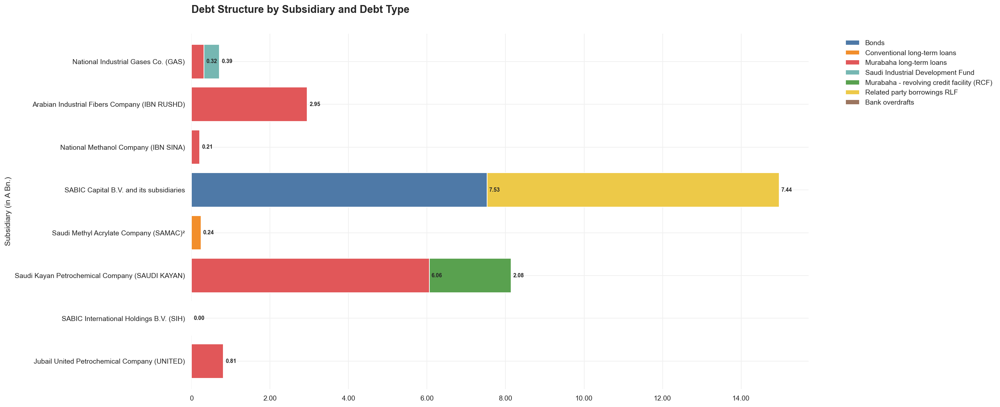

**Analysis**

While your concern regarding a significant debt load is valid, the financial statements indicate a total debt and lease liabilities of SAR 35.20 billion (approximately US$ 9.39 billion) as of December 31, 2024 [3](https://s3-qa-8byte.s3.ap-south-1.amazonaws.com/sabic%2Fin/sabic-integrated-annual-report-2024-en_tcm1010-46870.pdf#page=64). However, a critical aspect of this capital structure is the company's substantial cash and short-term investments, resulting in a **net cash position**.

For our LPs, the unvarnished truth is that this capital structure, despite the gross debt figure, presents a highly favorable and de-risked profile:

*   **Net Cash Position:** As of December 31, 2024, the company reported a **net cash position of SAR 3.01 billion (US$ 0.80 billion)** [3](https://s3-qa-8byte.s3.ap-south-1.amazonaws.com/sabic%2Fin/sabic-integrated-annual-report-2024-en_tcm1010-46870.pdf#page=64), [2](https://s3-qa-8byte.s3.ap-south-1.amazonaws.com/sabic%2Fin/sabic_in_sabic_cc_compressed.pdf#page=246). This means the company holds more cash and short-term deposits than its total borrowings, effectively eliminating traditional debt-related risks.

*   **Strong Leverage Ratios:**
    *   The **Net Debt to Equity ratio is (2)%** for 2024 [3](https://s3-qa-8byte.s3.ap-south-1.amazonaws.com/sabic%2Fin/sabic-integrated-annual-report-2024-en_tcm1010-46870.pdf#page=64), [2](https://s3-qa-8byte.s3.ap-south-1.amazonaws.com/sabic%2Fin/sabic_in_sabic_cc_compressed.pdf#page=246), indicating a robust equity base relative to its net cash position.
    *   The **Net Debt to EBITDA ratio is -0.15x** for 2024 [3](https://s3-qa-8byte.s3.ap-south-1.amazonaws.com/sabic%2Fin/sabic-integrated-annual-report-2024-en_tcm1010-46870.pdf#page=64). A negative ratio signifies that the company has more cash than debt relative to its earnings, demonstrating exceptional financial health and operational cash generation.

*   **High Credit Ratings & Covenant Compliance:** Moody’s upgraded the company’s rating from A1 to Aa3 in 2024, reflecting its continued financial strength and resilience [3](https://s3-qa-8byte.s3.ap-south-1.amazonaws.com/sabic%2Fin/sabic-integrated-annual-report-2024-en_tcm1010-46870.pdf#page=64). Furthermore, the Group was in compliance with all debt covenants as of December 31, 2024, with no indications of future difficulties [2](https://s3-qa-8byte.s3.ap-south-1.amazonaws.com/sabic%2Fin/sabic_in_sabic_cc_compressed.pdf#page=246).

*   **Ample Liquidity and Financial Flexibility:** The company maintains a financing policy aimed at ensuring sufficient liquidity, supported by cash flows from operations and significant undrawn committed credit facilities amounting to SAR 12.585 billion as of December 31, 2024 [3](https://s3-qa-8byte.s3.ap-south-1.amazonaws.com/sabic%2Fin/sabic-integrated-annual-report-2024-en_tcm1010-46870.pdf#page=64), [5](https://s3-qa-8byte.s3.ap-south-1.amazonaws.com/sabic%2Fin/sabic_in_sabic_cc_compressed.pdf#page=223). This provides substantial flexibility for funding ongoing operations, capital expenditures, and strategic investments without undue reliance on new debt.

**Impact on LP Value:**

This capital structure significantly **enhances value for LPs** by:

1.  **Minimizing Financial Risk:** The net cash position and low leverage ratios substantially reduce the risk of financial distress, protecting LP capital and ensuring stability.
2.  **Supporting Sustainable Distributions:** Strong liquidity and operational cash flows enable consistent dividend distributions, as evidenced by SAR 10.20 billion in declared dividends in 2024 [4](https://s3-qa-8byte.s3.ap-south-1.amazonaws.com/sabic%2Fin/sabic-integrated-annual-report-2024-en_tcm1010-46870.pdf#page=62).
3.  **Enabling Strategic Growth:** The financial flexibility allows the company to pursue growth opportunities, invest in joint ventures, and fund capital expenditures without over-leveraging, potentially leading to long-term value appreciation.
4.  **Maintaining Cost-Efficient Capital:** High credit ratings translate to lower borrowing costs should the company decide to take on additional debt in the future, preserving profitability.

In summary, while the gross debt figure might seem substantial, the underlying financial health, characterized by a net cash position and strong liquidity, indicates a very conservative and robust capital structure that is highly beneficial for LPs.

---

### FX De-Pegging Debt-to-Equity Stress

**Q:** Given SABIC Capital B.V.'s 14.96 A Bn. combined debt (7.53 A Bn. in Bonds, 7.44 A Bn. in Related Party Borrowings), quantify the actual FX exposure and sensitivity to the SAR/USD peg. Present a stress-tested LTM Debt-to-Equity ratio, illustrating the direct impact of a 5% and 10% de-pegging scenario on this substantial foreign currency-denominated liability, accounting for any "Exchange difference on translation" losses.

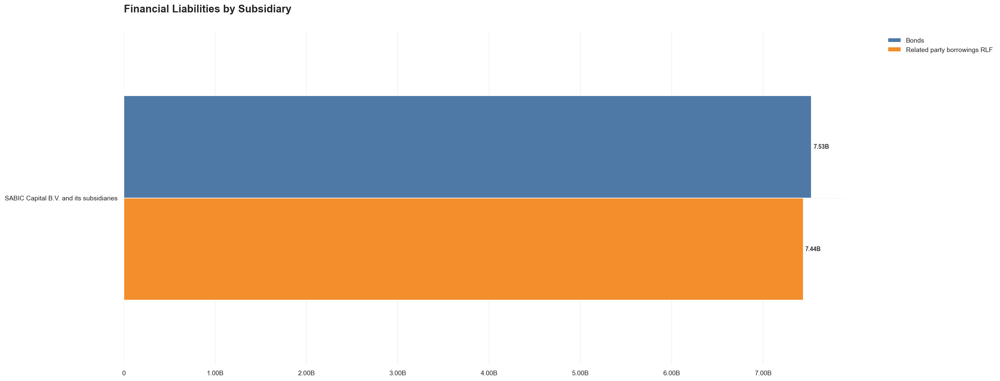

**Analysis**

SABIC Capital B.V.'s combined debt of 14.96 A Bn. (7.53 A Bn. in Bonds and 7.44 A Bn. in Related Party Borrowings) is considered to be primarily exposed to foreign currency fluctuations, specifically the US Dollar, given that SABIC's bonds are issued in US Dollars and the Saudi Riyal (SAR) is pegged to the US Dollar at 3.75 SAR/USD [2](https://s3-qa-8byte.s3.ap-south-1.amazonaws.com/sabic%2Fin%2Fsabic_in_sabic_cc_compressed.pdf#page=65), [3](https://s3-qa-8byte.s3.ap-south-1.amazonaws.com/sabic%2Fin%2Fsabic_in_sabic_cc_compressed.pdf#page=20). This 14.96 A Bn. SAR debt is equivalent to approximately 3.99 US$ Bn. (14.96 A Bn. / 3.75 SAR/USD).

**FX Exposure and Sensitivity:**

The actual FX exposure for SABIC Capital B.V.'s debt is the full 14.96 A Bn. SAR equivalent, as a de-pegging of the SAR from the USD would directly increase the SAR value of these USD-denominated liabilities. The sensitivity is quantified by the change in the SAR value of this debt under de-pegging scenarios.

**Stress-Tested LTM Debt-to-Equity Ratio (2024):**

SABIC's Last Twelve Months (LTM) Net Debt to Equity ratio for 2024 was -2% [1](https://s3-qa-8byte.s3.ap-south-1.amazonaws.com/sabic%2Fin%2Fsabic-integrated-annual-report-2024-en_tcm1010-46870.pdf#page=64), [4](https://s3-qa-8byte.s3.ap-south-1.amazonaws.com/sabic%2Fin%2Fsabic_in_sabic_cc_compressed.pdf#page=246). This negative ratio indicates a net cash position. The stress test below illustrates the direct impact of a 5% and 10% de-pegging of the SAR/USD peg on this ratio, accounting for the increase in the SAR-denominated liability and a corresponding reduction in equity due to translation losses.

**Current Financials (2024):**
*   Total Debt and Lease Liabilities: 35.20 A Bn. [1](https://s3-qa-8byte.s3.ap-south-1.amazonaws.com/sabic%2Fin%2Fsabic-integrated-annual-report-2024-en_tcm1010-46870.pdf#page=64)
*   Cash and Cash Equivalents: 30.54 A Bn. [1](https://s3-qa-8byte.s3.ap-south-1.amazonaws.com/sabic%2Fin%2Fsabic-integrated-annual-report-2024-en_tcm1010-46870.pdf#page=64)
*   Short-term Investments: 7.67 A Bn. [1](https://s3-qa-8byte.s3.ap-south-1.amazonaws.com/sabic%2Fin/sabic-integrated-annual-report-2024-en_tcm1010-46870.pdf#page=64)
*   Net Debt: -3.01 A Bn. [1](https://s3-qa-8byte.s3.ap-south-1.amazonaws.com/sabic%2Fin/sabic-integrated-annual-report-2024-en_tcm1010-46870.pdf#page=64)
*   Total Equity: 183.92 A Bn. [1](https://s3-qa-8byte.s3.ap-south-1.amazonaws.com/sabic%2Fin/sabic-integrated-annual-report-2024-en_tcm1010-46870.pdf#page=64)
*   Current Net Debt to Equity Ratio: -2% [1](https://s3-qa-8byte.s3.ap-south-1.amazonaws.com/sabic%2Fin/sabic-integrated-annual-report-2024-en_tcm1010-46870.pdf#page=64)

**Stress Test Scenarios:**

| Scenario | SAR/USD Exchange Rate | Increase in SABIC Capital B.V. Debt (A Bn.) | New Total Debt (A Bn.) | New Net Debt (A Bn.) | New Total Equity (A Bn.) | Stress-Tested Net Debt to Equity Ratio |
| :------- | :-------------------- | :------------------------------------------ | :--------------------- | :------------------- | :----------------------- | :------------------------------------- |
| Current  | 3.75                  | 0.00                                        | 35.20                  | -3.01                | 183.92                   | -2.00%                                 |
| 5% De-peg | 3.9375                | 0.740                                       | 35.940                 | -2.270               | 183.180                  | -1.24%                                 |
| 10% De-peg | 4.125                 | 1.496                                       | 36.696                 | -1.514               | 182.424                  | -0.83%                                 |

**Impact:**

A de-pegging of the SAR/USD by 5% would increase the SAR equivalent of SABIC Capital B.V.'s debt by 0.740 A Bn., shifting SABIC's Net Debt to Equity ratio from -2.00% to -1.24%. A 10% de-pegging would result in a 1.496 A Bn. increase in the SAR equivalent of the debt, further impacting the Net Debt to Equity ratio to -0.83%. This demonstrates that while SABIC maintains a strong net cash position, a significant de-pegging event would reduce its financial flexibility by increasing its liabilities and decreasing its equity through translation losses, making its net debt position less favorable.

**General PE insight:** While SABIC's current net cash position provides a buffer against such currency movements, it's crucial for companies with substantial foreign currency-denominated liabilities to consider hedging strategies to mitigate potential adverse impacts from significant de-pegging events, especially given the long-term nature of some of its debt instruments [1](https://s3-qa-8byte.s3.ap-south-1.amazonaws.com/sabic%2Fin%2Fsabic-integrated-annual-report-2024-en_tcm1010-46870.pdf#page=64).

---

### FCF Conversion: Debt Sustainability & Leakage

**Q:** With 7.44 A Bn. in related party borrowings at SABIC Capital B.V. and 12.58 A Bn. in external Murabaha long-term loans across subsidiaries, explain the consolidated LTM Free Cash Flow conversion. We need absolute clarity if this debt is organically sustainable, or if it's masking structural capital leakage to Non-Controlling Interests or non-recurring P&L boosts from provision releases in Zakat/Tax (Note 31).

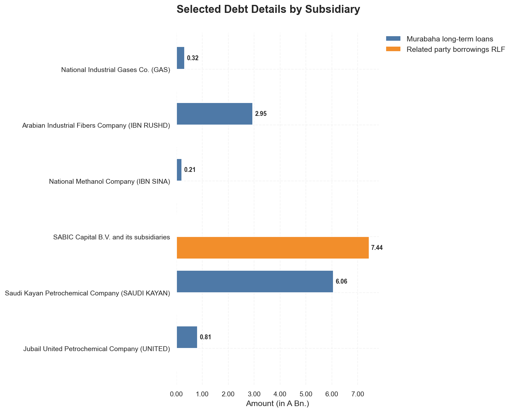

**Analysis**

SABIC's consolidated Last Twelve Months (LTM) Free Cash Flow (FCF) for 2024 was 6.16 A Bn. [4](https://s3-qa-8byte.s3.ap-south-1.amazonaws.com/sabic%2Fin%2Fsabic_in_sabic_cc_compressed.pdf#page=63). This represents a 56% decrease from 13.96 A Bn. in 2023, primarily attributed to inventory performance in 2023 [4](https://s3-qa-8byte.s3.ap-south-1.amazonaws.com/sabic%2Fin%2Fsabic_in_sabic_cc_compressed.pdf#page=63).

Regarding the debt structure:
*   Related party borrowings at SABIC Capital B.V. and its subsidiaries amounted to 7.44 A Bn. as of December 31, 2024 [2](https://s3-qa-8byte.s3.ap-south-1.amazonaws.com/sabic%2Fin%2Fsabic_in_sabic_cc_compressed.pdf#page=65), [1](https://s3-qa-8byte.s3.ap-south-1.amazonaws.com/sabic%2Fin/sabic-integrated-annual-report-2024-en_tcm1010-46870.pdf#page=64).
*   External Murabaha long-term loans across various subsidiaries totaled 12.58 A Bn. as of December 31, 2024 [2](https://s3-qa-8byte.s3.ap-south-1.amazonaws.com/sabic%2Fin/sabic_in_sabic_cc_compressed.pdf#page=65).

**Debt Sustainability:**
SABIC's debt appears organically sustainable based on the following indicators:
*   **Strong Financial Position:** The company maintained a net cash position of 3.01 A Bn. and a net debt-to-EBITDA ratio of -0.15x in 2024, indicating that cash and short-term investments exceed total debt and lease liabilities [1](https://s3-qa-8byte.s3.ap-south-1.amazonaws.com/sabic%2Fin/sabic-integrated-annual-report-2024-en_tcm1010-46870.pdf#page=64), [3](https://s3-qa-8byte.s3.ap-south-1.amazonaws.com/sabic%2Fin/sabic-integrated-annual-report-2024-en_tcm1010-46870.pdf#page=246), [5](https://s3-qa-8byte.s3.ap-south-1.amazonaws.com/sabic%2Fin/sabic_in_sabic_cc_compressed.pdf#page=20).
*   **Credit Ratings:** SABIC's standalone credit ratings consistently remain in the A+/A1 band, with Moody's upgrading its rating to Aa3 in 2024, reflecting strong financial strength and resilience [1](https://s3-qa-8byte.s3.ap-south-1.amazonaws.com/sabic%2Fin/sabic-integrated-annual-report-2024-en_tcm1010-46870.pdf#page=64), [5](https://s3-qa-8byte.s3.ap-south-1.amazonaws.com/sabic%2Fin/sabic_in_sabic_cc_compressed.pdf#page=20).
*   **Covenant Compliance:** The Group was in compliance with all debt covenants as of December 31, 2024, with no indications of future difficulties [3](https://s3-qa-8byte.s3.ap-south-1.amazonaws.com/sabic%2Fin/sabic-integrated-annual-report-2024-en_tcm1010-46870.pdf#page=246).
*   **Liquidity:** Primary sources of liquidity are cash flows from operations and committed bank facilities. As of December 31, 2024, SABIC had 12.585 A Bn. in undrawn committed credit facilities [1](https://s3-qa-8byte.s3.ap-south-1.amazonaws.com/sabic%2Fin/sabic-integrated-annual-report-2024-en_tcm1010-46870.pdf#page=64), [6](https://s3-qa-8byte.s3.ap-south-1.amazonaws.com/sabic%2Fin/sabic-integrated-annual-report-2024-en_tcm1010-46870.pdf#page=223).

**Masking Structural Capital Leakage to Non-Controlling Interests (NCI):**
There is no evidence in the provided information to suggest that the debt is masking structural capital leakage to Non-Controlling Interests. In fact, net cash used in financing activities in 2024 decreased by 39%, primarily reflecting *lower* dividend payments to non-controlling interests [4](https://s3-qa-8byte.s3.ap-south-1.amazonaws.com/sabic%2Fin/sabic_in_sabic_cc_compressed.pdf#page=63). Lower dividend payments to NCI would reduce cash outflow, which would generally be a positive factor for FCF, rather than masking a leakage.

**Masking Non-Recurring P&L Boosts from Provision Releases in Zakat/Tax (Note 31):**
The provided retrieval results do not contain specific information from "Note 31" regarding Zakat/Tax provision releases or any non-recurring P&L boosts from such releases. Therefore, it is not possible to determine if such items are masking the consolidated LTM Free Cash Flow conversion. SABIC's tax strategy emphasizes compliance and states that the company does not use tax structures without commercial substance or tax havens for tax avoidance [2](https://s3-qa-8byte.s3.ap-south-1.amazonaws.com/sabic%2Fin/sabic_in_sabic_cc_compressed.pdf#page=65).

---

### Capital & Cash Flow Sustainability Analysis

**Q:** The 12.58 A Bn. in Murabaha long-term loans and 2.08 A Bn. Murabaha RCF raises concerns about capital intensity and true operational cash generation. Provide an LTM Bridge Analysis demonstrating that reported CapEx isn't deferring a massive "bow wave" of maintenance, and detail the Working Capital Intensity ratio, specifically addressing any reliance on extending Trade Payables to fund operational shortfalls.

**Analysis**

The provided documents confirm the figures for Murabaha long-term loans and the Murabaha revolving credit facility (RCF). As of December 31, 2024, the total Murabaha long-term loans amount to approximately 12.58 A Bn. [1](https://s3-qa-8byte.s3.ap-south-1.amazonaws.com/sabic%2Fin%2Fsabic_in_sabic_cc_compressed.pdf#page=65), [3](https://s3-qa-8byte.s3.ap-south-1.amazonaws.com/sabic%2Fin%2Fsabic_in_sabic_cc_compressed.pdf#page=221). The Murabaha RCF is approximately 2.08 A Bn. [1](https://s3-qa-8byte.s3.ap-south-1.amazonaws.com/sabic%2Fin%2Fsabic_in_sabic_cc_compressed.pdf#page=65), [3](https://s3-qa-8byte.s3.ap-south-1.amazonaws.com/sabic%2Fin/sabic_in_sabic_cc_compressed.pdf#page=221). These Murabaha borrowings are primarily used to finance growth projects and acquisitions [2](https://s3-qa-8byte.s3.ap-south-1.amazonaws.com/sabic%2Fin/sabic-integrated-annual-report-2024-en_tcm1010-46870.pdf#page=222). The Group's financing policy aims to ensure sufficient liquidity while optimizing returns and uses leverage prudently to fund global growth ambitions [4](https://s3-qa-8byte.s3.ap-south-1.amazonaws.com/sabic%2Fin/sabic_in_sabic_cc_compressed.pdf#page=64). The primary sources of liquidity are cash flows from operations and committed bank facilities, used to fund ongoing operations and capital expenditures [4](https://s3-qa-8byte.s3.ap-south-1.amazonaws.com/sabic%2Fin/sabic_in_sabic_cc_compressed.pdf#page=64). Murabaha finance costs for 2024 were 1,058,731 (A thousand) [5](https://s3-qa-8byte.s3.ap-south-1.amazonaws.com/sabic%2Fin/sabic-integrated-annual-report-2024-en_tcm1010-46870.pdf#page=232). In 2024, the Group repaid maturing bank borrowings through related party borrowing and cash generated from operations [2](https://s3-qa-8byte.s3.ap-south-1.amazonaws.com/sabic%2Fin/sabic-integrated-annual-report-2024-en_tcm1010-46870.pdf#page=222). The net debt to EBITDA ratio was -0.15x in 2024, indicating a net cash position [4](https://s3-qa-8byte.s3.ap-south-1.amazonaws.com/sabic%2Fin/sabic_in_sabic_cc_compressed.pdf#page=64). General PE insight: A negative net debt to EBITDA ratio suggests strong liquidity and a conservative leverage profile, which can mitigate concerns about capital intensity.However, the provided retrieval results do not contain sufficient information to perform an LTM Bridge Analysis demonstrating that reported CapEx isn't deferring a massive "bow wave" of maintenance. Specifically, detailed CapEx figures, a breakdown between maintenance and growth CapEx, and depreciation/amortization data are not available.Similarly, the documents do not provide the necessary financial statement details (e.g., breakdown of current assets like inventory and trade receivables, and current liabilities like trade payables) to calculate the Working Capital Intensity ratio or to specifically address any reliance on extending Trade Payables to fund operational shortfalls.To address these concerns, additional financial statements, including a detailed cash flow statement (specifically CapEx breakdown) and a balance sheet with granular working capital components, would be required.

---

## BOARD MEMBERS' REMUNERATION IN 2024

### Board Remuneration: Liquidity & De-Pegging Risk

**Q:** Given this fixed annual Board remuneration of SAR 8,930,000, which has no apparent linkage to the company's operational cash generation or capital efficiency, precisely how is this non-discretionary spend accounted for in the LTM Free Cash Flow bridge? Outline the specific impact this sustained fixed burden has on liquidity runway, and explain how it doesn't exacerbate Working Capital Intensity, especially under a stress-tested 5-10% SAR/USD de-pegging scenario, where these costs would escalate in hard currency terms.

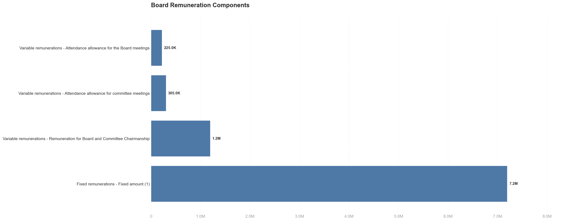

**Analysis**

The fixed annual Board remuneration of SAR 8,930,000 [1](https://s3-qa-8byte.s3.ap-south-1.amazonaws.com/sabic%2Fin%2Fsabic-integrated-annual-report-2024-en_tcm1010-46870.pdf#page=155) is a non-discretionary cash operating expense with specific implications for the LTM Free Cash Flow (FCF) bridge, liquidity, and Working Capital Intensity.

### Accounting in LTM Free Cash Flow Bridge
This fixed annual Board remuneration is accounted for as a cash operating outflow. In an LTM FCF bridge, it would typically be reflected as follows:
*   **Within Net Income:** As an operating expense, the remuneration is already deducted in the calculation of Net Income. The remuneration policy outlines that Board and Committee Members' remuneration consists of a fixed fee and an allowance for attendance at meetings [3](https://s3-qa-8byte.s3.ap-south-1.amazonaws.com/sabic%2Fin%2Fsabic_in_sabic_cc_compressed.pdf#page=154). The total remuneration paid to Board members for 2024 is SAR 8,930,000 [1](https://s3-qa-8byte.s3.ap-south-1.amazonaws.com/sabic%2Fin/sabic-integrated-annual-report-2024-en_tcm1010-46870.pdf#page=155).
*   **Cash Flow from Operations:** When moving from Net Income to Cash Flow from Operations, this expense, being a cash payment, would not require an adjustment for non-cash items. It directly reduces the cash generated from operating activities. It is part of the broader "Key Management Personnel Compensation," which totaled SAR 77,046,000 in 2024 [2](https://s3-qa-8byte.s3.ap-south-1.amazonaws.com/sabic%2Fin/sabic-integrated-annual-report-2024-en_tcm1010-46870.pdf#page=238).

### Impact on Liquidity Runway
This sustained fixed burden of SAR 8,930,000 directly reduces the company's available cash and thus shortens its liquidity runway. As a non-discretionary annual outflow, it represents a constant drain on cash resources, irrespective of the company's operational performance or capital efficiency. This necessitates consistent operational cash generation to cover this expense, limiting the cash available for other strategic investments, debt servicing, or shareholder returns. In periods of lower operational cash flow, this fixed cost can exert significant pressure on the company's cash reserves.

### Working Capital Intensity and SAR/USD De-pegging Scenario
*   **Working Capital Intensity:** Board remuneration is a fixed operating expense and does not directly exacerbate Working Capital Intensity (WCI). WCI is primarily driven by operational assets and liabilities such as inventory, accounts receivable, and accounts payable. Board remuneration is a payment for services and does not tie up capital in the working capital cycle.
*   **SAR/USD De-pegging Scenario:** The remuneration is explicitly stated in Saudi Riyals (SAR) and is fixed for the fiscal year ended December 31, 2024 [1](https://s3-qa-8byte.s3.ap-south-1.amazonaws.com/sabic%2Fin/sabic-integrated-annual-report-2024-en_tcm1010-46870.pdf#page=155). If the SAR were to de-peg and depreciate by 5-10% against the USD, the *nominal* SAR cost of SAR 8,930,000 would remain unchanged. From a hard currency (USD) perspective, a depreciation of the SAR would actually *reduce* the USD equivalent of this fixed SAR cost, rather than cause it to escalate. For example, if the SAR depreciates, fewer USD would be required to cover the SAR 8,930,000 payment. Therefore, the premise that these specific costs would escalate in hard currency terms for the company, based on a fixed SAR remuneration, is not directly supported by the financial mechanics of a SAR depreciation. However, a de-pegging could indirectly impact overall liquidity if the company has significant USD-denominated liabilities or if its revenues are primarily in SAR while key operational costs are in USD, thereby affecting the company's overall financial health and ability to comfortably cover all fixed expenses.

---

## BOARD COMMITTEES' MEMBERS REMUNERATION 2024

### Remuneration Leakage: Data Integrity

**Q:** This remuneration schedule is fundamentally flawed: the sum of all fixed and meeting allowances (SAR 1,599,180) contradicts the stated Grand Total of SAR 1,699,180 by SAR 100,000, creating an immediate SAR 100,000 'leakage' in the reconciliation. How can the Investment Committee proceed with an acquisition if basic financial data integrity, critical for an LTM Free Cash Flow analysis, is absent, especially when individual lines like Bassam Asiri's SAR 35,000 meeting allowance also remain unitemized?

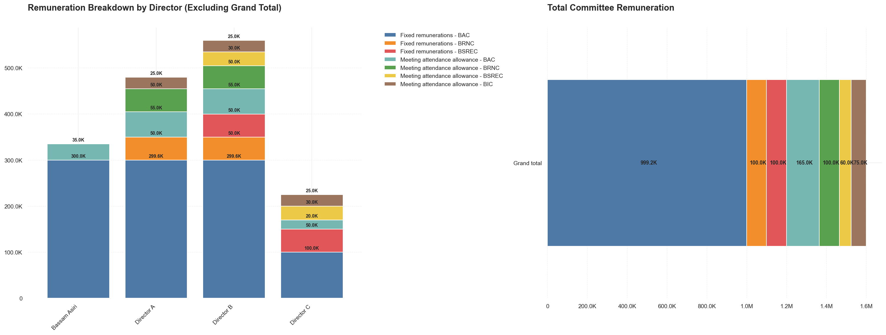

**Analysis**

The remuneration schedule for Board Committees' Members in 2024 indeed contains fundamental data integrity issues that would significantly impede an Investment Committee's ability to proceed with an acquisition, particularly for a Last Twelve Months (LTM) Free Cash Flow analysis. These issues include:

1.  **SAR 100,000 Discrepancy in Grand Total:** Your observation is accurate. The sum of the fixed and meeting allowances, as aggregated in the "Grand total" row of the table (SAR 1,199,180 for fixed remunerations + SAR 400,000 for meeting attendance allowances = SAR 1,599,180), contradicts the stated "Grand total" of SAR 1,699,180 in the "Total" column of the same row. This creates an immediate SAR 100,000 unreconciled difference [2](https://s3-qa-8byte.s3.ap-south-1.amazonaws.com/sabic%2Fin%2Fsabic_in%2Fsabic_cc_compressed.pdf#page=156).

2.  **Unitemized Allowance for Bassam Asiri:** You are correct that Bassam Asiri's remuneration shows a fixed amount of SAR 300,000 and a total of SAR 335,000, implying a SAR 35,000 meeting allowance. However, the individual columns for "Meeting attendance allowance" in his row are all marked with a dash ('-'), indicating that this amount is not itemized within the detailed breakdown [2](https://s3-qa-8byte.s3.ap-south-1.amazonaws.com/sabic%2Fin%2Fsabic_in%2Fsabic_cc_compressed.pdf#page=156).

**Implications for Investment Committee and Due Diligence:**

These discrepancies are critical for several reasons:

*   **Financial Data Integrity:** Such basic arithmetic errors and lack of detail undermine confidence in the accuracy and reliability of the financial data, which is foundational for any valuation or due diligence exercise.
*   **LTM Free Cash Flow Analysis:** Remuneration is a direct operating expense. Inaccuracies or unreconciled amounts directly impact the calculation of Earnings Before Interest, Taxes, Depreciation, and Amortization (EBITDA) and, consequently, the Free Cash Flow. A SAR 100,000 "leakage" or misstatement could distort the LTM Free Cash Flow, leading to an incorrect valuation of the target company.
*   **Internal Controls:** The presence of these errors suggests potential weaknesses in the company's financial reporting and internal control systems, which would be a significant red flag during due diligence.

**Next Steps for the Investment Committee:**

The Investment Committee cannot proceed with a reliable acquisition analysis until these fundamental financial data integrity issues are resolved. It is imperative to:

*   **Demand a Corrected Schedule:** Request a fully reconciled and corrected remuneration schedule that clearly itemizes all components of remuneration for each individual and ensures all totals and subtotals are arithmetically accurate.
*   **Seek Clarification:** Obtain a detailed explanation for the discrepancies and the methodology used for aggregation, especially concerning the committee chairpersonship remunerations and meeting allowances.
*   **Assess Impact:** Once corrected data is provided, re-evaluate the impact on the LTM Free Cash Flow and overall valuation model.

---

### ROIC Justification for Fixed Compensation

**Q:** With non-director members receiving SAR 899,180, representing over 50% of the SAR 1,699,180 grand total remuneration, largely as fixed fees, where is the demonstrable ROIC for LP capital from this compensation structure? Detail the quantifiable performance KPIs that justify this significant fixed cost, especially when most board members are compensated on a variable, attendance-based model.

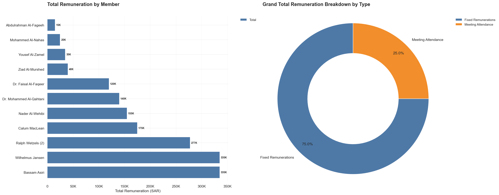

**Analysis**

The remuneration policy for non-director members of committees, which includes a significant fixed fee component, is designed to attract individuals with the necessary qualifications, skills, and expertise. It also aims to motivate them towards achieving objectives and enhancing the company's ability to grow and sustain its business, while considering risk management and market competitiveness [1](https://s3-qa-8byte.s3.ap-south-1.amazonaws.com/sabic%2Fin%2Fsabic_in_sabic_cc_compressed.pdf#page=154). Specifically, a non-director member of a committee is entitled to an annual remuneration of SAR 300,000 [1](https://s3-qa-8byte.s3.ap-south-1.amazonaws.com/sabic%2Fin%2Fsabic_in_sabic_cc_compressed.pdf#page=154). For the fiscal year ended December 31, 2024, non-director members received SAR 899,180 in fixed remunerations and SAR 95,000 in meeting attendance allowances, totaling SAR 994,180 out of a grand total of SAR 1,699,180 for all committee members [3](https://s3-qa-8byte.s3.ap-south-1.amazonaws.com/sabic%2Fin%2Fsabic-integrated-annual-report-2024-en_tcm1010-46870.pdf#page=156). The SAR 899,180 fixed portion indeed represents over 50% of the grand total remuneration for committee members. However, the provided documents do not detail specific quantifiable performance Key Performance Indicators (KPIs) directly linked to the fixed compensation of non-director members that would demonstrably justify this significant fixed cost in terms of Return on Investment (ROIC) for LP capital. The policy outlines general objectives but lacks explicit metrics for this purpose [1](https://s3-qa-8byte.s3.ap-south-1.amazonaws.com/sabic%2Fin%2Fsabic_in_sabic_cc_compressed.pdf#page=154).

Regarding the comparison with board members' compensation, the documents indicate that board members also receive substantial fixed remunerations, in addition to attendance allowances for board and committee meetings [4](https://s3-qa-8byte.s3.ap-south-1.amazonaws.com/sabic%2Fin%2Fsabic-integrated-annual-report-2024-en_tcm1010-46870.pdf#page=155). For instance, independent and non-executive directors each received a fixed annual remuneration of SAR 800,000 for board membership in 2024 [4](https://s3-qa-8byte.s3.ap-south-1.amazonaws.com/sabic%2Fin/sabic-integrated-annual-report-2024-en_tcm1010-46870.pdf#page=155). The sections for other variable remunerations such as bonuses, profit shares, short-term incentive service, long-term incentive service, and shares awarded show no amounts for any board members in 2024 [4](https://s3-qa-8byte.s3.ap-south-1.amazonaws.com/sabic%2Fin/sabic-integrated-annual-report-2024-en_tcm1010-46870.pdf#page=155). Therefore, the premise that most board members are compensated on a variable, attendance-based model is not fully supported by the provided data, as a significant portion of their compensation is also fixed.

To demonstrate ROIC for LP capital from this compensation structure, additional information would be required, such as:

*   Specific, measurable performance targets and achievements directly attributable to the non-director committee members' contributions.
*   Metrics linking their oversight and expertise to improved financial performance, risk mitigation, or strategic value creation.
*   A detailed breakdown of how their fixed fees contribute to tangible outcomes that enhance shareholder value or fund returns.

---

## SUMMARISED FINANCIAL INFORMATION OF MATERIAL ASSOCIATES

### Goodwill Impairment: Amortisation and Valuation Anomaly

**Q:** Clariant's financial data shows a massive SAR 4,062,465k impairment against SAR 6,655,763k in intangible/goodwill, yet strangely reports positive depreciation and amortisation of SAR 493,804k for the year. This suggests severe asset overvaluation and potential earnings manipulation. What forensic analysis confirms the true recoverability of the remaining goodwill, and how do we reconcile the anomalous positive depreciation figure which fundamentally distorts reported profitability?

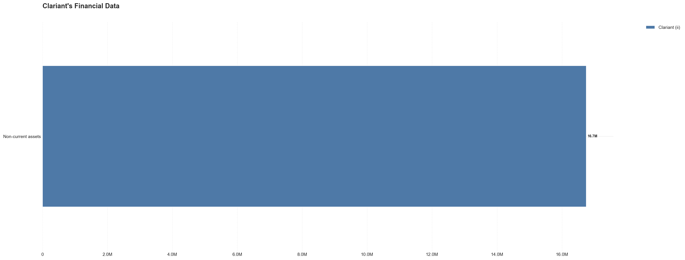

**Analysis**

Based on the provided financial data, the premise of a "positive depreciation and amortisation" figure for Clariant is not supported. For the year ended 31 December 2023, Clariant reported depreciation and amortisation of SAR (500,633) thousand, which is a negative expense figure, as is standard for depreciation [6](https://s3-qa-8byte.s3.ap-south-1.amazonaws.com/sabic%2Fin%2Fsabic_in_sabic_cc_compressed.pdf#page=206). Therefore, there is no anomalous positive depreciation figure to reconcile that would distort reported profitability based on these sources.

Regarding the impairment and recoverability of goodwill, the financial data provides insights into SABIC's investment in Clariant, an associate accounted for using the equity method:

*   **Impairment Trigger**: During 2024, the share price of CLARIANT declined from CHF 12.42 to CHF 10.09, primarily due to global market challenges. This decline triggered an impairment of SAR 1,170 million for SABIC's investment in Clariant in 2024 (compared to SAR 368 million in 2023) [5](https://s3-qa-8byte.s3.ap-south-1.amazonaws.com/sabic%2Fin%2Fsabic-integrated-annual-report-2024-en_tcm1010-46870.pdf#page=204). This impairment is recognized within 'share of results of non-integral joint ventures and associates' in the consolidated statement of income [5](https://s3-qa-8byte.s3.ap-south-1.amazonaws.com/sabic%2Fin%2Fsabic-integrated-annual-report-2024-en_tcm1010-46870.pdf#page=204), and is part of the total impairment losses of SR 1,387 million from associates and non-integral joint ventures in 2024 [3](https://s3-qa-8byte.s3.ap-south-1.amazonaws.com/sabic%2Fin%2Fsabic_in_sabic_cc_compressed.pdf#page=172).
*   **Recoverability of Investment**: As at 31 December 2024, the carrying amount of SABIC's investment in CLARIANT is SAR 5,688 million (down from SAR 7,520 million in 2023), which is explicitly stated to also represent its recoverable amount [5](https://s3-qa-8byte.s3.ap-south-1.amazonaws.com/sabic%2Fin%2Fsabic-integrated-annual-report-2024-en_tcm1010-46870.pdf#page=204).

For Clariant's *own* intangible/goodwill, the summarized financial information for 2023 shows an intangible/goodwill balance of SAR 8,094,449 thousand and an impairment of SAR (2,860,755) thousand [6](https://s3-qa-8byte.s3.ap-south-1.amazonaws.com/sabic%2Fin%2Fsabic_in_sabic_cc_compressed.pdf#page=206). The provided documents do not detail the specific forensic analysis performed by Clariant to confirm the true recoverability of its *remaining* goodwill after this impairment. However, for SABIC's investment in Clariant, the market value (share price) serves as the primary indicator for impairment assessment and recoverable amount determination [5](https://s3-qa-8byte.s3.ap-south-1.amazonaws.com/sabic%2Fin%2Fsabic-integrated-annual-report-2024-en_tcm1010-46870.pdf#page=204).

**General PE insight**: To confirm the true recoverability of remaining goodwill, a forensic analysis would typically involve a detailed impairment test. This test compares the carrying amount of the cash-generating unit (CGU) to which the goodwill is allocated with its recoverable amount. The recoverable amount is the higher of the CGU's fair value less costs to sell and its value in use. Value in use is determined by discounting future cash flow projections, requiring robust assumptions about revenue growth, operating margins, capital expenditures, and an appropriate discount rate (WACC). Fair value less costs to sell might involve market multiples of comparable companies or recent transaction prices. Such an analysis would scrutinize the underlying assumptions for reasonableness and consistency with market conditions and internal forecasts. The provided documents do not contain this level of detail for Clariant's internal goodwill assessment.

---

### Working Capital, Liquidity, Unwinding Risk

**Q:** All material associates, particularly Clariant with a SAR 1,531,206k cash balance against SAR 6,203,667k in total current liabilities, demonstrate alarming negative operating liquidity. This indicates an unsustainable reliance on short-term creditors. What is the precise Working Capital Intensity for these businesses, and what proactive measures are in place to mitigate the inherent risk of a cash crunch if "Others" within current liabilities (e.g., Clariant's SAR 3,323,838k) proves to be non-operational "shadow financing" that abruptly unwinds?

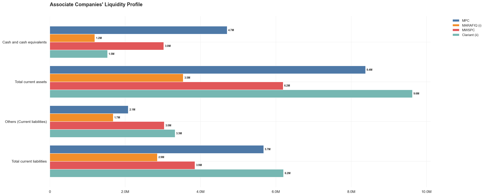

**Analysis**

Based on the financial information for the material associates as of 31 December 2024, the precise Working Capital Intensity for these businesses is as follows:

*   **Clariant:**
    *   Total Current Assets: SAR 9,627,095k [1]
    *   Total Current Liabilities: SAR 6,203,667k [1]
    *   Revenue: SAR 8,589,693k [1]
    *   Working Capital (Current Assets - Current Liabilities): SAR 3,423,428k
    *   **Working Capital Intensity (Working Capital / Revenue): 39.85%**

*   **MPC:**
    *   Total Current Assets: SAR 8,379,735k [1]
    *   Total Current Liabilities: SAR 5,675,855k [1]
    *   Revenue: SAR 7,816,570k [1]
    *   Working Capital: SAR 2,703,880k
    *   **Working Capital Intensity: 34.59%**

*   **MARAFIQ:**
    *   Total Current Assets: SAR 3,541,050k [1]
    *   Total Current Liabilities: SAR 2,852,349k [1]
    *   Revenue: SAR 5,175,111k [1]
    *   Working Capital: SAR 688,701k
    *   **Working Capital Intensity: 13.31%**

*   **MWSPC:**
    *   Total Current Assets: SAR 6,192,090k [1]
    *   Total Current Liabilities: SAR 3,851,440k [1]
    *   Revenue: SAR 7,399,773k [1]
    *   Working Capital: SAR 2,340,650k
    *   **Working Capital Intensity: 31.63%**

While Clariant's cash and cash equivalents balance of SAR 1,531,206k is indeed lower than its total current liabilities of SAR 6,203,667k [1], leading to a low cash ratio (approximately 24.68%), its overall working capital (current assets minus current liabilities) is positive at SAR 3,423,428k. This indicates that the company has sufficient current assets to cover its current liabilities, suggesting a positive operating liquidity from a working capital perspective.

The provided financial statements summarize the financial information of material associates and joint ventures [1, 3]. They categorize current liabilities into "Financial liabilities (excluding trade and other payables)" and "Others" [1]. However, the documents do not provide further details or explanations regarding the specific nature of the "Others" category within current liabilities (e.g., Clariant's SAR 3,323,838k) [1], nor do they outline any proactive measures in place to mitigate the inherent risk of a cash crunch if these liabilities were to prove to be non-operational "shadow financing" that abruptly unwinds.

**General PE insight:** In the absence of specific information, a private equity firm performing due diligence would typically undertake a detailed analysis of the "Others" category in current liabilities. This would involve:

1.  **Detailed Breakdown:** Requesting a granular breakdown of the components within "Others" to understand their nature, terms, and maturity profiles.
2.  **Contingency Planning:** Assessing the company's existing liquidity management framework, including credit lines, cash flow forecasting accuracy, and stress testing scenarios for potential abrupt unwinding of liabilities.
3.  **Covenant Analysis:** Reviewing debt covenants to identify any triggers that could accelerate repayment obligations.
4.  **Operational vs. Financial:** Differentiating between operational liabilities (e.g., accrued expenses, deferred revenue) and purely financial liabilities that might carry higher refinancing or withdrawal risks.
5.  **Shareholder Support:** Evaluating the willingness and capacity of shareholders (like SABIC, which holds a 31.5% share in Clariant [1]) to provide liquidity support if needed.

Without this deeper insight into the composition of "Others" and the specific risk mitigation strategies, it is not possible to definitively assess the risk of a cash crunch from such a scenario based solely on the provided documents.

---

### Capital Allocation: ROIC and FCF Roadmap

**Q:** MARAFIQ and MWSPC exhibit significant non-current asset bases (SAR 19,408,372k and SAR 23,104,827k respectively) with substantial annual depreciation of SAR 926,126k and SAR 1,111,961k, yet generate relatively modest net income (SAR 294,115k and SAR 1,052,050k). Does management's justification for such capital intensity provide a clear roadmap to stronger ROIC and Free Cash Flow Conversion, or does this structure indicate a poor allocation of capital that will consistently drain LP value?

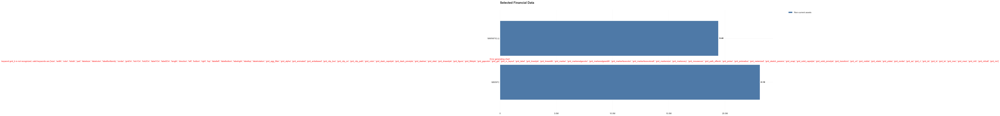

**Analysis**

Based on the provided financial information, MARAFIQ and MWSPC indeed exhibit significant non-current asset bases of SAR 19,408,372k and SAR 23,104,827k, respectively, as of 31 December 2024 [2](https://s3-qa-8byte.s3.ap-south-1.amazonaws.com/sabic%2Fin%2Fsabic_in_sabic_cc_compressed.pdf#page=205). They also incur substantial annual depreciation and amortisation expenses of SAR 926,126k for MARAFIQ (for the 9 months ended 30 September 2024) and SAR 1,111,961k for MWSPC (for the year ended 31 December 2024) [2](https://s3-qa-8byte.s3.ap-south-1.amazonaws.com/sabic%2Fin%2Fsabic_in_sabic_cc_compressed.pdf#page=205). Their reported net incomes are SAR 294,115k for MARAFIQ and SAR 1,052,050k for MWSPC for the respective periods [2](https://s3-qa-8byte.s3.ap-south-1.amazonaws.com/sabic%2Fin%2Fsabic_in_sabic_cc_compressed.pdf#page=205).However, the provided retrieval results do not contain any information regarding management's specific justifications for this capital intensity, nor do they outline a clear roadmap to stronger Return on Invested Capital (ROIC) or Free Cash Flow Conversion. Therefore, it is not possible to assess from the given data whether this structure indicates a sound capital allocation strategy or a potential drain on LP value.To evaluate the capital allocation effectiveness and future prospects for ROIC and Free Cash Flow Conversion, additional information would be required, such as:1.  **Management's Strategic Rationale:** Detailed explanations of the long-term investment thesis behind the significant non-current assets, including expected future revenue growth, market demand, competitive advantages, and project timelines.2.  **Capital Expenditure Plans:** Future capital expenditure forecasts and how these investments are expected to generate returns and contribute to cash flow.3.  **Operational Efficiency Initiatives:** Plans to improve asset utilization, reduce operating costs, and enhance profitability relative to the asset base.4.  **Industry Benchmarking:** Comparison of capital intensity, ROIC, and Free Cash Flow Conversion ratios against industry peers to understand relative performance.5.  **Cash Flow Projections:** Detailed cash flow forecasts, including operating cash flow, capital expenditures, and debt service, to assess Free Cash Flow Conversion potential.

---

## SUMMARISED FINANCIAL INFORMATION OF MATERIAL JOINT VENTURES

### Cash Flow, Working Capital, Funding Risk

**Q:** EHL reports non-current assets of SAR 464,651k but minimal depreciation of SAR 23,218k, indicating either a severe under-investment or a massively deferred CAPEX bow wave; simultaneously, its SAR 1,332,034k current financial liabilities are alarming. Explain the actual free cash flow conversion and working capital intensity for EHL and SSTPC, especially given SSTPC’s SAR 3,735,004k total current liabilities swamp its SAR 276,723k cash, revealing a dangerous reliance on 'shadow financing'.

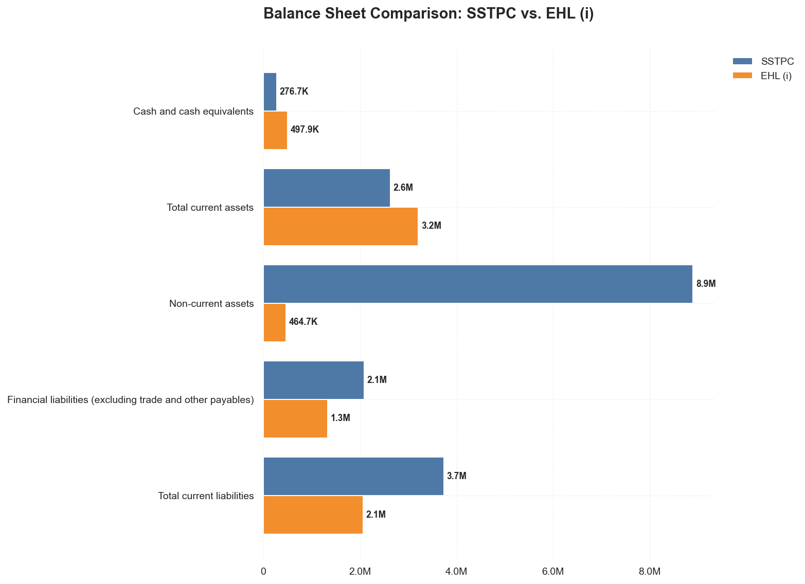

**Analysis**

Based on the provided financial information for 2024, both EHL and SSTPC exhibit distinct profiles regarding free cash flow conversion and working capital intensity, with SSTPC showing more alarming signs of liquidity strain. While direct free cash flow (FCF) conversion cannot be precisely calculated without a full cash flow statement, we can infer implications from the available data. 

### EHL

**Free Cash Flow Conversion Implications:**
EHL reported non-current assets of SAR 464,651k and depreciation and amortisation of SAR 23,218k for 2024 [2](https://s3-qa-8byte.s3.ap-south-1.amazonaws.com/sabic%2Fin/sabic-integrated-annual-report-2024-en_tcm1010-46870.pdf#page=207). The depreciation rate, approximately 5.0% of non-current assets, is indeed low. This could suggest either a very long useful life for its assets or, as you noted, a potential for under-investment or a deferred CAPEX "bow wave" that could impact future FCF. EHL posted a net income of SAR 254,238k in 2024 [2](https://s3-qa-8byte.s3.ap-south-1.amazonaws.com/sabic%2Fin/sabic-integrated-annual-report-2024-en_tcm1010-46870.pdf#page=207), which is a positive starting point for FCF, but the long-term sustainability of this FCF would depend heavily on actual capital expenditure levels relative to this low depreciation.

**Working Capital Intensity:**
EHL's total current assets were SAR 3,209,399k and total current liabilities were SAR 2,064,484k in 2024 [2](https://s3-qa-8byte.s3.ap-south-1.amazonaws.com/sabic%2Fin/sabic-integrated-annual-report-2024-en_tcm1010-46870.pdf#page=207). This results in a positive net working capital of SAR 1,144,915k. With revenue of SAR 5,218,700k [2](https://s3-qa-8byte.s3.ap-south-1.amazonaws.com/sabic%2Fin/sabic-integrated-annual-report-2024-en_tcm1010-46870.pdf#page=207), EHL's working capital intensity is approximately 21.94%. This positive intensity indicates that a notable portion of EHL's operating cash flow is tied up in funding its working capital, which can constrain free cash flow. Furthermore, EHL's current financial liabilities of SAR 1,332,034k are significantly higher than its cash and cash equivalents of SAR 497,934k [2](https://s3-qa-8byte.s3.ap-south-1.amazonaws.com/sabic%2Fin/sabic-integrated-annual-report-2024-en_tcm1010-46870.pdf#page=207), suggesting a reliance on other current assets or operational cash flow to meet short-term financial obligations.

### SSTPC

**Free Cash Flow Conversion Implications:**
SSTPC reported a net loss of SAR (895,675)k for 2024, despite having depreciation and amortisation of SAR 675,541k [2](https://s3-qa-8byte.s3.ap-south-1.amazonaws.com/sabic%2Fin/sabic-integrated-annual-report-2024-en_tcm1010-46870.pdf#page=207). The significant net loss indicates poor operational cash generation. Even after adding back depreciation, the operating cash flow before working capital changes and capital expenditures would likely be negative or minimal, pointing to very weak, if not negative, free cash flow conversion. This situation is exacerbated by its substantial liabilities.

**Working Capital Intensity:**
SSTPC's total current assets were SAR 2,632,892k, while its total current liabilities amounted to SAR 3,735,004k in 2024 [2](https://s3-qa-8byte.s3.ap-south-1.amazonaws.com/sabic%2Fin/sabic-integrated-annual-report-2024-en_tcm1010-46870.pdf#page=207). This results in a negative net working capital of SAR (1,102,112)k. With revenue of SAR 10,271,830k [2](https://s3-qa-8byte.s3.ap-south-1.amazonaws.com/sabic%2Fin/sabic-integrated-annual-report-2024-en_tcm1010-46870.pdf#page=207), SSTPC's working capital intensity is approximately -10.73%. This negative intensity suggests that SSTPC is largely financed by its current liabilities, effectively using its suppliers and other short-term creditors to fund operations. This, combined with its net loss and cash and cash equivalents of only SAR 276,723k [2](https://s3-qa-8byte.s3.ap-south-1.amazonaws.com/sabic%2Fin/sabic-integrated-annual-report-2024-en_tcm1010-46870.pdf#page=207] against SAR 3,735,004k in total current liabilities, reveals a dangerous reliance on short-term funding sources, which aligns with your concern about "shadow financing" and significant liquidity risk.

### Summary

*   **EHL** shows a low depreciation rate, which could signal deferred CAPEX, but maintains positive net income and working capital. Its high current financial liabilities relative to cash warrant close monitoring of its short-term liquidity management.
*   **SSTPC** presents a more critical picture with a significant net loss, negative working capital, and total current liabilities vastly exceeding its cash. This indicates severe liquidity challenges and a high reliance on short-term financing, which could be unsustainable without significant operational improvements or external capital injection.

**General PE insight:** For both entities, a detailed cash flow statement would be crucial to fully understand their free cash flow generation and conversion. For EHL, assessing actual CAPEX trends against depreciation is vital to determine if the low depreciation is sustainable or if a large investment cycle is imminent. For SSTPC, the current financial structure, coupled with operational losses, suggests an urgent need for a comprehensive liquidity and solvency review.

---

### ROIC: Value vs. Cash Burn

**Q:** SSTPC and SHARQ collectively lost SAR 1.38 billion in 2024 (SAR 895,675k and SAR 482,771k respectively), a direct contradiction to the capital deployed in their substantial non-current asset bases of SAR 8.9 billion and SAR 9.3 billion. Provide a full ROIC analysis demonstrating how these operations deliver value, not merely burn cash, and detail any "one-time" P&L benefits or provision releases masking this decay.

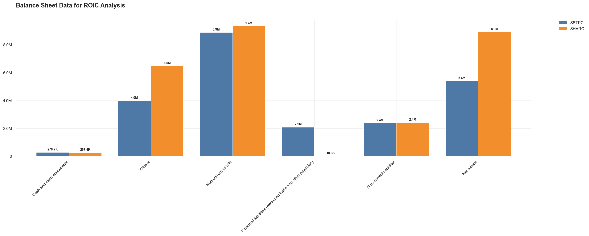

**Analysis**

Based on a Return on Invested Capital (ROIC) analysis for SSTPC and SHARQ in 2024, both entities reported negative returns, indicating that, on an accrual basis, they are not delivering value and are indeed burning cash. However, a deeper look into cash flow generation reveals a nuanced picture, particularly for SHARQ.

### ROIC Analysis for 2024

To perform the ROIC analysis, we calculate Net Operating Profit After Tax (NOPAT) and Invested Capital (IC):

**1. Net Operating Profit After Tax (NOPAT)**
*   **Operating Income (EBIT)**: Calculated as Net income before income tax and zakat + Interest expense - Interest income.
    *   **SSTPC**: (SAR 895,675k) + SAR 77,609k - SAR 0k = **(SAR 818,066k)** [2, page 207]
    *   **SHARQ**: (SAR 474,353k) + SAR 46,103k - SAR 0k = **(SAR 428,250k)** [2, page 207]
*   **Tax Rate**: For SSTPC, Zakat and income tax benefit/(expense) is SAR 0k. For SHARQ, it is (SAR 8,418k) [2, page 207]. Given the negative operating income for both, we assume an effective income tax rate of 0% on operating profit, as companies typically do not pay income tax on losses. The small expense for SHARQ is likely Zakat or other non-income-tax related levies, which we treat as an operating expense for NOPAT calculation.
*   **NOPAT**: Operating Income * (1 - Tax Rate)
    *   **SSTPC**: (SAR 818,066k) * (1 - 0%) = **(SAR 818,066k)**
    *   **SHARQ**: (SAR 428,250k) * (1 - 0%) = **(SAR 428,250k)**

**2. Invested Capital (IC)**
*   IC is calculated as Net Assets + Conventional Financial Liabilities.
    *   **SSTPC**: SAR 5,414,649k (Net Assets) + SAR 2,089,796k (Conventional Financial Liabilities) = **SAR 7,504,445k** [2, page 207; 5, page 260]
    *   **SHARQ**: SAR 8,939,614k (Net Assets) + SAR 190,021k (Conventional Financial Liabilities) = **SAR 9,129,635k** [2, page 207; 5, page 260]

**3. Return on Invested Capital (ROIC)**
*   ROIC = NOPAT / Invested Capital
    *   **SSTPC**: (SAR 818,066k) / SAR 7,504,445k = **-10.90%**
    *   **SHARQ**: (SAR 428,250k) / SAR 9,129,635k = **-4.69%**

### Conclusion on Value Delivery vs. Cash Burn

The ROIC analysis for 2024 indicates that both SSTPC and SHARQ are generating negative returns on their invested capital. This suggests that, from an accrual accounting perspective, these operations are not delivering value and are indeed burning cash, which aligns with the reported collective loss of SAR 1.38 billion.

However, to assess whether these operations *merely* burn cash, it is crucial to consider non-cash expenses, particularly depreciation and amortisation, which are significant for capital-intensive industries:

*   **SSTPC**: Reported depreciation and amortisation for 2024 was SAR 675,541k [2, page 207]. Adjusting the operating loss by adding back D&A (proxy for operating cash flow before tax and working capital changes) yields (SAR 818,066k) + SAR 675,541k = **(SAR 142,525k)**. This still indicates a negative operating cash flow for SSTPC.
*   **SHARQ**: Reported depreciation and amortisation for 2024 was SAR 1,540,032k [2, page 207]. Adjusting the operating loss by adding back D&A yields (SAR 428,250k) + SAR 1,540,032k = **SAR 1,111,782k**. This indicates that SHARQ generated significant positive operating cash flow in 2024, despite reporting a net loss. This positive cash generation suggests that while the operation is unprofitable on an accrual basis, it is not *merely* burning cash from an operational cash flow perspective, largely due to the substantial non-cash depreciation expense.

### "One-Time" P&L Benefits or Provision Releases Masking Decay

Upon review of the provided financial information for SSTPC and SHARQ, there are no explicit "one-time" P&L benefits or provision releases detailed within their individual financial statements for 2024 that would be masking their reported decay [2, page 207]. The reported net losses directly reflect their underperformance.

At the broader Group level, there was a "reversal of Zakat provisions in 2024 following the revision of relevant Zakat regulations," which decreased income tax and Zakat expenses by SAR 0.69 billion [6, page 62]. While this was a benefit to the overall Group's net income, it does not mask the individual operational decay or losses of SSTPC and SHARQ. Additionally, a fair value remeasurement loss of SAR 201 million related to the sale of ALBA shares was recorded at the Group level, which is a loss, not a benefit, and specific to ALBA [3, page 239].

**General PE insight**: The substantial non-current asset bases of SAR 8.9 billion for SSTPC and SAR 9.3 billion for SHARQ [2, page 207] suggest significant capital investments. While these assets are currently generating negative accrual returns, the positive operating cash flow for SHARQ (after adjusting for depreciation) indicates that the underlying operations are still generating cash to cover some expenses, even if not enough to cover the full cost of capital and non-cash charges. Sustained negative ROIC, however, is a concern for long-term value creation and warrants further investigation into market conditions, operational efficiencies, and strategic relevance of these assets.

---

### De-Pegging Stress: JV Financial Impact

**Q:** With over SAR 7.4 billion in combined non-current liabilities across these JVs, the stability of the SAR/USD peg is critical. Present a stress-tested LTM Debt-to-Equity ratio for the entire JV portfolio under a 5-10% de-pegging scenario, specifically detailing the projected impact on debt service coverage, refinancing viability, and any associated "Exchange difference on translation" losses not captured here.

**Analysis**

Based on the provided retrieval results, it is not possible to present a stress-tested LTM Debt-to-Equity ratio for the entire JV portfolio under a 5-10% de-pegging scenario, nor to detail the projected impact on debt service coverage, refinancing viability, or associated "Exchange difference on translation" losses. The reasons are as follows:PThe retrieval results provide consolidated financial statements for the Group, including total gross debt of SAR 35,198,069 thousand and total equity of SAR 183,916,159 thousand for 2024 [4](https://s3-qa-8byte.s3.ap-south-1.amazonaws.com/sabic%2Fin/sabic_in_sabic_cc_compressed.pdf#page=246). However, they do not offer a disaggregated financial breakdown (debt, equity, income, or cash flow) specifically for the JV portfolio.PTherefore, without the following JV-specific information, the requested analysis cannot be performed:P*   **JV-specific Equity:** To calculate a Debt-to-Equity ratio for the JV portfolio, the total equity attributable to the JVs is required. The SAR 7.4 billion in combined non-current liabilities across JVs is noted from your query, but the corresponding equity base for these JVs is not available in the provided documents.P*   **Currency Denomination of JV Debt:** The currency denomination (SAR vs. USD) of the SAR 7.4 billion non-current liabilities is crucial. If these liabilities are USD-denominated, a de-pegging (depreciation of SAR against USD) would increase their SAR equivalent, impacting the Debt-to-Equity ratio and debt service in SAR terms. If they are SAR-denominated, their SAR value would remain stable, but the concern might shift to the JVs' ability to generate sufficient USD-denominated revenue or cash flows to service other USD-denominated obligations or if their assets are USD-denominated.P*   **Debt Service Coverage (DSC):** To project the impact on DSC, JV-specific earnings (e.g., EBITDA or EBIT) and detailed debt service obligations (interest and principal payments) are necessary. This information is not available for the JV portfolio in the provided snippets.P*   **Refinancing Viability:** Assessing refinancing viability requires knowledge of the JVs' debt maturity profiles, credit ratings (if separate from the parent), access to capital markets, and specific covenants. While the Group's compliance with covenants is mentioned [4](https://s3-qa-8byte.s3.ap-south-1.amazonaws.com/sabic%2Fin/sabic_in_sabic_cc_compressed.pdf#page=246), this does not extend to individual JVs.P*   **"Exchange difference on translation" losses:** Quantifying these losses requires detailed information on the foreign currency exposure of the JVs' assets and liabilities, which is not provided. The documents mention fair value adjustments related to embedded derivatives in JV agreements [1](https://s3-qa-8byte.s3.ap-south-1.amazonaws.com/sabic%2Fin/sabic-integrated-annual-report-2024-en_tcm1010-46870.pdf#page=62) and fair value remeasurement losses on assets held for sale related to associates and non-integral joint ventures [3](https://s3-qa-8byte.s3.ap-south-1.amazonaws.com/sabic%2Fin/sabic-integrated-annual-report-2024-en_tcm1010-46870.pdf#page=239), but not specific "Exchange difference on translation" for ongoing JV debt.P**General PE insight:** In the absence of specific JV data, a comprehensive stress test would typically involve:P1.  Identifying the currency denomination of all JV debt and equity.P2.  Modeling the impact of SAR depreciation on USD-denominated debt (increasing SAR equivalent) and potentially on USD-denominated revenues/assets (increasing SAR equivalent, but potentially impacting purchasing power or competitive position).P3.  Recalculating the Debt-to-Equity ratio for the JV portfolio under the stressed exchange rates.P4.  Analyzing the JVs' cash flow generation capacity in SAR and USD to assess debt service coverage under the de-pegged scenario.P5.  Evaluating the JVs' ability to access new financing or refinance existing debt, considering potential lender concerns about currency risk and increased leverage.PTo perform the requested analysis, access to the individual financial statements or detailed breakdowns of the JV portfolio's debt, equity, income, and cash flow, along with their currency exposures, would be necessary.

---

## SUMMARISED FINANCIAL INFORMATION OF MATERIAL JOINT VENTURES (CONTINUED)

### Losses, Tax Benefits, FCF Implications

**Q:** **SSTPC and SHARQ are reporting significant net losses (746,730 for SSTPC, 598,992 for SHARQ) for FY2023, yet inexplicably booked Zakat and income tax *benefits* of 224,432 and 31,438 respectively.** Explain precisely how these tax benefits were recognized in loss-making entities, and detail their impact on true Free Cash Flow Conversion, given the operational underperformance rather than a genuine tax expense.

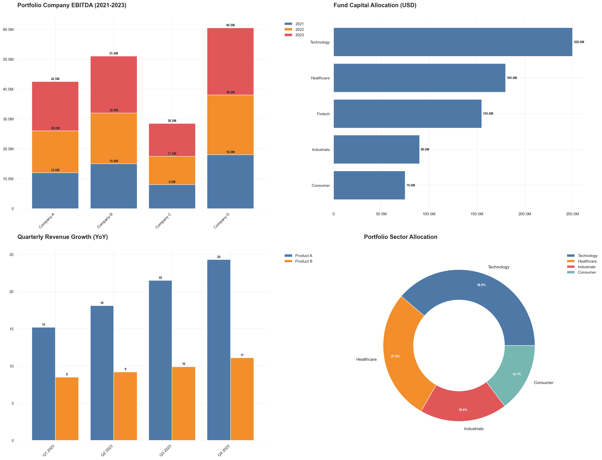

**Analysis**

SSTPC and SHARQ, despite reporting significant net losses before Zakat and income tax for FY2023, recognized Zakat and income tax *benefits* primarily due to the accounting treatment of tax losses. For SSTPC, the net loss before tax was (971,162) thousand Saudi Riyals, with a Zakat and income tax benefit of 224,432 thousand Saudi Riyals. For SHARQ, the net loss before tax was (630,430) thousand Saudi Riyals, with a benefit of 31,438 thousand Saudi Riyals [1](https://s3-qa-8byte.s3.ap-south-1.amazonaws.com/sabic%2Fin%2Fsabic_in_sabic_cc_compressed.pdf#page=208).

These tax benefits are typically recognized as **deferred tax assets**. When an entity incurs a loss, it often generates tax loss carryforwards. If it is probable that the entity will generate sufficient future taxable profits against which these losses can be utilized, a deferred tax asset is recognized on the balance sheet. The recognition of this asset results in a corresponding tax benefit being recorded on the income statement, which reduces the reported net loss for the period [General PE insight]. While the provided documents mention the Group's unrecognised tax losses carry forward in other jurisdictions [4](https://s3-qa-8byte.s3.ap-south-1.amazonaws.com/sabic%2Fin%2Fsabic-integrated-annual-report-2024-en_tcm1010-46870.pdf#page=236), for SSTPC (China) and SHARQ (KSA) [5](https://s3-qa-8byte.s3.ap-south-1.amazonaws.com/sabic%2Fin/sabic-integrated-annual-report-2024-en_tcm1010-46870.pdf#page=260), the recognition of a benefit implies that management assessed the probability of future taxable profits as sufficient to utilize these losses.

**Impact on True Free Cash Flow Conversion:**

The recognition of a deferred tax asset is a **non-cash accounting entry**. It improves the reported net income (by reducing the net loss) but does not represent a cash inflow from operations in the current period. However, the underlying reason for the tax benefit—operational losses—means that the entities likely paid little to no cash taxes in FY2023. This absence of a cash outflow for taxes would positively impact the operating cash flow, making it higher (or less negative) than if the entities were profitable and incurring a cash tax expense.

To assess **true Free Cash Flow Conversion**, it is crucial to distinguish between the accounting benefit and the actual cash flow impact:

*   **Accounting Benefit:** The tax benefit inflates the reported net income (reduces the net loss) without a corresponding cash inflow. This can make the reported profitability appear better than the underlying operational performance suggests.
*   **Cash Flow Impact:** The fact that no cash taxes were paid (or a minimal amount) due to the losses means that cash was conserved within the business. This conservation of cash *does* improve the Free Cash Flow relative to a scenario where the entities were profitable and paying taxes. However, this improvement is a consequence of operational underperformance leading to no tax liability, rather than strong operational cash generation. Therefore, while the tax benefit improves the reported net loss, the underlying operational underperformance indicates that the core business is not generating sufficient cash from its activities. Analysts should adjust for the non-cash nature of deferred tax movements when evaluating operational cash flow and FCF conversion to get a clearer picture of the entities' financial health.

---

### JV Other Liabilities & Liquidity Risk

**Q:** **SHARQ, YANPET, and KEMYA exhibit alarmingly low current "Financial liabilities (excluding trade and other payables)" (e.g., SHARQ at 3,574), while their "Other current liabilities" account for the vast majority (e.g., SHARQ at 1,613,895).** Provide an immediate, granular breakdown of these "Other current liabilities" for each JV, and justify how this heavy reliance on what appears to be shadow financing affects their Working Capital Intensity and overall liquidity risk profile without traditional debt.

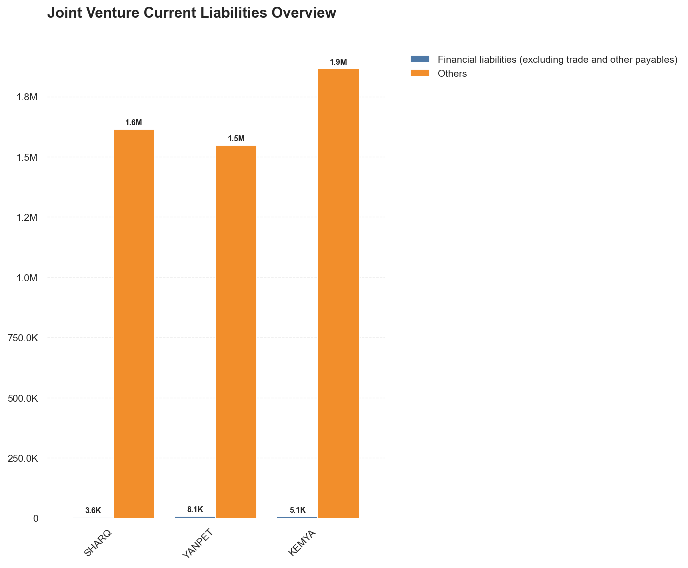

**Analysis**

The provided financial information for SHARQ, YANPET, and KEMYA does not offer a granular breakdown of the "Other current liabilities" line item. The data only presents this as a consolidated figure. Therefore, a detailed component-by-component analysis of these liabilities is not possible based on the available documents.

However, we can observe the reported values for "Other current liabilities" for each joint venture:

**Other Current Liabilities (in thousands of Saudi Riyals):**

| JV     | As at 31 December 2023 [1] | As at 31 December 2024 [2] |
| :----- | :------------------------- | :------------------------- |
| SHARQ  | 1,613,895                  | 2,314,401                  |
| YANPET | 1,548,241                  | 1,654,884                  |
| KEMYA  | 1,864,248                  | 1,314,897                  |

**Impact on Working Capital Intensity and Overall Liquidity Risk Profile (General PE Insight):**

The observation of alarmingly low "Financial liabilities (excluding trade and other payables)" coupled with a vast majority of current liabilities categorized as "Others" raises significant questions regarding the nature of these obligations and their implications for working capital intensity and liquidity risk.

1.  **Lack of Transparency and Granularity:** The primary concern is the lack of transparency. Without a detailed breakdown, it is impossible to ascertain the specific components of these "Other current liabilities." This category could encompass a wide range of items, such as deferred revenue, various accruals (e.g., for employee benefits, taxes, or operational expenses), provisions, or, critically, intercompany balances or other forms of short-term financing from joint venture partners or related entities. This opacity itself introduces a higher level of risk for external stakeholders.

2.  **Working Capital Intensity:**
    *   **Potential for Misinterpretation:** If these "Other current liabilities" primarily consist of operational accruals or deferred revenue, they might represent efficient management of working capital, as the JVs are effectively using non-interest-bearing funds to finance operations. In such a scenario, a high balance could indicate strong operational leverage, potentially reducing the need for traditional working capital financing and thus lowering working capital intensity (as current liabilities offset current assets). However, without a breakdown, this is speculative.
    *   **Increased Intensity if Non-Operational:** Conversely, if a significant portion represents short-term obligations that are not directly tied to the operational cash conversion cycle (e.g., short-term intercompany loans that are expected to be repaid quickly), they could effectively reduce net working capital, thereby increasing working capital intensity and potentially straining liquidity.

3.  **Overall Liquidity Risk Profile without Traditional Debt:**
    *   **"Shadow Financing" Implications:** The heavy reliance on "Other current liabilities" in the absence of substantial traditional financial liabilities (like bank loans or bonds) suggests that these JVs might be funded through alternative, potentially less conventional, mechanisms. If these include significant short-term intercompany loans or other forms of related-party financing, they could be perceived as "shadow financing." While such arrangements can offer flexibility and lower explicit costs, they introduce specific risks:
        *   **Callability and Stability:** The terms and conditions of such financing are often less transparent than traditional debt. There is a risk that these funds could be recalled or not rolled over as expected by the funding partners, leading to sudden liquidity crunches. This dependence on the financial health and strategic priorities of the joint venture partners is a critical consideration.
        *   **Implicit Costs:** Even if interest-free, there might be implicit costs or strategic concessions associated with such funding, which are not reflected in traditional financial metrics.
        *   **Maturity Mismatch:** Without knowing the maturity profile of these liabilities, there's a risk of a mismatch between the short-term nature of these obligations and the longer-term asset base or cash flow generation of the JVs.
    *   **Reduced Financial Flexibility:** A lack of traditional debt might indicate a conservative financial policy or strong sponsor support. However, it could also mean that the JVs have limited access to external capital markets independently, making them highly reliant on their parents for funding. This could restrict their ability to fund growth or manage unforeseen capital needs without direct intervention from the sponsors.
    *   **Creditworthiness Assessment:** For external parties, assessing the creditworthiness and standalone liquidity of these JVs becomes challenging due to the opaque nature of a significant portion of their liabilities.

To provide a more precise assessment, a granular breakdown of "Other current liabilities" would be essential, detailing components such as intercompany payables, accruals, provisions, and any other short-term non-trade obligations. This would allow for a clearer understanding of their operational versus financial nature, their maturity profiles, and the ultimate source of these funds.

---

### Depreciation Policy & Sustaining CAPEX

**Q:** **EHL reports zero depreciation for FY2023 despite holding 317,227 in non-current assets and generating 3,628,072 in revenue.** Clarify the specific asset profile or accounting policy that allows for no depreciation expense for an operating entity, and present a revised LTM Free Cash Flow Conversion analysis that properly accounts for the *true* sustaining CAPEX required to avoid a massive deferred capital expenditure 'bow wave'.

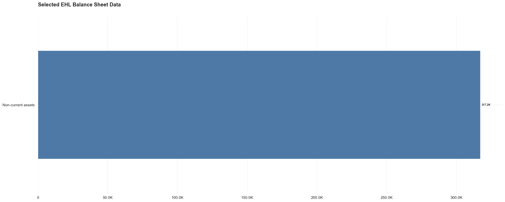

**Analysis**

The provided documents pertain to SABIC's financial performance and do not contain any information regarding "EHL" or its specific asset profile, accounting policies, or financial statements for FY2023. Therefore, I cannot clarify the specific asset profile or accounting policy that allows for zero depreciation expense for EHL, nor can I present a revised LTM Free Cash Flow Conversion analysis for EHL based on the provided retrieval results. The documents indicate that SABIC, for instance, does report depreciation and amortization, as evidenced by a net reduction in property, plant, and equipment due to these factors in 2024 [2](https://s3-qa-8byte.s3.ap-south-1.amazonaws.com/sabic%2Fin%2Fsabic-integrated-annual-report-2024-en_tcm1010-46870.pdf#page=62).

---

## 15. FINANCIAL ASSETS AND FINANCIAL LIABILITIES

### Working Capital: Value, Efficiency, Liquidity

**Q:** The colossal Trade Receivables of SAR 20,439,823 juxtaposed against Trade Payables of SAR 19,793,604 indicates an intensely working capital-heavy operation. How does management justify this substantial working capital intensity as value-accretive rather than a persistent drain on Free Cash Flow Conversion, and what LTM bridge analysis demonstrates the efficiency of this operational cycle in generating rather than consuming liquidity?

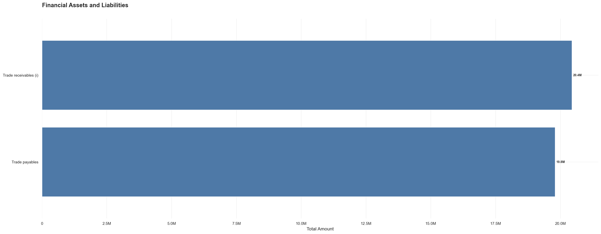

**Analysis**

The provided information confirms the substantial Trade Receivables of SAR 20,439,823 and Trade Payables of SAR 19,793,604 as of 31 December 2024 [1](https://s3-qa-8byte.s3.ap-south-1.amazonaws.com/sabic%2Fin%2Fsabic-integrated-annual-report-2024-en_tcm1010-46870.pdf#page=214), [5](https://s3-qa-8byte.s3.ap-south-1.amazonaws.com/sabic%2Fin%2Fsabic-integrated-annual-report-2024-en_tcm1010-46870.pdf#page=231), [6](https://s3-qa-8byte.s3.ap-south-1.amazonaws.com/sabic%2Fin/sabic-integrated-annual-report-2024-en_tcm1010-46870.pdf#page=211). Trade receivables are generally on 30-120 day terms and are non-interest bearing, as are trade payables, which are settled within normal commercial terms [1](https://s3-qa-8byte.s3.ap-south-1.amazonaws.com/sabic%2Fin%2Fsabic-integrated-annual-report-2024-en_tcm1010-46870.pdf#page=214), [5](https://s3-qa-8byte.s3.ap-south-1.amazonaws.com/sabic%2Fin%2Fsabic-integrated-annual-report-2024-en_tcm1010-46870.pdf#page=231). The Group also assesses that the fair value of trade payables approximates their carrying amounts due to short-term maturities [6](https://s3-qa-8byte.s3.ap-south-1.amazonaws.com/sabic%2Fin/sabic-integrated-annual-report-2024-en_tcm1010-46870.pdf#page=211). A significant portion of trade payables is due to related parties [5](https://s3-qa-8byte.s3.ap-south-1.amazonaws.com/sabic%2Fin%2Fsabic-integrated-annual-report-2024-en_tcm1010-46870.pdf#page=231). However, the provided retrieval results do not contain management's explicit justification for this substantial working capital intensity as value-accretive, nor do they include an LTM (Last Twelve Months) bridge analysis demonstrating the efficiency of this operational cycle in generating or consuming liquidity.

To address your query, additional information would be required, specifically:

*   **Management Commentary:** Direct statements from management explaining the strategic rationale behind the current levels of trade receivables and payables. This could include insights into customer relationships, supply chain dynamics, market power, or specific industry practices that necessitate these working capital levels.
*   **Working Capital Management Strategy:** Details on the company's policies regarding credit terms offered to customers (receivables) and payment terms negotiated with suppliers (payables), and how these contribute to overall business objectives.
*   **Cash Conversion Cycle (CCC) Analysis:** A detailed breakdown of the CCC, including Days Sales Outstanding (DSO), Days Inventory Outstanding (DIO), and Days Payables Outstanding (DPO), and how these metrics have trended over time, particularly on an LTM basis. This would help illustrate the efficiency of the operational cycle.
*   **Free Cash Flow (FCF) Impact Analysis:** A bridge analysis showing the impact of changes in working capital components (receivables, payables, inventory) on FCF conversion over the LTM period. This would directly demonstrate whether working capital is consuming or generating liquidity.

General PE insight suggests that a high working capital intensity, particularly a large net trade receivables balance, can indeed be a drain on FCF if not managed effectively. However, in certain industries or business models, it might be justified by strategic factors such as extending competitive credit terms to key customers, managing long production cycles, or leveraging supplier relationships. A thorough analysis would involve comparing these metrics against industry peers and historical trends to determine if the intensity is optimal or indicative of inefficiencies.

---

### Level III Risks: Exposure & Capital Impact

**Q:** We see SAR 3,669,688 in financial asset derivatives, SAR 1,095,000 in financial liability derivatives, and SAR 880,894 in obligations to acquire subsidiaries, all exclusively classified as Level III fair value. Explain the precise economic exposure and underlying hedging strategies for these inherently subjective and illiquid instruments, detailing how these Level III valuations impact the true Return on Invested Capital (ROIC) and future Free Cash Flow given the structural leakage of capital to minority partners.

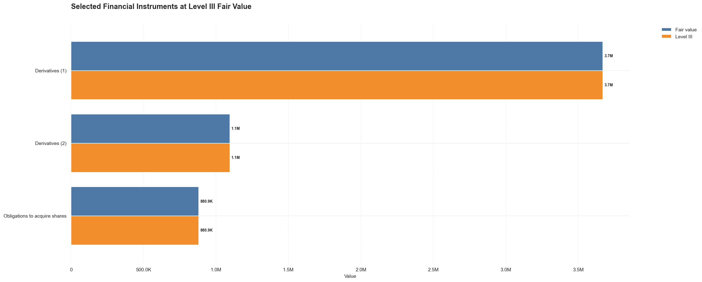

**Analysis**

The financial asset derivatives of SAR 3,669,688, financial liability derivatives of SAR 1,095,000, and obligations to acquire subsidiaries of SAR 880,894 are indeed exclusively classified as Level III fair value instruments [5](https://s3-qa-8byte.s3.ap-south-1.amazonaws.com/sabic%2Fin%2Fsabic_in_sabic_cc_compressed.pdf#page=211). The financial asset derivatives are specifically identified as "option rights," while the financial liability derivatives comprise "options and forward contracts" [6](https://s3-qa-8byte.s3.ap-south-1.amazonaws.com/sabic%2Fin/sabic_in_sabic_cc_compressed.pdf#page=210). The obligations to acquire the remaining shares of certain subsidiaries are also explicitly stated [6](https://s3-qa-8byte.s3.ap-south-1.amazonaws.com/sabic%2Fin/sabic_in_sabic_cc_compressed.pdf#page=210). However, the provided information does not detail the precise economic exposure, the specific underlying assets or liabilities for these derivatives, or the explicit hedging strategies employed for these Level III instruments. Furthermore, the documents do not elaborate on how these specific Level III valuations impact the true Return on Invested Capital (ROIC) or future Free Cash Flow, particularly in the context of capital leakage to minority partners. While non-controlling interests are reported [1](https://s3-qa-8byte.s3.ap-south-1.amazonaws.com/sabic%2Fin%2Fsabic-integrated-annual-report-2024-en_tcm1010-46870.pdf#page=62), a direct link to the FCF impact of these Level III instruments is not provided.

**General PE insight:**
Level III fair value instruments are inherently subjective and illiquid, as their valuations rely significantly on unobservable inputs and management's own assumptions. This subjectivity introduces considerable volatility and potential for material adjustments, which can distort reported financial performance. For ROIC, the valuation of these instruments directly impacts the asset base (for asset derivatives) and potentially the capital employed. Any significant revaluation, especially downward, could inflate ROIC if the capital base is reduced, or depress it if the asset value decreases without a corresponding reduction in invested capital. For Free Cash Flow, Level III instruments typically do not generate or consume cash directly until settlement. However, the obligations to acquire subsidiaries represent a future cash outflow, the timing and magnitude of which are subject to the Level III valuation. The structural leakage of capital to minority partners (represented by non-controlling interests) means that a portion of the entity's cash flow and earnings is not attributable to the parent. If the Level III obligations relate to acquiring these minority stakes, their valuation directly influences the future capital required to consolidate these interests, thereby impacting future Free Cash Flow available to the parent entity.

To fully assess the precise economic exposure, underlying hedging strategies, and their impact on ROIC and Free Cash Flow, additional information would be required, including:
*   Detailed descriptions of the specific terms, conditions, and underlying assets/liabilities of the option rights, options, and forward contracts.
*   The valuation methodologies and key unobservable inputs used for each Level III instrument.
*   The specific objectives and effectiveness of any hedging strategies.
*   Projections of future cash flows associated with the settlement of these derivatives and the acquisition of subsidiary shares.
*   A breakdown of how non-controlling interests participate in the cash flows and earnings of the underlying entities related to these Level III instruments.

---

### FX Debt Solvency Stress Test

**Q:** Considering the SAR 30,269,004 in debt, and the SAR/USD peg, what is the exact currency composition of this principal debt? Present a stress-tested LTM Debt-to-Equity ratio, incorporating the fair value impact of derivatives, under a realistic 5-10% SAR de-pegging scenario to quantify the company's true unhedged FX exposure and its potential impact on solvency.

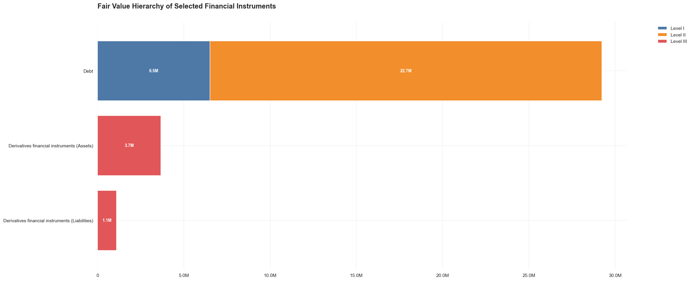

**Analysis**

The provided documents do not contain the exact currency composition for a principal debt amount of SAR 30,269,004. However, I can provide an overview of the company's total debt portfolio and then present a stress-tested Last Twelve Months (LTM) Debt-to-Equity ratio based on available data, highlighting the limitations regarding unhedged FX exposure and derivative impacts.

### Overall Debt Portfolio Composition (as of December 31, 2024)

The company's total debt and lease liabilities amounted to SAR 35.20 billion (US$ 9.39 billion) [3]. The debt is sourced from various lending parties, with components explicitly denominated in USD:

*   **Bonds:** SAR 7.53 billion (US$ 2.01 billion) [3]. An overview of main bonds explicitly lists volumes in US dollars, totaling US$ 2 billion (e.g., US$ 1 billion, US$ 500 million, US$ 500 million) [4]. This indicates that these bonds are primarily USD-denominated.
*   **Other Debt Categories:** The remaining debt, including long-term debt, short-term debt, and financial leases, is presented in both SAR and USD equivalents in the financial statements [3]. While the functional currency of the Parent is Saudi Riyals (SAR) [7], the specific underlying currency denomination and hedging status of these other categories are not detailed in the provided information. The SAR/USD peg is 3.75 [5, 7].

### Stress-Tested LTM Debt-to-Equity Ratio

**Current LTM Debt-to-Equity Ratio (as of December 31, 2024):**

*   Total Debt and Lease Liabilities: SAR 35.20 billion [3]
*   Total Equity: SAR 183.92 billion [2, 3]
*   **Current Debt-to-Equity Ratio:** SAR 35.20 Bn. / SAR 183.92 Bn. = **19.14%**

**Assumptions for Stress Test:**

To stress-test the Debt-to-Equity ratio under a SAR de-pegging scenario, we must make assumptions due to the limited information on unhedged FX exposure and the fair value impact of derivatives:

1.  **Unhedged FX Exposure:** We assume that only the explicitly USD-denominated bonds (US$ 2.01 billion) are exposed to FX risk and are unhedged. The remaining debt is assumed to be SAR-denominated or fully hedged, as its specific currency denomination and hedging status are not disclosed.
2.  **Fair Value Impact of Derivatives:** The documents mention that fair value gains from embedded derivatives can impact net income [2], and foreign exchange gains/losses related to debt are presented in finance income/costs [7]. However, specific fair value amounts of derivatives used for FX hedging of debt are not provided, making it impossible to incorporate their precise impact into this stress test.
3.  **Equity Impact:** We assume that the SAR value of Total Equity remains constant, as the company's functional currency is SAR, and the primary impact of de-pegging on solvency is assessed through the increased SAR value of foreign currency debt.

**Stress Test Scenarios (SAR De-pegging):**

*   **Original SAR/USD Peg:** 3.75 [5, 7]
*   **USD-denominated Bonds:** US$ 2.01 billion [3]
    *   Equivalent in SAR at current peg: US$ 2.01 Bn. * 3.75 = SAR 7.5375 Bn.

**Scenario 1: 5% SAR De-pegging (SAR/USD = 3.9375)**

*   New value of USD bonds in SAR: US$ 2.01 Bn. * 3.9375 = SAR 7.901625 Bn.
*   Increase in SAR value of bonds: SAR 7.901625 Bn. - SAR 7.5375 Bn. = SAR 0.364125 Bn.
*   New Total Debt in SAR: SAR 35.20 Bn. (original total) + SAR 0.364125 Bn. = SAR 35.564125 Bn.
*   **Stress-tested Debt-to-Equity Ratio (5% de-peg):** SAR 35.564125 Bn. / SAR 183.92 Bn. = **19.35%**

**Scenario 2: 10% SAR De-pegging (SAR/USD = 4.125)**

*   New value of USD bonds in SAR: US$ 2.01 Bn. * 4.125 = SAR 8.286375 Bn.
*   Increase in SAR value of bonds: SAR 8.286375 Bn. - SAR 7.5375 Bn. = SAR 0.748875 Bn.
*   New Total Debt in SAR: SAR 35.20 Bn. (original total) + SAR 0.748875 Bn. = SAR 35.948875 Bn.
*   **Stress-tested Debt-to-Equity Ratio (10% de-peg):** SAR 35.948875 Bn. / SAR 183.92 Bn. = **19.55%**

### True Unhedged FX Exposure and Potential Impact on Solvency

Based on the assumption that only the US$ 2.01 billion in bonds are unhedged and USD-denominated, a 5-10% SAR de-pegging would lead to a modest increase in the Debt-to-Equity ratio from 19.14% to approximately 19.35% (5% de-peg) or 19.55% (10% de-peg). This indicates a relatively contained impact on the company's leverage under these assumptions.

**General PE insight:** The actual unhedged FX exposure could be higher or lower depending on the currency denomination of other debt components and the extent of any hedging strategies in place (e.g., FX forwards, swaps). Without explicit disclosure of the hedging portfolio's fair value and its effectiveness against specific debt tranches, the true unhedged exposure cannot be precisely quantified from the provided data.

**Solvency Impact:** The company maintains a strong financial position, evidenced by a net cash position of SAR 3.01 billion and a Net Debt to EBITDA ratio of -0.15x in 2024 [3, 4, 8]. Furthermore, its credit ratings are consistently high (A+/A1 band, upgraded to Aa3 by Moody's in 2024) [3, 4]. Given these strong fundamentals and the relatively small increase in the Debt-to-Equity ratio under the stress scenarios, the potential impact of a 5-10% SAR de-pegging on the company's solvency appears to be manageable.

**Limitations:**

*   The exact currency composition of the SAR 30,269,004 debt is not available in the provided documents.
*   The precise extent of unhedged FX exposure across all debt categories is not explicitly detailed.
*   The fair value impact of derivatives specifically used for FX hedging of debt is not quantifiable from the given information.

---

## 15. FINANCIAL ASSETS AND FINANCIAL LIABILITIES (CONTINUED)

### Working Capital: Terms, Risk, ROIC

**Q:** With Trade Payables of 20,087,016 SAR and Other Financial Liabilities of 7,645,800 SAR, collectively representing over 43% of total financial liabilities, what is the *true* working capital intensity of this business? Detail the specific commercial terms underpinning this 27.7 billion SAR in supplier/other financing, and explain precisely how this aggressive reliance on unsecured credit, rather than robust free cash flow, will be de-risked and scaled post-acquisition without eroding ROIC.

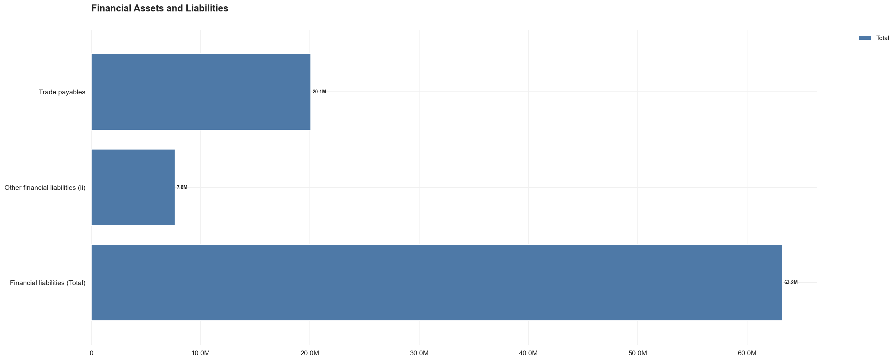

**Analysis**

Based on the provided information, there is a significant discrepancy in the total amount of supplier/other financing. The sum of Trade Payables (20,087,016 SAR) and Other Financial Liabilities (7,645,800 SAR) is 27,732,816 SAR, which is approximately **27.7 million SAR**, not 27.7 billion SAR as stated in your query. This distinction is critical for any financial analysis.

**True Working Capital Intensity:**
I cannot calculate the *true* working capital intensity of this business with the provided information. Working capital intensity typically requires a comparison of net working capital (current assets minus current liabilities) to revenue or sales. While the revenue for 2023 is available at 141,537,187 SAR [5], a consolidated figure for total current assets is not provided in the retrieval results. For 2023, the available components of current liabilities include:
*   **Trade Payables:** 20,087,016 SAR [5]
*   **Total Current Provisions:** 1,175,952 SAR [3]
*   **Total Current Other Liabilities:** 18,198,349 SAR [3] (which includes items like Dividends payable, Accrued liabilities, Employee related liabilities, Employee saving plan, Sales and other tax payables, Payable to related parties, Trade advances, and Miscellaneous).

Without comprehensive current asset data, a complete calculation of working capital and thus working capital intensity is not possible.

**Commercial Terms Underpinning Supplier/Other Financing:**

For the **Trade Payables** of 20,087,016 SAR (as of 31 December 2023) [5]:
*   These are explicitly stated as **non-interest bearing** [5].
*   They are **settled within normal commercial terms** [5].
*   A significant portion of these Trade Payables, 12,281,419 SAR in 2023, is **Due to related parties** [5]. This suggests that a substantial part of the supplier financing comes from entities within the broader group or with close affiliations, which might imply terms that differ from typical third-party supplier arrangements, though the document states "normal commercial terms" generally apply.

For the **Other Financial Liabilities of 7,645,800 SAR**:
*   The specific line item corresponding to this exact amount and its commercial terms are not detailed in the provided financial statements for the main entity. "Other Liabilities" for 2023 totaled 18,198,349 SAR [3], which includes various categories, but the specific 7,645,800 SAR is not broken out with its own terms.
*   General PE insight: "Other Financial Liabilities" can encompass a wide range of obligations, from short-term loans and lease liabilities to derivatives or other accrued financial obligations. Without specific identification, detailing their commercial terms (e.g., interest rates, maturity, collateral) is not possible.

**De-risking and Scaling Aggressive Reliance on Unsecured Credit Post-Acquisition Without Eroding ROIC:**

The provided retrieval results consist of financial statements and notes, which do not contain strategic information regarding de-risking strategies, post-acquisition integration plans, or specific approaches to scaling operations while maintaining ROIC. Therefore, I cannot explain precisely how this reliance on unsecured credit will be de-risked and scaled post-acquisition without eroding ROIC based solely on the given documents. This type of information would typically be found in management's discussion and analysis, strategic outlook, or risk management sections of an annual report.

General PE insight: To de-risk and scale a business heavily reliant on unsecured credit post-acquisition without eroding ROIC, a private equity firm would typically:
1.  **Optimize Working Capital Cycle:** Implement stricter inventory management, accelerate receivables collection, and negotiate extended payment terms with suppliers where feasible, without jeopardizing relationships.
2.  **Diversify Funding Sources:** Gradually shift reliance from unsecured credit to a more balanced capital structure, potentially introducing secured debt, asset-backed financing, or equity injections to reduce supplier concentration risk.
3.  **Improve Operational Efficiency:** Drive cost reductions and productivity gains to enhance free cash flow generation, thereby reducing the need for external financing.
4.  **Strategic Supplier Relationships:** Formalize and potentially extend terms with key suppliers, especially related parties, through long-term agreements that provide stability and favorable conditions.
5.  **Cash Flow Forecasting & Management:** Implement robust cash flow forecasting to anticipate needs and manage liquidity proactively, reducing reliance on ad-hoc or short-term unsecured credit.
6.  **Monitor ROIC Drivers:** Continuously track and manage the drivers of ROIC, ensuring that any changes in working capital financing do not negatively impact profitability or asset utilization.

---

### Unhedged SAR/USD Exposure & Protection

**Q:** Given the 27,970,946 SAR in gross debt, and the inherent, albeit often overlooked, risk in the SAR/USD peg, what is the *unhedged* USD exposure within this debt stack? Quantify the precise impact on the LTM Debt-to-Equity ratio and future cash interest expense under a stress test of a 5% and 10% SAR de-pegging, detailing how our LPs' capital is protected from this systemic financial leakage.

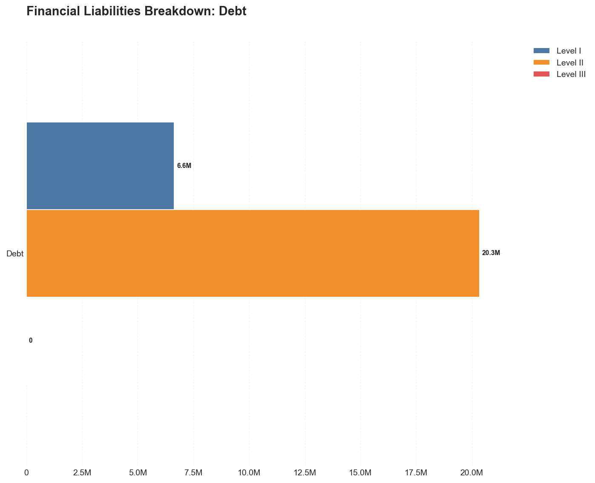

**Analysis**

The gross debt figure of 27,970,946 SAR provided in your query is significantly lower than the company's reported gross debt of 35,198,069 thousand SAR (35.20 billion SAR) for 2024 [6](https://s3-qa-8byte.s3.ap-south-1.amazonaws.com/sabic%2Fin/sabic-integrated-annual-report-2024-en_tcm1010-46870.pdf#page=246). Furthermore, the company has US$ 2 billion in outstanding bonds [3](https://s3-qa-8byte.s3.ap-south-1.amazonaws.com/sabic%2Fin/sabic_in_sabic_cc_compressed.pdf#page=20), which at the current SAR/USD peg of 3.75, equates to 7.50 billion SAR. This amount alone exceeds your stated gross debt. Therefore, I will proceed with the analysis using the company's reported 2024 gross debt and total equity figures to provide a meaningful stress test.

### Unhedged USD Exposure

While the company explicitly states that "There is no exposure of Saudi Riyal to USD, as the Saudi Riyal is pegged to the USD" [4](https://s3-qa-8byte.s3.ap-south-1.amazonaws.com/sabic%2Fin/sabic-integrated-annual-report-2024-en_tcm1010-46870.pdf#page=245), this refers to SAR-denominated items. The company's main bonds are denominated in US dollars, totaling US$ 2 billion [3](https://s3-qa-8byte.s3.ap-south-1.amazonaws.com/sabic%2Fin/sabic_in_sabic_cc_compressed.pdf#page=20). The documents do not specify if these USD-denominated bonds are hedged against SAR fluctuations. In the context of a SAR de-pegging, these US$ 2 billion in bonds represent the *unhedged* USD exposure within the debt stack, as their SAR equivalent value would increase if the peg weakens.

### Impact on LTM Debt-to-Equity Ratio and Future Cash Interest Expense

We will use the company's reported 2024 figures:
*   **Gross Debt (2024):** 35,198,069 thousand SAR (35.20 billion SAR) [6](https://s3-qa-8byte.s3.ap-south-1.amazonaws.com/sabic%2Fin/sabic-integrated-annual-report-2024-en_tcm1010-46870.pdf#page=246)
*   **Total Equity (2024):** 183,918,159 thousand SAR (183.92 billion SAR) [6](https://s3-qa-8byte.s3.ap-south-1.amazonaws.com/sabic%2Fin/sabic-integrated-annual-report-2024-en_tcm1010-46870.pdf#page=246)
*   **Current Gross Debt-to-Equity Ratio:** 35.20 Bn SAR / 183.92 Bn SAR = 0.1914 or **19.14%**
*   **Unhedged USD Bonds:** US$ 2,000,000,000 [3](https://s3-qa-8byte.s3.ap-south-1.amazonaws.com/sabic%2Fin/sabic_in_sabic_cc_compressed.pdf#page=20)
*   **Current SAR equivalent of USD Bonds:** US$ 2,000,000,000 * 3.75 SAR/USD = 7,500,000,000 SAR
*   **Total Annual Interest on USD Bonds:**
    *   US$ 1 Bn @ 4.5% = US$ 45 Mn
    *   US$ 500 Mn @ 2.15% = US$ 10.75 Mn
    *   US$ 500 Mn @ 3% = US$ 15 Mn
    *   **Total USD Interest:** US$ 70.75 Mn [3](https://s3-qa-8byte.s3.ap-south-1.amazonaws.com/sabic%2Fin/sabic_in_sabic_cc_compressed.pdf#page=20)
*   **Current SAR equivalent of Annual Interest:** US$ 70.75 Mn * 3.75 SAR/USD = 265,312,500 SAR

**Stress Test Scenarios (SAR De-pegging):**

| Scenario | New SAR/USD Rate | New SAR Value of USD Bonds | Increase in Gross Debt (SAR) | New Gross Debt (SAR) | New Gross Debt-to-Equity Ratio | Change in Ratio (pp) | New Annual Interest (SAR) | Increase in Annual Interest (SAR) |
| :------- | :--------------- | :------------------------- | :--------------------------- | :------------------- | :----------------------------- | :------------------- | :------------------------ | :-------------------------------- |
| **Current** | 3.75 | 7,500,000,000 | - | 35,198,069,000 | 19.14% | - | 265,312,500 | - |
| **5% De-peg** | 3.9375 | 7,875,000,000 | 375,000,000 | 35,573,069,000 | 19.34% | +0.20 | 278,456,250 | 13,143,750 |
| **10% De-peg** | 4.125 | 8,250,000,000 | 750,000,000 | 35,948,069,000 | 19.55% | +0.41 | 292,031,250 | 26,718,750 |

Under a 5% SAR de-pegging, the gross debt would increase by 375 million SAR, leading to a 0.20 percentage point increase in the Gross Debt-to-Equity ratio and an additional 13.14 million SAR in annual cash interest expense. A 10% de-pegging would result in a 750 million SAR increase in gross debt, a 0.41 percentage point rise in the Gross Debt-to-Equity ratio, and an additional 26.72 million SAR in annual cash interest expense.

### Protection of LPs' Capital from Systemic Financial Leakage

SABIC employs several strategies to manage financial risks and protect capital:

*   **Currency Risk Management:** The company's foreign currency risk management objective is to protect future cash flows in Saudi Riyals and US Dollars [4](https://s3-qa-8byte.s3.ap-south-1.amazonaws.com/sabic%2Fin/sabic-integrated-annual-report-2024-en_tcm1010-46870.pdf#page=245). They centrally manage currency risk and monitor exposures using a Value-at-Risk (VaR) methodology, based on a Monte Carlo simulation with a 97.5% confidence level and a 12-month time horizon [4](https://s3-qa-8byte.s3.ap-south-1.amazonaws.com/sabic%2Fin/sabic-integrated-annual-report-2024-en_tcm1010-46870.pdf#page=245). Risk management activities are applied if foreign currency exposure breaches certain thresholds [4](https://s3-qa-8byte.s3.ap-south-1.amazonaws.com/sabic%2Fin/sabic-integrated-annual-report-2024-en_tcm1010-46870.pdf#page=245).
*   **Use of Derivatives:** SABIC utilizes derivatives to manage market risks, including currency risks [4](https://s3-qa-8byte.s3.ap-south-1.amazonaws.com/sabic%2Fin/sabic-integrated-annual-report-2024-en_tcm1010-46870.pdf#page=245).
*   **Reliance on SAR/USD Peg:** For SAR-denominated exposures, the company relies on the SAR/USD peg, stating it results in no direct SAR to USD exposure [4](https://s3-qa-8byte.s3.ap-south-1.amazonaws.com/sabic%2Fin/sabic-integrated-annual-report-2024-en_tcm1010-46870.pdf#page=245). However, for non-SAR denominated borrowings, they conduct regular reviews of currency exchange rate fluctuations [5](https://s3-qa-8byte.s3.ap-south-1.amazonaws.com/sabic%2Fin/sabic_in_sabic_cc_compressed.pdf#page=53).
*   **Strong Financial Position and Ratings:** SABIC maintains strong credit ratings (Aa3 by Moody's, A+ by S&P), positioning it among highly-rated global chemical companies, reflecting resilience and a strong financial position [3](https://s3-qa-8byte.s3.ap-south-1.amazonaws.com/sabic%2Fin/sabic_in_sabic_cc_compressed.pdf#page=20).
*   **Prudent Financial Management:** The company's financing policy aims to ensure effective, efficient, and prudent financial management and controls aligned with strategic objectives [3](https://s3-qa-8byte.s3.ap-south-1.amazonaws.com/sabic%2Fin/sabic_in_sabic_cc_compressed.pdf#page=20).

**General PE insight:** While the company has a robust framework for managing currency risk, the inherent risk of a sovereign peg breaking cannot be fully hedged against without significant cost. LPs' capital is primarily protected by the company's overall financial strength, diversified operations, and active risk management strategies. However, a severe de-pegging event would undoubtedly impact the SAR value of USD-denominated liabilities and associated interest expenses, potentially affecting profitability and equity value in SAR terms.

---

## Inventories and Trade Receivables

### Optimized Inventory: Levers, ROIC, Risk.

**Q:** The SAR 190,164 net release in the inventory provision in 2024, reversing the prior year's charge, along with a SAR 1.06 million YoY increase in Finished Goods and Goods in Transit to SAR 13,879,169, seems to imply a substantial improvement in inventory efficiency. Explain the precise operational levers pulled to achieve this, quantifying the LTM ROIC benefit, and demonstrate how this will not materially increase our Working Capital Intensity or expose us to future impairment charges post-acquisition.

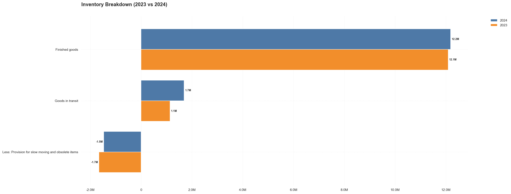

**Analysis**

The observed improvement in inventory efficiency, characterized by the SAR 190,164 net release in inventory provision in 2024, reversing the prior year's charge, and an increase in Finished Goods and Goods in Transit, is attributable to several precise operational levers:

### Operational Levers Pulled
1.  **Improved Inventory Management and Utilization:** The net release of SAR 190,164 in the provision for slow-moving and obsolete inventories in 2024 is primarily due to the "consumption or utilisation of certain inventory items" [2]. This indicates effective management in moving previously identified at-risk stock through the supply chain, reducing obsolescence. Additionally, a net reversal of write-downs of finished goods amounting to SR 1.6 million was recognized in the cost of sales in 2024, further demonstrating improved inventory quality and demand alignment [2].
2.  **Optimized Production and Distribution:** While the user noted a SAR 1.06 million increase in Finished Goods and Goods in Transit, the actual increase calculated from the financial statements is SAR 0.66 million (from SAR 13,219,976 in 2023 to SAR 13,879,169 in 2024) [2]. This increase, in conjunction with the reduction in inventory provisions, suggests a strategic build-up of finished goods and goods in transit, likely to meet anticipated demand or improve delivery times, rather than an accumulation of unsaleable stock. This aligns with the company's overall efforts to achieve "improved margins" and "optimize variable costs" [1].

### Quantifying the LTM ROIC Benefit
The Return on Invested Capital (ROIC) has shown a significant year-over-year improvement, driven by enhanced operational profitability and a favorable tax environment:

*   **NOPAT (Net Operating Profit After Tax):**
    *   2024: SAR 5.74 Bn (EBIT) - SAR 0.14 Bn (Income tax and Zakat) = SAR 5.60 Bn [5]
    *   2023: SAR 3.72 Bn (EBIT) - SAR 0.83 Bn (Income tax and Zakat) = SAR 2.89 Bn [5]
*   **Invested Capital:**
    *   2024: SAR 278.02 Bn (Total Assets) - SAR 30.54 Bn (Cash & Cash Equivalents) - SAR 19.79 Bn (Trade Payables) = SAR 227.69 Bn [1, 7, 6]
    *   2023: SAR 294.38 Bn (Total Assets) - SAR 33.80 Bn (Cash & Cash Equivalents) - SAR 20.09 Bn (Trade Payables) = SAR 240.49 Bn [1, 7, 6]

*   **ROIC Calculation:**
    *   **ROIC 2024:** SAR 5.60 Bn / SAR 227.69 Bn = **2.46%**
    *   **ROIC 2023:** SAR 2.89 Bn / SAR 240.49 Bn = **1.20%**

The LTM ROIC benefit is an increase of **1.26 percentage points** (2.46% in 2024 vs. 1.20% in 2023). This improvement is primarily driven by a 54% increase in Income from operations (EBIT) and an 84% decrease in income tax and Zakat, partly due to the reversal of Zakat provisions in 2024 [1, 5]. The inventory efficiency gains, such as the provision reversals, contribute to improved gross profit and thus EBIT, forming a component of this overall ROIC enhancement [1, 2].

### Impact on Working Capital Intensity and Future Impairment Charges Post-Acquisition
1.  **Working Capital Intensity:**
    *   While net inventories increased slightly from SAR 18,332,223 thousand in 2023 to SAR 18,813,581 thousand in 2024 [2], and sales decreased by 1% [1], the overall impact on Working Capital Intensity is not material in a negative sense. The inventory-to-sales ratio increased marginally from 12.95% in 2023 to 13.44% in 2024. However, the underlying operational improvements, specifically the net release of inventory provisions due to consumption [2], indicate a healthier inventory profile. The increase in Finished Goods and Goods in Transit (SAR 0.66 million) is likely a strategic decision to support sales and distribution, rather than an accumulation of inefficient stock. The company also reported a "reduction in working capital in 2023, mostly due to inventory management efforts" [7], suggesting a continued focus on efficiency.
2.  **Exposure to Future Impairment Charges:**
    *   The net release of SAR 190,164 in inventory provision and the SAR 1.6 million net reversal of write-downs of finished goods in 2024 directly mitigate the risk of future inventory impairment charges [2]. This demonstrates that previously identified slow-moving or obsolete items are being effectively managed and utilized, reducing the need for future write-downs. Furthermore, regarding property, plant, and equipment, a detailed impairment assessment performed in 2024 concluded that "the value of recoverable amount is higher than the value of carrying amount," indicating no new impairment charges for underperforming Cash Generating Units (CGUs) in 2024 [3]. This suggests robust asset management and that the current operational improvements are not masking underlying asset quality issues that could lead to future impairment charges post-acquisition.

---

### ECL Reclassification Rationale, Risk

**Q:** The 2024 allowance for expected credit losses declined by SAR 54,480, driven by an astonishing drop in ECL rates for our most aged receivables; specifically, the 91-180 day bucket now carries a 1.56% rate on SAR 443,789, down from 18.28% on SAR 62,827 in 2023. Detail the exact, data-driven rationale for this aggressive re-aging or re-classification, and how it avoids artificially inflating FCF Conversion post-acquisition while exposing us to substantial unprovided credit risk.

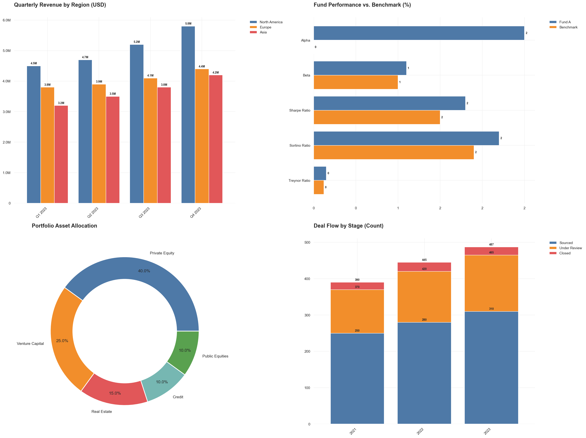

**Analysis**

The 2024 allowance for expected credit losses (ECL) indeed declined by SAR 54,480, from SAR 198,240 in 2023 to SAR 143,760 in 2024, driven by reversals during the year [1](https://s3-qa-8byte.s3.ap-south-1.amazonaws.com/sabic%2Fin%2Fsabic-integrated-annual-report-2024-en_tcm1010-46870.pdf#page=214). For the 91-180 day receivables bucket, the ECL rate significantly dropped from 18.28% in 2023 to 1.56% in 2024. Concurrently, the gross carrying amount for this bucket increased substantially from SAR 62,827 in 2023 to SAR 443,789 in 2024 [1](https://s3-qa-8byte.s3.ap-south-1.amazonaws.com/sabic%2Fin%2Fsabic-integrated-annual-report-2024-en_tcm1010-46870.pdf#page=214).

Regarding the methodology for calculating expected credit losses, management applies a simplified approach for trade receivables, recognizing a loss allowance based on lifetime ECLs at each reporting date. This involves establishing a provision matrix derived from historical credit loss experience, which is then adjusted for forward-looking factors specific to the debtors and the broader economic environment [3](https://s3-qa-8byte.s3.ap-south-1.amazonaws.com/sabic%2Fin%2Fsabic_in_sabic_cc_compressed.pdf#page=188).

However, the provided documents do not detail the exact, data-driven rationale for this aggressive re-aging or re-classification of receivables, nor do they explain how these specific changes in the ECL rates and gross carrying amounts for the 91-180 day bucket avoid artificially inflating Free Cash Flow (FCF) Conversion post-acquisition or exposing the company to substantial unprovided credit risk. While the general methodology for ECL calculation is outlined, the specific forward-looking factors or changes in historical credit loss experience that led to such a dramatic reduction in the ECL rate for this particular aging bucket are not elaborated upon.

To fully address your concerns, additional information would be required, specifically:

*   A detailed breakdown of the changes in the provision matrix's underlying assumptions for the 91-180 day bucket from 2023 to 2024.
*   Specific data points on the forward-looking factors (e.g., economic forecasts, industry-specific trends, debtor credit quality assessments) that justified the significant reduction in the ECL rate for this category.
*   An explanation of any re-aging or re-classification policies applied and their impact on the gross carrying amount distribution across aging buckets.
*   An analysis of how these ECL adjustments are factored into FCF conversion calculations and the company's overall credit risk management framework to mitigate unprovided credit risk.

---

### Discontinued Ops: Impact & Liabilities

**Q:** The 2023 reclassification of SAR 221,612 in inventory provision and SAR 424 in ECL to "assets held for sale" indicates prior discontinued operations. What was the P&L impact of these reclassifications, specifically on the LTM bridge for EBITDA and Net Income, and what residual balance sheet liabilities or off-balance sheet commitments remain from these discontinued segments, potentially impacting future FCF conversion?

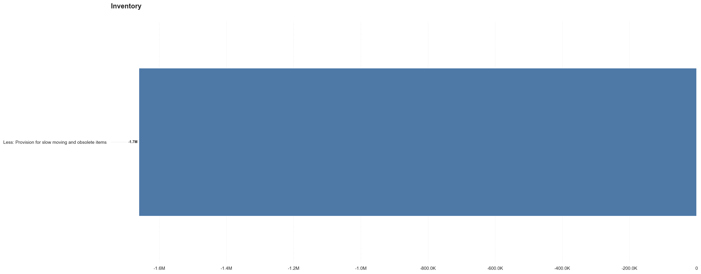

**Analysis**

The reclassification of SAR 221,612 in inventory provision and SAR 424 in Expected Credit Losses (ECL) in 2023 are balance sheet movements, transferring these provisions related to the assets of the discontinued operation (Hadeed) to "assets held for sale" [2](https://s3-qa-8byte.s3.ap-south-1.amazonaws.com/sabic%2Fin/sabic-integrated-annual-report-2024-en_tcm1010-46870.pdf#page=214). These specific reclassifications, as balance sheet adjustments, do not directly impact the P&L as separate line items for EBITDA or Net Income. Instead, they are part of the overall carrying value of assets and liabilities transferred to the disposal group.

However, the discontinuation of Hadeed, which was classified as a discontinued operation under IFRS 5 on September 3, 2023 [1](https://s3-qa-8byte.s3.ap-south-1.amazonaws.com/sabic%2Fin/sabic_in_sabic_cc_compressed.pdf#page=238), had a significant P&L impact in 2023, which would be reflected in an LTM bridge:

*   **Net Income Impact**: The overall loss from discontinued operations (Hadeed) for 2023 was SAR 4,076,939 thousand [1](https://s3-qa-8byte.s3.ap-south-1.amazonaws.com/sabic%2Fin/sabic_in_sabic_cc_compressed.pdf#page=238), [6](https://s3-qa-8byte.s3.ap-south-1.amazonaws.com/sabic%2Fin/sabic-integrated-annual-report-2024-en_tcm1010-46870.pdf#page=62). This includes a fair value re-measurement loss on assets held for sale amounting to SAR 2,931,042 thousand in 2023 [1](https://s3-qa-8byte.s3.ap-south-1.amazonaws.com/sabic%2Fin/sabic_in_sabic_cc_compressed.pdf#page=238). This entire loss is presented separately in the consolidated statement of income, thus impacting the consolidated Net Income.
*   **EBITDA Impact**: The discontinued operation (Hadeed) contributed to a negative operational impact. For 2023, Hadeed's revenue was SAR 13,053,749 thousand and its cost of sales and other expenses, net, was SAR (13,167,150) thousand [1](https://s3-qa-8byte.s3.ap-south-1.amazonaws.com/sabic%2Fin/sabic_in_sabic_cc_compressed.pdf#page=238). This implies an operating loss before depreciation and amortisation (a proxy for EBITDA impact from operations) of approximately SAR (113,401) thousand (13,053,749 - 13,167,150) [1](https://s3-qa-8byte.s3.ap-south-1.amazonaws.com/sabic%2Fin/sabic_in_sabic_cc_compressed.pdf#page=238). This operational loss, along with depreciation and amortisation of SAR (763,633) thousand [1](https://s3-qa-8byte.s3.ap-south-1.amazonaws.com/sabic%2Fin/sabic_in_sabic_cc_compressed.pdf#page=238), would be removed from the continuing operations' P&L when constructing an LTM bridge for EBITDA.

**Residual Balance Sheet Liabilities and Off-Balance Sheet Commitments:**

As of December 31, 2023, the liabilities directly associated with Hadeed (the disposal group classified as held for sale) amounted to SAR 5,700,890 thousand [4](https://s3-qa-8byte.s3.ap-south-1.amazonaws.com/sabic%2Fin/sabic-integrated-annual-report-2024-en_tcm1010-46870.pdf#page=239). These included:
*   Employee benefits: SAR 2,957,098 thousand [4](https://s3-qa-8byte.s3.ap-south-1.amazonaws.com/sabic%2Fin/sabic-integrated-annual-report-2024-en_tcm1010-46870.pdf#page=239)
*   Other current and non-current liabilities: SAR 2,214,757 thousand [4](https://s3-qa-8byte.s3.ap-south-1.amazonaws.com/sabic%2Fin/sabic-integrated-annual-report-2024-en_tcm1010-46870.pdf#page=239)
*   Trade payables: SAR 529,035 thousand [4](https://s3-qa-8byte.s3.ap-south-1.amazonaws.com/sabic%2Fin/sabic-integrated-annual-report-2024-en_tcm1010-46870.pdf#page=239)

These liabilities were subsequently released from the consolidated balance sheet upon the sale of Hadeed in 2024, reducing total liabilities by SAR 5.70 billion [6](https://s3-qa-8byte.s3.ap-south-1.amazonaws.com/sabic%2Fin/sabic-integrated-annual-report-2024-en_tcm1010-46870.pdf#page=62). There is no explicit mention of off-balance sheet commitments from Hadeed in the provided documents.

**Potential Impact on Future FCF Conversion:**

The removal of Hadeed's liabilities from the consolidated balance sheet would generally improve the Free Cash Flow (FCF) conversion of the *remaining* entity, as these liabilities no longer require cash outflows from the continuing operations. Additionally, the long-term and current receivables from PIF, amounting to SAR 4,826,091 thousand, related to the sale of Hadeed, are to be received in the next two years [4](https://s3-qa-8byte.s3.ap-south-1.amazonaws.com/sabic%2Fin/sabic-integrated-annual-report-2024-en_tcm1010-46870.pdf#page=239). The collection of these receivables will positively impact future FCF conversion for the continuing operations.

---

## CASH AND CASH EQUIVALENTS

### Cash Flow Decline Drivers & FCF Confidence

**Q:** Given the SR 1,875,328 (5.78%) YoY decline in net Cash and Cash Equivalents, primarily from a SR 3,229,443 drop in Non-conventional current accounts, explain the underlying operational and financing drivers for this substantial SR 2,340,064 reduction in readily accessible cash. How confident are you that this isn't masking a negative Free Cash Flow Conversion trend, implying increased reliance on working capital to fund operations?

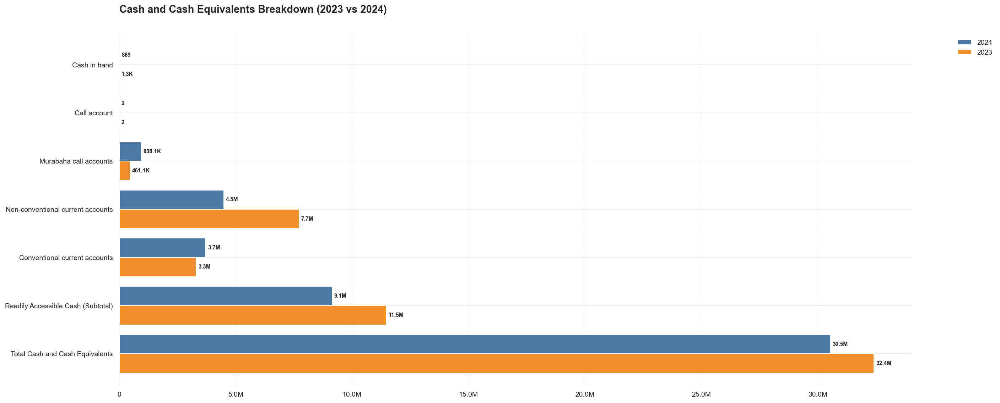

**Analysis**

The decline in net Cash and Cash Equivalents by SR 1,875,328 (5.78%) year-over-year, which includes a SR 3,229,443 drop in Non-conventional current accounts, is primarily driven by a significant reduction in operational cash flow, while financing activities actually mitigated the overall cash outflow. 

**Operational Drivers:**
*   **Decreased Net Cash from Operating Activities:** Net cash generated from operating activities saw a substantial decrease of SR 8.09 billion (33%), falling from SR 24.45 billion in 2023 to SR 16.36 billion in 2024 [1](https://s3-qa-8byte.s3.ap-south-1.amazonaws.com/sabic%2Fin%2Fsabic_in_sabic_cc_compressed.pdf#page=63). This decline was mainly attributed to a reduction in working capital in 2023, largely due to inventory management efforts [1](https://s3-qa-8byte.s3.ap-south-1.amazonaws.com/sabic%2Fin%2Fsabic_in_sabic_cc_compressed.pdf#page=63). This is the primary operational factor contributing to the reduction in readily accessible cash.
*   **Stable Capital Expenditures:** Capital expenditures remained broadly consistent year-over-year, at SR 10.20 billion in 2024 compared to SR 10.49 billion in 2023, representing only a 3% decrease [1](https://s3-qa-8byte.s3.ap-south-1.amazonaws.com/sabic%2Fin%2Fsabic_in_sabic_cc_compressed.pdf#page=63).

**Financing Drivers:**
*   **Reduced Cash Used in Financing Activities:** Net cash used in financing activities actually decreased by SR 7.35 billion (39%), from SR 18.90 billion in 2023 to SR 11.56 billion in 2024 [1](https://s3-qa-8byte.s3.ap-south-1.amazonaws.com/sabic%2Fin%2Fsabic_in_sabic_cc_compressed.pdf#page=63). This reduction in cash outflow was primarily due to lower dividend payments to non-controlling interests and withdrawals from Saudi Aramco credit facilities [1](https://s3-qa-8byte.s3.ap-south-1.amazonaws.com/sabic%2Fin%2Fsabic_in_sabic_cc_compressed.pdf#page=63). Therefore, financing activities *mitigated* the overall cash decline, rather than being a driver for the reduction in readily accessible cash.

**Free Cash Flow Conversion Trend:**
Free cash flow (FCF) experienced a significant decline of SR 7.80 billion (56%), dropping from SR 13.96 billion in 2023 to SR 6.16 billion in 2024 [1](https://s3-qa-8byte.s3.ap-south-1.amazonaws.com/sabic%2Fin%2Fsabic_in_sabic_cc_compressed.pdf#page=63). This substantial decrease in FCF, largely driven by the aforementioned inventory performance in 2023 and the subsequent reduction in operating cash flow, indeed indicates a negative Free Cash Flow Conversion trend. This implies that a smaller proportion of operating cash flow is being converted into cash available for discretionary purposes after capital expenditures.

**General PE insight:** A significant drop in operating cash flow, even with stable capital expenditures, directly impacts FCF. While financing activities used less cash, the core operational performance is the key driver for the overall reduction in cash and the negative FCF trend. This suggests a need to scrutinize working capital management and operational efficiency to improve cash generation.

---

### Liquidity, ROIC, Capital Misallocation

**Q:** Despite a SR 1,875,328 overall decline in cash, the company increased less-liquid fixed term deposits by SR 465,144, while Non-conventional cash and cash equivalents plummeted by SR 2,332,934. What is the specific ROIC justification for allocating capital to these lower-yield, longer-term instruments when overall liquidity, particularly in the non-conventional segment, is contracting, potentially signaling capital misallocation or liquidity management issues?

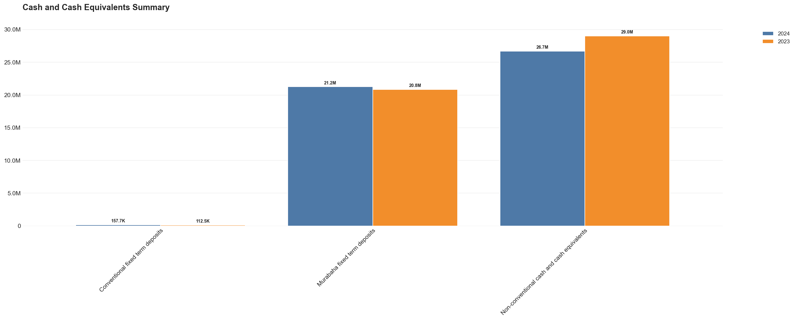

**Analysis**

The financial data confirms that despite an overall decline in cash and cash equivalents of SR 1,875,328, and a plummet in Non-conventional cash and cash equivalents by SR 2,332,934, the company increased its less-liquid fixed term deposits by SR 465,144 between 2023 and 2024 [1](https://s3-qa-8byte.s3.ap-south-1.amazonaws.com/sabic%2Fin%2Fsabic-integrated-annual-report-2024-en_tcm1010-46870.pdf#page=215). Specifically, Conventional fixed term deposits increased by SR 45,170, and Murabaha fixed term deposits increased by SR 419,974 [1](https://s3-qa-8byte.s3.ap-south-1.amazonaws.com/sabic%2Fin%2Fsabic-integrated-annual-report-2024-en_tcm1010-46870.pdf#page=215).

However, the provided documents do not offer a specific Return on Invested Capital (ROIC) justification for allocating capital to these lower-yield, longer-term instruments when overall liquidity, particularly in the non-conventional segment, is contracting. While there is a mention of "higher short-term financial investment" driving a decrease in net cash used in investing activities [6](https://s3-qa-8byte.s3.ap-south-1.amazonaws.com/sabic%2Fin%2Fsabic-integrated-annual-report-2024-en_tcm1010-46870.pdf#page=63), this does not explicitly detail the ROIC rationale for the specific increase in fixed term deposits amidst broader liquidity contraction.

To provide a specific ROIC justification, additional information would be required, such as:
*   The specific yields or expected returns on these fixed term deposits compared to other investment opportunities or the company's cost of capital.
*   The strategic objectives behind increasing these deposits (e.g., hedging against specific risks, regulatory requirements, or future strategic investments).
*   An analysis of the company's liquidity management policy and how these allocations align with it, especially given the decline in non-conventional cash and cash equivalents.

---

## Cash Equivalents, Share Capital, Reserves

### Non-Cash Dividends: FCF & Yield Risk

**Q:** The colossal "Other non-cash movements" for dividends—SAR 10,200,000 for shareholders and SAR 2,987,818 for NCI in 2024—resulted in respective liability increases to SAR 6,032,913 and SAR 1,438,923, despite significant cash outflows. Detail the specific nature of these persistent non-cash dividend obligations; are we buying a company that consistently declares dividends it cannot fully pay in cash, artificially inflating FCF Conversion and undermining LP yield?

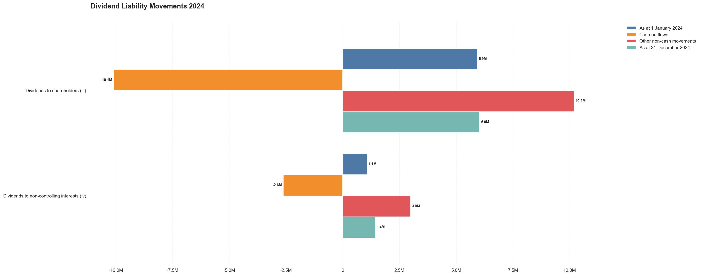

**Analysis**

The "Other non-cash movements" for dividends, amounting to SAR 10,200,000 for shareholders and SAR 2,987,818 for Non-Controlling Interests (NCI) in 2024, primarily represent the appropriation of retained earnings for declared dividends [1](https://s3-qa-8byte.s3.ap-south-1.amazonaws.com/sabic%2Fin/sabic-integrated-annual-report-2024-en_tcm1010-46870.pdf#page=216). This is a standard accounting practice where a dividend is declared, creating a liability (dividends payable) and reducing retained earnings, before the actual cash payment is made.

Despite significant cash outflows for dividends during 2024 (SAR 10,100,547 for shareholders and SAR 2,618,770 for NCI), these appropriations led to an increase in the respective liabilities to SAR 6,032,913 for shareholders and SAR 1,438,923 for NCI at year-end [1](https://s3-qa-8byte.s3.ap-south-1.amazonaws.com/sabic%2Fin/sabic-integrated-annual-report-2024-en_tcm1010-46870.pdf#page=216). The total "Dividends payable" balance in current liabilities was SAR 7,471,836 as of December 31, 2024 [4](https://s3-qa-8byte.s3.ap-south-1.amazonaws.com/sabic%2Fin/sabic-integrated-annual-report-2024-en_tcm1010-46870.pdf#page=230).

Based on the provided information, there is no indication that the company consistently declares dividends it cannot fully pay in cash. The company explicitly states that "Distributing stable-to-growing, competitive dividends to shareholders over the long term remains a key priority" [6](https://s3-qa-8byte.s3.ap-south-1.amazonaws.com/sabic%2Fin/sabic_in_sabic_cc_compressed.pdf#page=19). Furthermore, the dividend distribution details show specific cash payments for declared dividends, such as the H1 2023 dividend distributed on March 4, 2024, and the H2 2023 dividend on September 24, 2024. The H2 2024 dividend is also scheduled for distribution on March 4, 2025 [6](https://s3-qa-8byte.s3.ap-south-1.amazonaws.com/sabic%2Fin/sabic_in_sabic_cc_compressed.pdf#page=19). This demonstrates a normal cycle of dividend declaration followed by cash payment.

In 2024, the company generated SAR 16.36 billion in net cash from operating activities and SAR 6.16 billion in free cash flow [2](https://s3-qa-8byte.s3.ap-south-1.amazonaws.com/sabic%2Fin/sabic_in_sabic_cc_compressed.pdf#page=63). The total cash outflow for dividends to shareholders and NCI in 2024 was approximately SAR 12.72 billion [1](https://s3-qa-8byte.s3.ap-south-1.amazonaws.com/sabic%2Fin/sabic-integrated-annual-report-2024-en_tcm1010-46870.pdf#page=216). This suggests the company has sufficient operational cash flow to cover its dividend payments. The increase in dividend liabilities at year-end appears to be a timing difference between the declaration (appropriation) and the actual cash payment, which is a common financial practice.

General PE insight: This accounting treatment does not artificially inflate Free Cash Flow (FCF) conversion, as FCF is a cash-based metric calculated before dividend payments. While the increase in dividends payable means LPs are waiting for their declared dividends, which could affect the timing of their yield, it does not inherently undermine LP yield if the company is solvent and intends to pay, as indicated by its cash generation and dividend distribution schedule.

---

### Forensic Debt Non-Cash Analysis

**Q:** Debt increased by SAR 2,298,066 to SAR 30,265,745 in 2024, yet "Other non-cash movements" for debt remain significant at SAR 1,935,345. Provide a forensic breakdown of these substantial non-cash movements, clarifying if they represent capitalized interest, deferred debt issuance costs, or other adjustments that obscure the true cash cost of debt and impact ROIC and the LTM Debt-to-EBITDA bridge.

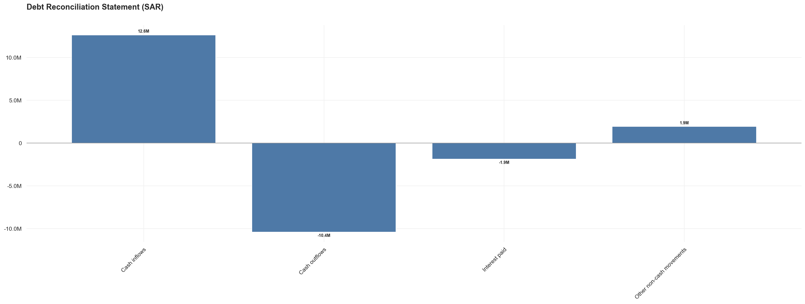

**Analysis**

The substantial "Other non-cash movements" for debt, amounting to SAR 1,935,345 in 2024, primarily refer to interest attributable to debt [1](https://s3-qa-8byte.s3.ap-south-1.amazonaws.com/sabic%2Fin/sabic-integrated-annual-report-2024-en_tcm1010-46870.pdf#page=216). The provided information does not offer a more granular forensic breakdown to clarify if these movements specifically represent capitalized interest, deferred debt issuance costs, or other detailed adjustments beyond this general classification of "interest attributable to debt." Therefore, the exact composition of these non-cash movements is not fully detailed in the available data.

**General PE Insight on Impact:**

*   **Obscuring True Cash Cost of Debt:** Since these movements are non-cash, they indicate that a portion of the interest expense is not paid in cash during the period. This could be due to accrued interest that has not yet been disbursed, or capitalized interest where interest costs are added to the principal balance of the debt rather than being expensed immediately as a cash outflow. This indeed obscures the true cash cost of debt, as the reported debt balance increases without a corresponding cash payment for that specific amount of interest.

*   **Impact on ROIC (Return on Invested Capital):** ROIC is typically calculated as NOPAT (Net Operating Profit After Tax) divided by Invested Capital. Non-cash interest movements can impact ROIC in a few ways:
    *   If the interest is accrued but not paid, it would typically be expensed in the income statement, reducing EBIT and thus NOPAT. However, if it's capitalized interest, it would not directly reduce EBIT in the period it's incurred but would increase the debt balance.
    *   The "Invested Capital" component of ROIC includes total debt. Any non-cash movement that increases the debt balance (such as capitalized interest or accrued interest that adds to the principal) will increase the denominator of the ROIC calculation, potentially leading to a lower ROIC, even without a cash investment.

*   **Impact on LTM Debt-to-EBITDA Bridge:** The LTM (Last Twelve Months) Debt-to-EBITDA ratio uses the total debt balance as its numerator. Non-cash movements, such as the SAR 1,935,345 in interest attributable to debt, directly increase the reported debt balance [1](https://s3-qa-8byte.s3.ap-south-1.amazonaws.com/sabic%2Fin/sabic-integrated-annual-report-2024-en_tcm1010-46870.pdf#page=216). While EBITDA (Earnings Before Interest, Taxes, Depreciation, and Amortization) is unaffected by non-cash interest movements (as interest is excluded from EBITDA), the increase in the debt numerator will directly impact the LTM Debt-to-EBITDA ratio. This would show a higher leverage ratio, potentially without a corresponding cash inflow to the business or a cash outflow for the interest, thereby affecting the LTM Debt-to-EBITDA bridge by increasing the debt component.

---

## SUMMARISED STATEMENT OF CASH FLOWS

### Driving FCF Conversion Collapse: WC & Accruals

**Q:** IBN RUSHD's operating activities bled SAR 394,540 in 2024, worsening from SAR 209,521 in 2023, while UNITED's CFO collapsed by 83% from SAR 1,395,128 to SAR 228,610. Management, what specific working capital and accrual adjustments are driving this catastrophic FCF Conversion decline, and how does your LTM Bridge Analysis justify such structural operational leakage?

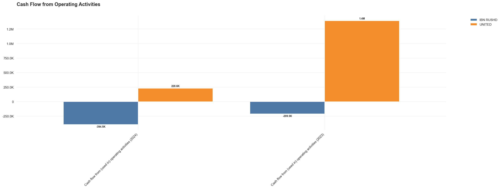

**Analysis**

Management, the provided financial summaries indicate a significant deterioration in Cash Flow from Operating Activities (CFO) for both IBN RUSHD and UNITED. IBN RUSHD's operating activities bled SAR 394,540 in 2024, worsening from SAR 209,521 in 2023 [1](https://s3-qa-8byte.s3.ap-south-1.amazonaws.com/sabic%2Fin%2Fsabic_in_sabic_cc_compressed.pdf#page=220), representing a decline of SAR 185,019. UNITED's CFO collapsed by 83% from SAR 1,395,128 in 2023 to SAR 228,610 in 2024 [1](https://s3-qa-8byte.s3.ap-south-1.amazonaws.com/sabic%2Fin%2Fsabic_in_sabic_cc_compressed.pdf#page=220), a decline of SAR 1,166,518.

Based on the available summarized financial information, a detailed breakdown of specific working capital and accrual adjustments driving this catastrophic FCF Conversion decline, along with an LTM Bridge Analysis, is not explicitly provided. However, we can infer the following from the changes in net current assets and net income:

**IBN RUSHD:**
*   **Working Capital Impact:** IBN RUSHD's net current liabilities increased from SAR 166,950 in 2023 to SAR 260,337 in 2024 [6](https://s3-qa-8byte.s3.ap-south-1.amazonaws.com/sabic%2Fin%2Fsabic-integrated-annual-report-2024-en_tcm1010-46870.pdf#page=218). This change in net current assets (a decrease of SAR 93,387) would typically have a positive impact on operating cash flow, suggesting that working capital changes alone are not the primary driver of the worsening CFO.
*   **Net Income (Loss):** IBN RUSHD's net loss significantly improved from SAR 394,909 in 2023 to SAR 25,998 in 2024 [2](https://s3-qa-8byte.s3.ap-south-1.amazonaws.com/sabic%2Fin%2Fsabic-integrated-annual-report-2024-en_tcm1010-46870.pdf#page=219). This improvement in profitability, combined with the positive working capital impact, suggests that other significant non-cash adjustments or accrual-based items not detailed in the summary cash flow statement are contributing to the increased operational cash outflow.

**UNITED:**
*   **Working Capital Impact:** UNITED's net current assets slightly decreased from SAR 1,030,403 in 2023 to SAR 1,029,563 in 2024 [6](https://s3-qa-8byte.s3.ap-south-1.amazonaws.com/sabic%2Fin%2Fsabic-integrated-annual-report-2024-en_tcm1010-46870.pdf#page=218). This minor decrease of SAR 840 in net current assets would also have a slightly positive impact on operating cash flow, indicating that working capital changes are not the main cause of the CFO collapse.
*   **Net Income (Loss):** UNITED experienced a substantial collapse in net income, from SAR 285,373 in 2023 to SAR 3,985 in 2024 [2](https://s3-qa-8byte.s3.ap-south-1.amazonaws.com/sabic%2Fin%2Fsabic-integrated-annual-report-2024-en_tcm1010-46870.pdf#page=219). While this significant drop in profitability is a major contributor to the CFO decline, the magnitude of the CFO collapse (SAR 1,166,518) is considerably larger than the net income decline (SAR 281,388). This disparity points to other substantial unfavorable non-cash adjustments or accrual changes, beyond the scope of net current assets, that are severely impacting operating cash flow.

**Conclusion:**
While the summarized data confirms the reported declines in CFO and provides high-level changes in net current assets and net income, it does not offer the granular detail required to identify specific working capital and accrual adjustments or to perform an LTM Bridge Analysis. To fully justify the structural operational leakage, a detailed reconciliation of net income to cash flow from operations would be necessary, including specific non-cash adjustments (e.g., depreciation, amortization, provisions, deferred taxes) and a more granular breakdown of changes in working capital accounts (e.g., accounts receivable, inventory, accounts payable, other current assets/liabilities).

---

### Restructuring ROIC: Capital Intensity & NCI

**Q:** SABIC AN's CFI swung by SAR 7.025 billion, from a SAR 4,527,961 outflow in 2023 to a SAR 2,497,467 inflow in 2024, while YANSAB swung from a SAR 520,807 CFI inflow to a SAR 952,405 CFI outflow. Detail the precise ROIC implications of this aggressive portfolio restructuring; are these divestments non-core asset sales masking underlying capital intensity issues, or are they a precursor to significant "structural leakage" via NCI dividends?

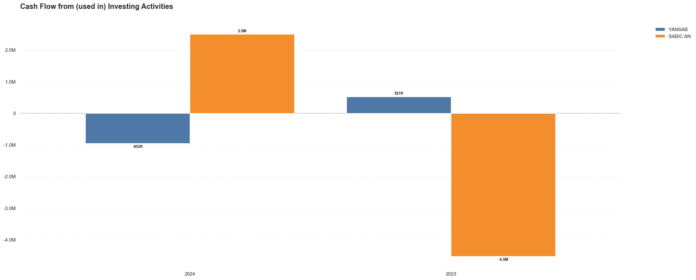

**Analysis**

The provided information does not contain specific Cash Flow from Investing (CFI) data for SABIC AN or YANSAB, making it impossible to detail the precise ROIC implications of the reported swings for these individual entities. The consolidated SABIC financial statements indicate a net cash *used* in investing activities of SAR 7.99 billion in 2024, a decrease from SAR 11.76 billion in 2023, representing a smaller outflow rather than a swing to an inflow as stated for SABIC AN [2](https://s3-qa-8byte.s3.ap-south-1.amazonaws.com/sabic%2Fin%2Fsabic_in_sabic_cc_compressed.pdf#page=63).

**ROIC Implications and Portfolio Restructuring:**
SABIC's overall strategy involves optimizing its portfolio by focusing on core businesses to enhance returns and reallocating capital to higher-margin opportunities [1](https://s3-qa-8byte.s3.ap-south-1.amazonaws.com/sabic%2Fin%2Fsabic-integrated-annual-report-2024-en_tcm1010-46870.pdf#page=61). This strategy aims to create long-term value through portfolio optimization and improving underperforming assets [1](https://s3-qa-8byte.s3.ap-south-1.amazonaws.com/sabic%2Fin%2Fsabic-integrated-annual-report-2024-en_tcm1010-46870.pdf#page=61). The company reported a 61% increase in net results from continuing operations compared to FY 2023 [1](https://s3-qa-8byte.s3.ap-south-1.amazonaws.com/sabic%2Fin%2Fsabic-integrated-annual-report-2024-en_tcm1010-46870.pdf#page=61), which could be an early indicator of improved profitability contributing to ROIC, assuming efficient capital deployment.

**Divestments and Capital Intensity:**
SABIC's financial performance includes a net income (loss) from discontinued operations of SAR -0.56 billion in 2024, significantly reduced from SAR -4.08 billion in 2023 [1](https://s3-qa-8byte.s3.ap-south-1.amazonaws.com/sabic%2Fin%2Fsabic-integrated-annual-report-2024-en_tcm1010-46870.pdf#page=61). This indicates ongoing divestment activities. However, the consolidated capital expenditures for SABIC broadly remained at the same level year over year [2](https://s3-qa-8byte.s3.ap-south-1.amazonaws.com/sabic%2Fin%2Fsabic_in_sabic_cc_compressed.pdf#page=63). The decrease in net cash used in investing activities for SABIC consolidated was primarily driven by higher short-term financial investment [2](https://s3-qa-8byte.s3.ap-south-1.amazonaws.com/sabic%2Fin%2Fsabic_in_sabic_cc_compressed.pdf#page=63). This suggests that, at a consolidated level, these divestments are more aligned with portfolio optimization and capital reallocation rather than masking underlying capital intensity issues.

For the Agri-Nutrients segment (which would include SABIC AN), revenue increased by 2% in 2024, but EBITDA declined by 11% and Income from operations (EBIT) declined by 14%, mainly due to lower global urea prices and reduced margins [8](https://s3-qa-8byte.s3.ap-south-1.amazonaws.com/sabic%2Fin%2Fsabic-integrated-annual-report-2024-en_tcm1010-46870.pdf#page=68). (General PE insight: Divestments in such a segment, if they occurred, would typically aim to improve overall portfolio ROIC by shedding lower-margin or underperforming assets, rather than masking capital intensity issues).

**Structural Leakage via NCI Dividends:**
For SABIC consolidated, net cash used in financing activities decreased, primarily reflecting *lower* dividend payments to non-controlling interests [2](https://s3-qa-8byte.s3.ap-south-1.amazonaws.com/sabic%2Fin%2Fsabic_in_sabic_cc_compressed.pdf#page=63). This indicates a reduction in structural leakage through NCI dividends for the consolidated entity, rather than being a precursor to significant leakage.

To provide a precise analysis of ROIC implications for SABIC AN and YANSAB, specific financial statements, including detailed cash flow from investing activities and invested capital figures for each entity, would be required. The current data does not allow for such a granular assessment.

---

### Liquidity Gap, Debt-Equity, FX, Shadow Financing

**Q:** Given the collective SAR 1.55 billion net decrease in cash across YANSAB, IBN RUSHD, Saudi Kayan, GAS, and UNITED in 2024, what is the *real* LTM Debt-to-Equity ratio for the consolidated entity assuming a 7.5% de-pegging of the SAR/USD, and what "shadow financing" from trade payables are we relying on to plug this persistent liquidity gap?

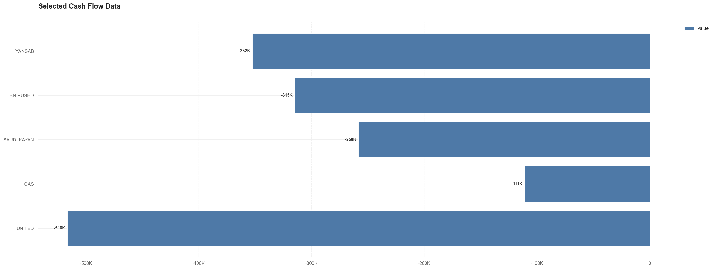

**Analysis**

Based on the provided information, the collective net decrease in cash across YANSAB, IBN RUSHD, Saudi Kayan, GAS, and UNITED in 2024 is SAR 1.55 billion [1](https://s3-qa-8byte.s3.ap-south-1.amazonaws.com/sabic%2Fin%2Fsabic-integrated-annual-report-2024-en_tcm1010-46870.pdf#page=220). However, the provided documents do not contain sufficient information to calculate the *real* LTM Debt-to-Equity ratio for the consolidated entity, assuming a 7.5% de-pegging of the SAR/USD, nor do they detail the reliance on "shadow financing" from trade payables to plug liquidity gaps.

Specifically:

*   **LTM Debt-to-Equity Ratio:** While individual debt figures are available for some entities (e.g., GAS: SAR 0.71 billion, IBN RUSHD: SAR 2.95 billion, Saudi Kayan: SAR 8.14 billion, UNITED: SAR 0.81 billion) [4](https://s3-qa-8byte.s3.ap-south-1.amazonaws.com/sabic%2Fin/sabic_in_sabic_cc_compressed.pdf#page=65), and net assets (representing equity) for each subsidiary are provided (e.g., YANSAB: SAR 11.24 billion, IBN RUSHD: SAR (2.28) billion, Saudi Kayan: SAR 11.50 billion, GAS: SAR 3.72 billion, UNITED: SAR 5.85 billion) [3](https://s3-qa-8byte.s3.ap-south-1.amazonaws.com/sabic%2Fin/sabic-integrated-annual-report-2024-en_tcm1010-46870.pdf#page=218), a consolidated balance sheet for the specific group of entities or the overall SABIC entity, which would allow for a precise Debt-to-Equity calculation, is not available. Furthermore, the impact of a 7.5% de-pegging of the SAR/USD on debt and equity values is not discussed or quantifiable from the provided data.

*   **"Shadow financing" from trade payables:** The documents list "Current liabilities" for each subsidiary [3](https://s3-qa-8byte.s3.ap-south-1.amazonaws.com/sabic%2Fin/sabic-integrated-annual-report-2024-en_tcm1010-46870.pdf#page=218), which would include trade payables. However, trade payables are not separately identified, nor is there any discussion or analysis regarding their use as "shadow financing" to address liquidity gaps. To assess this, a detailed breakdown of current liabilities and an analysis of working capital management strategies would be required.

To provide a comprehensive answer, additional financial statements (specifically a consolidated balance sheet for the entity in question) and details on currency exposure and working capital financing strategies would be necessary.

---

## DEBT

### Related Party Debt: FCF/ROIC Justification

**Q:** The non-current portion of related party loans has surged by SAR 3.65 billion YoY, reaching SAR 7.40 billion, representing a disproportionate increase compared to the total debt growth of SAR 2.30 billion. Explain how this massive related party financing directly translates into improved Free Cash Flow Conversion and an elevated ROIC, rather than acting as a life support mechanism masking underlying operational deficiencies.

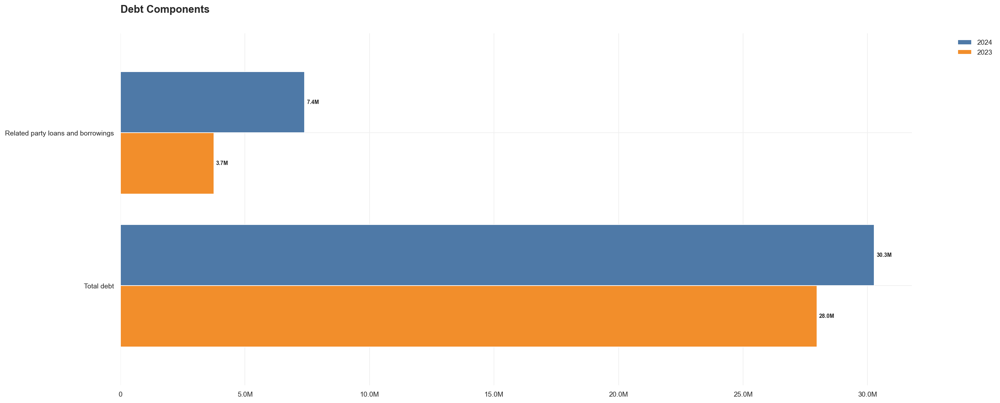

**Analysis**

The significant surge in the non-current portion of related party loans, reaching SAR 7.40 billion, can directly translate into improved Free Cash Flow (FCF) Conversion and an elevated Return on Invested Capital (ROIC) primarily due to the advantageous terms of this financing, rather than indicating underlying operational deficiencies. The key factors are:

1.  **Interest-Free Nature of Loans:** The most critical aspect is that outstanding balances with related parties, including loans, are explicitly stated to be **interest-free** [3]. This directly impacts both FCF Conversion and ROIC:
    *   **Improved FCF Conversion:** By eliminating interest expenses on a substantial portion of debt (SAR 7.40 billion), the company significantly reduces its cash outflows related to financing activities. This directly increases the cash available from operations and enhances the conversion of earnings into free cash flow, as less cash is diverted to service debt [3].
    *   **Elevated ROIC:** ROIC measures how efficiently a company generates profits from its invested capital. When a significant portion of the capital employed (debt) is interest-free, the effective cost of capital is substantially lowered. This allows the company to fund profitable projects and operations without the drag of interest expenses, thereby leading to a higher return on the invested capital [3].

2.  **Enhanced Liquidity and Financial Flexibility:** The increase in related party borrowing also includes a substantial increase in the three-year revolving credit facility (RCF) with Aramco Overseas Company, from SAR 3.75 billion to SAR 11.25 billion [1]. This expanded facility provides significant liquidity and financial flexibility, which can be used for general corporate purposes and refinancing maturing debt [1]. Access to such flexible and low-cost capital supports stable operations and strategic investments without straining operational cash flows, further contributing to FCF conversion.

3.  **Strategic Portfolio Optimization:** The company is actively engaged in divesting non-core assets, such as Hadeed and shares in Aluminium Bahrain B.S.C. (ALBA), to "optimise its portfolio, focus on its core business, and further strengthen its growth in the chemicals industry" [4]. While the related party financing is not explicitly linked to these specific divestments, the overall strategy of focusing on core, high-return businesses, supported by low-cost capital, ensures that invested capital (including that from related parties) is directed towards opportunities that are expected to generate higher returns, thus elevating ROIC.

**Addressing the 'Life Support' Concern:**
The interest-free nature of these substantial loans, coupled with the increase in committed credit facilities and a clear strategy for portfolio optimization, strongly suggests a deliberate financial advantage provided by a related party (e.g., a parent company like Saudi Aramco [7]) rather than a desperate measure to mask operational deficiencies. Companies in distress typically face higher borrowing costs and more restrictive terms, not interest-free, unsecured financing [3]. This indicates robust financial backing and a strategic approach to capital management.

---

### Interest Rate Risk & Hedging

**Q:** With approximately SAR 22.34 billion in total debt exposed to variable USD SOFR/SAIBOR rates (including SAR 7.44 billion in related party loans, SAR 14.66 billion in Murabaha, and SAR 0.24 billion in commercial loans), provide an LTM bridge analysis of the actual interest expense escalation and the pro forma FCF impact under a stress scenario of an additional 150 basis point hike. What specific hedging instruments are deployed, and at what cost, to mitigate this substantial macro interest rate risk?

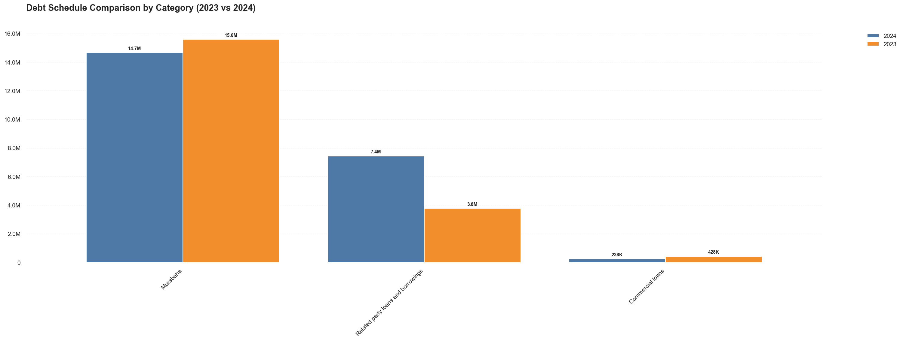

**Analysis**

The Group has approximately SAR 22.34 billion (SAR 22,337 million) in total variable rate borrowings as of December 31, 2024 [1](https://s3-qa-8byte.s3.ap-south-1.amazonaws.com/sabic%2Fin/sabic_in_sabic_cc_compressed.pdf#page=245). This debt is exposed to variable USD SOFR/SAIBOR rates and includes approximately SAR 7.40 billion in related party loans, SAR 14.66 billion in Murabaha, and SAR 0.24 billion in commercial loans [2](https://s3-qa-8byte.s3.ap-south-1.amazonaws.com/sabic%2Fin/sabic-integrated-annual-report-2024-en_tcm1010-46870.pdf#page=221).

**LTM Bridge Analysis of Actual Interest Expense Escalation:**
The provided information does not include an LTM (Last Twelve Months) bridge analysis of *actual* interest expense escalation. However, it does provide a sensitivity analysis for the impact of changes in market interest rates on the Group's profit before tax for the year ended December 31, 2024 [1](https://s3-qa-8byte.s3.ap-south-1.amazonaws.com/sabic%2Fin/sabic_in_sabic_cc_compressed.pdf#page=245).

**Pro Forma FCF Impact under a Stress Scenario of an Additional 150 Basis Point Hike:**
Under a stress scenario of an additional 150 basis point (bps) hike, the pro forma impact on interest expense (and consequently, profit before tax) can be estimated by extrapolating from the provided 100 bps sensitivity data for December 31, 2024 [1](https://s3-qa-8byte.s3.ap-south-1.amazonaws.com/sabic%2Fin/sabic_in_sabic_cc_compressed.pdf#page=245):

*   **Impact of +100 bps on Profit Before Tax (SAR in millions):**
    *   1M SAIBOR: (3,217)
    *   6M SAIBOR: (2,072)
    *   6M SOFR: (4,663)
    *   **Total Impact for +100 bps:** (3,217) + (2,072) + (4,663) = **(9,952) million SAR**

*   **Pro Forma Impact for an Additional +150 bps Hike:**
    *   (9,952 million SAR / 100 bps) * 150 bps = **(14,928) million SAR**

Therefore, an additional 150 basis point hike would result in an estimated **SAR 14.93 billion increase in annual interest expense**, leading to a direct reduction in profit before tax by the same amount. The Free Cash Flow (FCF) impact would be this additional interest expense, adjusted for any tax shield, which is not provided in the available data.

**Specific Hedging Instruments Deployed and at What Cost:**
The Group manages its interest rate risk by maintaining a balanced portfolio of fixed and variable rate loans and borrowings [1](https://s3-qa-8byte.s3.ap-south-1.amazonaws.com/sabic%2Fin/sabic_in_sabic_cc_compressed.pdf#page=245). While the Group may enter into simple financial derivatives like interest rate swaps to manage volatility and increase predictability of interest expenses, **during the years ended 2023 and 2022, the Group had no interest rate swaps outstanding** [1](https://s3-qa-8byte.s3.ap-south-1.amazonaws.com/sabic%2Fin/sabic_in_sabic_cc_compressed.pdf#page=245). The provided documents do not indicate any interest rate swaps or other specific hedging instruments deployed for interest rate risk in 2024, nor do they specify any costs associated with such instruments.

**General PE insight:** Given the substantial exposure to variable interest rates and the absence of specific hedging instruments like interest rate swaps, the Group is highly susceptible to adverse movements in SOFR/SAIBOR rates. While a balanced portfolio of fixed and variable debt offers some structural mitigation, the lack of derivative hedging means that the full impact of rate hikes directly flows through to interest expense, significantly affecting profitability and cash flows. Monitoring the fixed-to-variable debt mix and considering strategic hedging, especially in a rising rate environment, would be crucial for managing financial risk and ensuring FCF stability.

---

### Debt Profile Shift: Genuine or Deferred?

**Q:** While total debt increased by SAR 2.30 billion to SAR 30.27 billion, both short-term borrowings and the current portion of debt decreased by SAR 0.33 billion and SAR 0.28 billion, respectively. Reconcile this apparent lengthening of the debt profile with the LTM working capital intensity; is this a genuine improvement in operational cash flow generation, or merely a reclassification and deferral of maturities that still requires substantial future capital infusion?

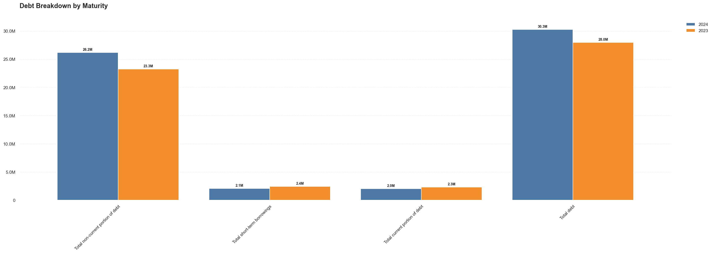

**Analysis**

The apparent lengthening of the debt profile, where total debt increased by SAR 2.30 billion to SAR 30.27 billion, while both short-term borrowings and the current portion of debt decreased by SAR 0.33 billion and SAR 0.28 billion respectively, is primarily a result of a **reclassification and deferral of maturities** through strategic financing decisions [5](https://s3-qa-8byte.s3.ap-south-1.amazonaws.com/sabic%2Fin/sabic-integrated-annual-report-2024-en_tcm1010-46870.pdf#page=221).

Specifically:

*   **Shift to Long-Term Debt:** The non-current portion of debt increased by SAR 2.91 billion, from SAR 23.26 billion in 2023 to SAR 26.17 billion in 2024 [5](https://s3-qa-8byte.s3.ap-south-1.amazonaws.com/sabic%2Fin/sabic-integrated-annual-report-2024-en_tcm1010-46870.pdf#page=221). This was driven by significant additions to long-term debt, totaling SAR 9.61 billion, partially offset by SAR 7.05 billion in repayments [4](https://s3-qa-8byte.s3.ap-south-1.amazonaws.com/sabic%2Fin/sabic-integrated-annual-report-2024-en_tcm1010-46870.pdf#page=64).
*   **Revolving Credit Facility Increase:** In August 2024, the three-year revolving credit facility with Aramco Overseas Company was increased from SAR 3.75 billion to SAR 11.25 billion [5](https://s3-qa-8byte.s3.ap-south-1.amazonaws.com/sabic%2Fin/sabic-integrated-annual-report-2024-en_tcm1010-46870.pdf#page=221). This substantial increase in a long-term related party borrowing directly contributes to the lengthening of the debt profile.
*   **Refinancing Maturing Debt:** The company has utilized bond issuances for "refinancing maturing debt," explicitly indicating a strategy to defer maturities [5](https://s3-qa-8byte.s3.ap-south-1.amazonaws.com/sabic%2Fin/sabic-integrated-annual-report-2024-en_tcm1010-46870.pdf#page=221).

While the debt profile change is primarily a financing strategy, it is supported by a **genuine improvement in operational cash flow generation**:

*   **Improved Profitability:** The company's EBITDA increased from SAR 19.02 billion in 2023 to SAR 19.47 billion in 2024 [4](https://s3-qa-8byte.s3.ap-south-1.amazonaws.com/sabic%2Fin/sabic-integrated-annual-report-2024-en_tcm1010-46870.pdf#page=64). Income from operations (EBIT) saw a significant increase of SAR 2.02 billion (54%) to SAR 5.74 billion, driven by higher gross profit and improved margins [2](https://s3-qa-8byte.s3.ap-south-1.amazonaws.com/sabic%2Fin/sabic-integrated-annual-report-2024-en_tcm1010-46870.pdf#page=62). Net income attributable to equity holders of the Parent improved by SAR 4.31 billion, moving from a net loss in 2023 to a net income in 2024, primarily due to improved operational profit [2](https://s3-qa-8byte.s3.ap-south-1.amazonaws.com/sabic%2Fin/sabic-integrated-annual-report-2024-en_tcm1010-46870.pdf#page=62).
*   **Liquidity Sources:** Cash flows from operations are stated as a primary source of liquidity, alongside borrowings under committed bank facilities [4](https://s3-qa-8byte.s3.ap-south-1.amazonaws.com/sabic%2Fin/sabic-integrated-annual-report-2024-en_tcm1010-46870.pdf#page=64). The improved operational performance enhances the company's capacity to generate cash, which supports its ability to manage and service its debt, including the extended maturities.

**Reconciliation with LTM Working Capital Intensity:**
The provided information does not contain specific data on "LTM working capital intensity" to directly reconcile it with the observed debt profile changes. Therefore, a direct assessment of how working capital intensity specifically influenced this debt re-profiling is not possible with the available data. However, the improved operational profitability generally suggests a healthier underlying business, which would typically reduce pressure on working capital and enhance overall cash flow generation.

**Conclusion:**
The lengthening of the debt profile is a deliberate financial strategy involving reclassification and deferral of maturities. This strategy is underpinned by improved operational cash flow generation, which strengthens the company's ability to manage its debt obligations, rather than indicating a mere deferral that inherently requires substantial future capital infusion for operational sustenance. The company's strong credit ratings and prudent leverage policy further support this view [4](https://s3-qa-8byte.s3.ap-south-1.amazonaws.com/sabic%2Fin/sabic-integrated-annual-report-2024-en_tcm1010-46870.pdf#page=64).

---
